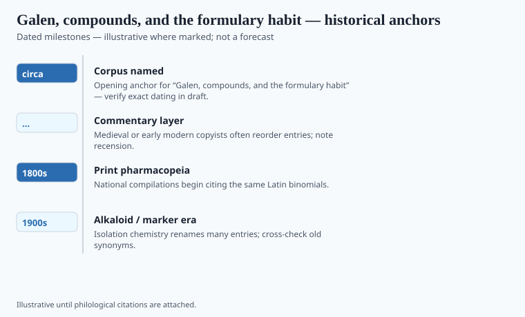

**Disclaimer.** Educational history only. Not medical advice. Past uses of plants do not prove safety or efficacy today. Do not use this series to self-treat or to market disease claims.

Galen of Pergamon liked to win. He won in public anatomy, in the circle of Marcus Aurelius, and in the long run of the curriculum. For pharmacy he left a machine: every simple has a temperament — a degree of heat, cold, moisture, dryness — and the compounder's job is to match that temperament to a patient's imbalance. The machine is elegant. It is also a way to be wrong with perfect consistency.

He was born in Pergamon in 129 CE, trained in Smyrna and Alexandria, practiced in Rome, and died around 216. The "circa 180" in the file is a mid-career marker, not a publication date. He wrote enough that later centuries could not lift the pile. The books on simples and the books on antidotes became the furniture of the shop.

## Textual and archaeological context

<!-- graphics-pack:v1 -->

*Figure 1. Anchors for antiquity-to-modern framing — verify dates in draft.*

A "simple" is a single substance. Galen graded many of them in degrees. The numbers feel quantitative. They were not thermometer readings. They were a trained consensus, argued from taste, from urine and pulse, from older authority. Once the number existed, a compounder could do arithmetic. The arithmetic traveled better than his bedside notes. It could be taught in Toledo and in Paris without a Mediterranean garden.

That is why humoral pharmacy lasted. It was portable. It was also why a northern student could assign a degree to a plant he had never smelled. Vivian Nutton keeps Galen a physician in a city, not a floating system. The system still floated. That is the joke history played on him.

He did not invent compounding. He professionalized a taste for it. Electuaries, plasters, oils, the great antidotes: twenty ingredients could be virtuous because the theory said they covered the aspects of a disease. Later critics — Paracelsus among the loudest — called this a gravy of names. A compound can be a way to make a bitter root takeable, or a way to hide that you do not know which ingredient matters. Both things can be true in the same pot.

## Plants named in the surviving record

<!-- graphics-pack:v1 -->

*Figure 2. Comparative materia medica plate — illustrative line art, not botanical ID.*

The plate shows simples. The shop, after Galen, showed jars of compounds: theriac, hiera, the named electuaries that Italian albarelli still wear as labels. Andromachus the Elder, Nero's physician in the usual story, reworked Mithridates' poison-proofing paste into a theriac that later cities treated as a public ritual — Venice and Montpellier cooked it in the street. The plants inside those jars — balsams, opium, squill, cinnamon when the ship came in — are Dioscorides's goods running through Galen's machine. *De simplicium medicamentorum temperamentis ac facultatibus* is the degree book. *De antidotis* is the compound book. Figure 2 should not be read as Galen's garden. It is the Mediterranean shelf he assumed.

Ḥunayn ibn Isḥāq's ninth-century translations put that machine into Arabic; Latin Toledo and then Paris put it into the curriculum. Islamic physicians kept the arithmetic and rebuilt the garden. Vesalius wrecked Galenic anatomy in the sixteenth century. Galenic pharmacy took longer to fall, because a theory of qualities does not need a correct liver. It needs a classroom and a clientele that wants a reason.

This series will not revive humoral prescribing. It will say that for a very long time the shop was a philosophical instrument. The plants were real. The arithmetic was a story about them. Stories that last a thousand years are not trivial. They are also not evidence in the sense a modern regulator means. Keep both facts in the same paragraph.

## After the albarello

Italian pharmacies still photograph well: rows of jars, Latin abbreviations, a lion or a saint. The room is Galenic even when the owner has never read Greek. The abbreviation is the residue of a victory. Vesalius could wreck the anatomy and leave the jars standing. A theory of qualities does not need a correct liver.

When a wellness writer says a food is "heating," a distant cousin of that classroom is speaking, usually without a degree chart and without Galen's demand for training. This series will not revive the chart. It will say the shop was a philosophical instrument for a very long time. Theriac, in a later essay's neighborhood, is the instrument at its most theatrical. A single foxglove leaf, later still, is the instrument breaking. Both belong on the same shelf in a museum. Only one belongs in a modern hospital, and then as a named glycoside with a lock on the cabinet.
