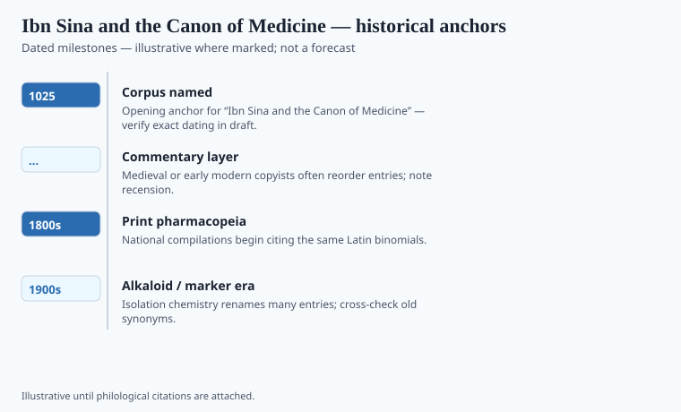

**Disclaimer.** Educational history only. Not medical advice. Past uses of plants do not prove safety or efficacy today. Do not use this series to self-treat or to market disease claims.

Ibn Sīnā (Avicenna to the Latins) finished worlds in prose. The *Kitāb al-Shifāʾ* took philosophy. The *Qānūn fī al-ṭibb* took the body. He was born near Bukhara in 980, served courts, died at Hamadan in 1037, and wrote as if a complete book could reduce practice to something a student in a strange city could open. The date 1025 that clings to the *Canon* is a conventional completion neighborhood, not a printer's colophon. `[VERIFY]` before a timeline treats it as a single Tuesday.

Five books: principles and anatomy; simples; diseases from head to foot; diseases that are not local; the formulary (*aqrābādhīn*). The simples and the formulary are why this series cares. They are a warehouse with an index.

## Textual and archaeological context

<!-- graphics-pack:v1 -->

*Figure 1. Anchors for antiquity-to-modern framing — verify dates in draft.*

His architecture is Galenic: faculties, humors, pulses, the need for a cause. His market is wider. Cassia, camphor, musk, Indian aromatics sit beside Mediterranean staples Dioscorides would have recognized. He gives temperament, degree, and indications in a compressed, teachable form. That compression is why the book won. A working doctor can hate a long story and still love a table.

He was not a field botanist in the Dioscorides manner. He was a systematizer who assumed names could be made to behave. When a Persian name, an Arabic name, and a Greek name pointed at three shrubs, later commentators fought in the margins. Those fights are the live science.

Gerard of Cremona's Toledo generation put the *Canon* into Latin in the twelfth century. For four hundred years it was the long book in European faculties — Bologna, Padua, Paris, Montpellier. You lectured on it. You disputed it. Renaissance humanists crying for Greek purity were often crying against this Arabic-Latin Avicenna who had become the furniture. The cry missed what the book had done for pharmacy: a drug from far away could be discussed with the same tools as a drug from the hill behind the hospital.

## Plants named in the surviving record

<!-- graphics-pack:v1 -->

*Figure 2. Comparative materia medica plate — illustrative line art, not botanical ID.*

Figure 2 will show a mixed shelf because the *Canon* is a mixed shelf. Do not caption it "Avicenna's garden." Caption it as the trade he assumed. Camphor and rhubarb sit in that assumption. So does the later European habit of wanting a simple from India to behave like a simple from Campania.

He does not give you a randomized trial or a modern dose. He does not give you permission to sell "Avicenna's cure" in a dropper. He gives you a picture of elite medicine when Bukhara and Isfahan could still think of themselves as the center of the useful world. There is a later Iranian and Unani life of the *Canon* that never passed through Paris. That life is not a footnote to Europe. It is another set of rooms.

Open the simples. Watch a man try to make a continent of plants sit still long enough to be taught. That effort — not a miracle plant — is the historical event.

## After the Latin rooms

Gentile da Foligno and Jacques Despars wrote the kind of commentary that makes a modern reader grateful for indexes. The *Canon* survived because it could be lectured. It also survived in Persian and Urdu rooms that never asked Paris for permission. Unani's later lithographs are that survival with cheap ink.

A postage-stamp Avicenna is a statue. The simples are a man trying to make names behave. When they would not, the margin fought. Those fights are why a later botanist can still get angry at a synonym. Anger at a synonym is a professional emotion. "Avicenna's secret" on a dropper is a different emotion, and a worse one. The *Canon* does not issue droppers. It issues an index. Use the index.

Gerard of Cremona's twelfth-century Toledo circle is the usual Latin bridge; later printed *Canons* (Venice especially) are why a Paris student could be examined on Book 2. Andrea Alpago's sixteenth-century notes tried to repair Arabic names the first Latin had mashed. Pormann and Savage-Smith will keep a reader from calling the whole operation "the Islamic Golden Age" as if it were a brand. It was courts, hospitals, and a book that could be lectured. Unani lithographs and Iranian school editions are the rooms that never asked Venice. They are not a footnote. They are the *Canon* still at work without a dropper.
