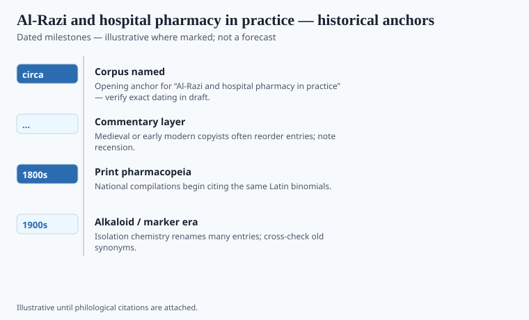

**Disclaimer.** Educational history only. Not medical advice. Past uses of plants do not prove safety or efficacy today. Do not use this series to self-treat or to market disease claims.

Abū Bakr Muḥammad ibn Zakariyyā al-Rāzī — Rhazes to the Latins — was born in Rayy, worked in Baghdad, and died about 925. He directed hospitals. That sentence matters more than the postage-stamp honorifics. A hospital is a place where a formulary meets a night shift. The *Kitāb al-Ḥāwī* (*Continens* in Latin) is a vast, posthumously arranged commonplace book of readings and observations. The *Kitāb al-Manṣūrī* is the tighter teaching text dedicated to a prince. Neither is a wellness pamphlet.

He wrote on smallpox and measles in a separate, famous treatise that later European printers kept opening. He also wrote as a man who had watched drugs fail. Failure is a clinical genre. Herbals that never fail are advertisements.

## Textual and archaeological context

<!-- graphics-pack:v1 -->

*Figure 1. Anchors for antiquity-to-modern framing — verify dates in draft.*

"Circa 900" is a career centroid. The ʿAbbasid hospital (*bīmāristān*) is the institution behind the books: wards, a pharmacy, a budget, a politics of who gets a bed. Baghdad's foundations in this period are a specialist file with pious origin stories; `[VERIFY]` any caption that names a single "first hospital" year. What can be said without romance is that al-Rāzī's voice assumes a staffed house, not a lone village bag.

He read Galen and argued with him. He read Indian and Persian material when it reached him. The *Ḥāwī* is messy because a working physician's notebook is messy. Latin Europe received a Latin mess and still used it. That is a kind of respect.

Alchemy and philosophy sit in his other books. This essay stays in the pharmacy: simples, compounds, the question of what to give when the textbook and the pulse disagree. He is less of a systematizer than Ibn Sīnā and more of a watcher. The pack needs both tempers.

## Plants named in the surviving record

<!-- graphics-pack:v1 -->

*Figure 2. Comparative materia medica plate — illustrative line art, not botanical ID.*

The plate is the shared Islamicate shelf: senna and other cathartics, rose, camphor, opium as a known tool, the gum-resins of the Gulf and the Red Sea. Al-Rāzī's contribution is not a new plant so much as a hospital sentence about an old one. He will note that a drug that looks official can still be the wrong drug for this patient tonight. That sentence later becomes, in other mouths, "the dose makes the poison." He did not need Paracelsus to notice a bad night.

Do not turn him into a proto-clinician who secretly ran RCTs. He ran a ward. He wrote down what he trusted and what he had only read. The distinction is already a method. A modern supplement label that borrows "Rhazes" is borrowing a statue. The *Ḥāwī* is a pile of notes. Prefer the pile.

## After the ward

Latin printers kept the smallpox treatise because Europe wanted a name for a disease it already had. They also kept chunks of the *Ḥāwī* because a pile of notes is useful when your own pile is thin. Usefulness is not the same as a system. Ibn Sīnā built the system. Al-Rāzī watched the night.

A hospital pharmacy in tenth-century Baghdad is not a Golden Age poster. It is a budget, a lock, a staff who can read, and a physician willing to say a famous drug failed this patient. That willingness is the method. Modern clinical medicine likes to claim it invented the willingness. It invented the IRB and the journal. The willingness is older. It does not license a "Rhazes tonic." The *Ḥāwī* is too long and too honest for a tonic.

<!-- prose-expand:v1 07-rhazes-clinical-pharmacy.md -->
## A ward book, a Latin smallpox, no tonic

Al-Rāzī directed the hospital at Baghdad and wrote the *Kitāb al-Ḥāwī* as a working pile: notes on patients, quotations, disagreements. Ibn al-Nadīm's *Fihrist* already treats him as a polymath who would not stop compiling. The smallpox-and-measles treatise traveled in Latin as *De variolis et morbillis* and gave Europe a clinical distinction it wanted. Gerard of Cremona's circle and later printers are that transmission.

He will record that a famous drug failed a named kind of patient tonight. That is a method. It is not a randomized trial and not a "Rhazes protocol." Senna, camphor, rose, opium as a tool, Gulf resins: the shared shelf. His contribution is often the hospital sentence, not a new plant. Paracelsus got the poster for dose-and-poison. Al-Rāzī had already had a bad night on a ward.

A supplement statue of "Rhazes" is a statue. Prefer the pile. The *Ḥāwī* is too long and too hedged for a tonic label.
