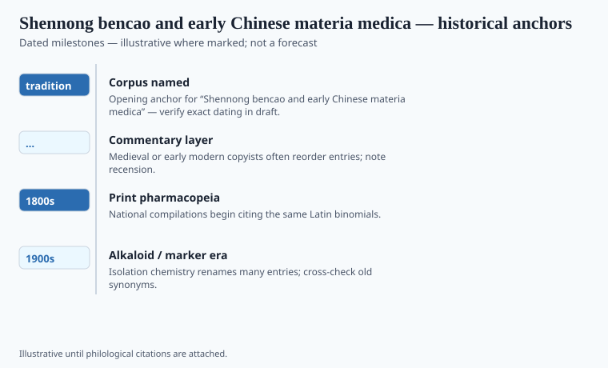

**Disclaimer.** Educational history only. Not medical advice. Past uses of plants do not prove safety or efficacy today. Do not use this series to self-treat or to market disease claims.

Shennong, the Divine Farmer, is said to have tasted plants and mapped the harmless from the killing, his body a mobile assay. He is also said to have invented agriculture. Both stories put the origin of knowledge in a body that works. The *Shen Nong Bencao Jing* is the book later scholars reconstructed from quotations, as if a Han library had once held the farmer's notes.

There was no farmer with a publication date. There was a genre. Han bibliographies already treat a *bencao* as a book a library should hold. Tao Hongjing in the sixth century is the named editor who tried to sort the Divine Farmer's material from later accretions. The hero stayed on the title page because a title page wants a father.

## Textual and archaeological context

<!-- graphics-pack:v1 -->

*Figure 1. Anchors for antiquity-to-modern framing — verify dates in draft.*

"Tradition 1st c." in the file means: the reconstructed classic is usually filed as Han, and the quotations are later. Do not date Shennong. Unschuld's history of Chinese pharmaceutics is the book that stops you from treating this as a quaint list. The *bencao* is a literature: Tao's *Bencao jing jizhu*, the Tang *Xinxiu bencao* of 659 (an official revision, one of the first state herbals), Song enlargements, foreign drugs walking in, Li Shizhen's *Bencao Gangmu* of 1596.

The reconstructed classic sorts drugs into upper, middle, and lower grades. Upper drugs — ginseng is the celebrity — were said to nourish life and to be taken at length. Lower drugs expelled illness and were not for lingering. That ranking is a philosophy of the body, not a modern safety study. Dietary-supplement marketing still lives off a vulgar version of the split, usually without qi, flavor, or channel entry.

A state herbal is a taxonomical and a political act. The Tang revision was both.

## Plants named in the surviving record

<!-- graphics-pack:v1 -->

*Figure 2. Comparative materia medica plate — illustrative line art, not botanical ID.*

*Rénshēn* (*Panax* in later naming fights) sits in the upper grade and in every later export story. *Má huáng* (*Ephedra*) sits as a releasing drug; the alkaloid ephedrine is a Meiji-era isolation (Nagai, 1885), not a Han tablet. *Qīnghāo* sits in emergency formulas; Tu Youyou's twentieth-century reading of a cold soak is a laboratory event, not "the ancients ran HPLC."

Figure 2 is illustrative. Chinese materia is a synonym war: the name in the old book may not be the plant in the market. Li Shizhen spent decades on that war and still admitted when he had not seen a drug himself. If you need a hero, take the man who admits an unseen plant.

Do not put Shennong in a lab coat. The farmer who tasted poisons is a way a civilization told itself that plant knowledge costs the body. The market that now sells "Shennong" teas pays in advertising. Keep the receipts separate. In the United States a powdered Chinese simple in a bottle is usually a DSHEA object, not a *bencao* grade.

## After the woodblock

Li Shizhen's 1596 encyclopedia is the stubborn later book this hero-title needed. He traveled, wrote letters, and left room for wonders he had not seen. Nappi's *Monkey and the Inkpot* treats him as a writer. Treat him that way. The PRC's later "TCM" package is younger than Li by a wide margin and should not be back-dated onto Shennong.

Ginseng, *má huáng*, *qīnghāo* will return in other mouths in this pack — export, ephedrine, Project 523. Each return is a category change. The *bencao* grade is not a DSHEA box. The Han culture hero is not a chromatogram. The *Xinxiu bencao* of 659 (next essay) is the first dated state enlargement this hero-title needed. The *Zhenglei bencao* and Li Shizhen's *Bencao gangmu* (printed 1596) are the stubborn later shelves. If an editor needs one sentence for a gallery wall: **the farmer on the title page is a story about cost; the ranked list is a literature; the capsule is a statute.** Do not let the gallery hang only the farmer. Nationalization is a twentieth-century event. Do not back-date it onto a Han title page.
