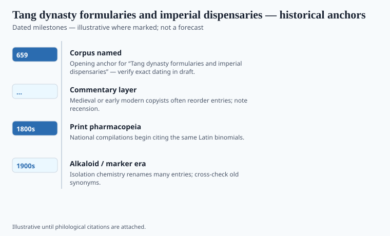

**Disclaimer.** Educational history only. Not medical advice. Past uses of plants do not prove safety or efficacy today. Do not use this series to self-treat or to market disease claims.

In 659 the Tang court issued the *Xinxiu bencao* — a revised materia medica with official weight. Twenty-odd later centuries of Chinese pharmacy would treat state books as a habit: the list is not only a scholar's argument; it is a dispensary's instruction. The date is one of the cleaner ones in this pack. The book is not "Shennong." It is a committee with a reign.

A formulary is a different object from a *bencao*. The *bencao* ranks and describes simples. The formulary tells you how to combine them for a pattern the school recognizes. Zhang Zhongjing's older *Shanghan lun* (late Han, reconstructed) is the formula constitution many later physicians kept opening. Tang dispensaries lived in the overlap: official simples, named compounds, a palace that wanted both.

## Textual and archaeological context

<!-- graphics-pack:v1 -->

*Figure 1. Anchors for antiquity-to-modern framing — verify dates in draft.*

The Tang medical office is a bureaucracy: physicians, pharmacists, a curriculum, punishments for a wrong drug in a wrong rank of patient. Japanese envoys and monks carried books and formulas east; the *Ishinpō* (984) would later preserve Chinese passages lost on the mainland. That is why a Tang date belongs on a Japanese as well as a Chinese timeline.

Sun Simiao (died 682) sits just off the 659 mark. His *Qianjin fang* (*Prescriptions Worth a Thousand Gold*) is a private encyclopedia with a public afterlife: ethics, formulas, a taste for the whole body. He is not the *Xinxiu* committee. He is the other Tang voice — the famous physician who still had to decide what the official list had missed.

Dunhuang medical fragments show the same century's less official hand: recipes on the road, Buddhist and technical mixing. A court book and a cave scrap are both Tang pharmacy. The court book had a seal.

## Plants named in the surviving record

<!-- graphics-pack:v1 -->

*Figure 2. Comparative materia medica plate — illustrative line art, not botanical ID.*

<!-- under-fig:v2 -->
Ginseng, licorice (*gancao*) as the great harmonizer in formulas, *má huáng*, ginger, rhubarb, and south-seas aromatics are the ingredients a plate can silhouette. The official unit is often the compound — a ratio and a logic — the way later Japanese Kampo insured extracts are compounds. The *Waitai miyao* (Wang Tao, 752) is a formula encyclopedia from the same dynasty’s later decades. Tanba Yasuyori’s *Ishinpō* (984) kept Tang-period material that China later lost. A single-herb capsule sold under a Tang name is a different object. No formula here is a protocol.

Ginseng, licorice (*gancao*) as the great harmonizer in formulas, ephedra, ginger, rhubarb, the aromatics that Silk Road traffic made ordinary in Chang'an. Figure 2 cannot show a formula. A formula is a ratio and a logic. The plate shows ingredients. The historical claim is that **the unit of Tang official medicine is often the compound**, the way Kampo's later insured extracts are compounds. A single-herb capsule sold under a Tang name is a different object.

Foreign drugs in the Tang lists — aromatics from the south seas, minerals, later identifications that Song editors would argue — are the empire as a stomach. Do not call this "multiculturalism." Call it a capital that could buy.

No formula in this essay is a protocol. The 659 book is a date on a state shelf. The shelf is why later dynasties thought pharmacy was their business. Ministries still do.

## After Chang'an

Japanese Kampo later made Tang-period formula ideas into insured extracts. That is a twentieth-century ending this 659 book did not expect. It is also why a Tang date belongs in a Tokyo clinic code. The *Shanghan lun* as a Japanese book is a different essay. The Tang official herbal is the shelf those formulas assumed.

Dunhuang scraps keep the court honest: not everyone had a seal. A road recipe and a palace dispensary share a dynasty and do not share a budget. This pack will not flatten them. It will also not print a *keishito* as a protocol. The unit is the compound. The compound is a historical object. The barcode on a modern granule is a later object. They may share a name. They do not share a ministry until a ministry says so.

<!-- prose-expand:v1 09-tang-formularies.md -->
## 659, Dunhuang, a Tokyo code

The *Xinxiu bencao* (659), ordered under Gaozong with Su Jing among the named editors, is a dated state herbal. Fragments and later citations survive; a complete Tang copy does not sit on every desk. `[VERIFY]` a holding against a modern edition (Shang Zhijun; Needham/Sivin neighborhood). Dunhuang and Turfan scraps show road recipes without a Chang'an seal. The palace dispensary and the caravan do not share a budget.

The *Waitai miyao* (Wang Tao, 752) is a formula encyclopedia from the same dynasty's later decades. Japanese *ishinpō* (Tanba Yasuyori, 984) kept Tang-period material that China later lost. Twentieth-century Kampo insurance codes are a distant grandchild. The *Shanghan lun* as a Japanese clinical book is a different essay. Call Tang foreign aromatics an empire that could buy, not "multiculturalism."

A modern granule barcode and a 659 compound may share a name. They share a ministry only when a ministry says so. No formula here is a protocol.
