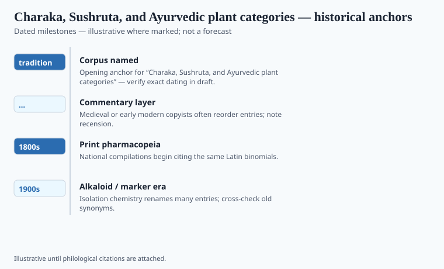
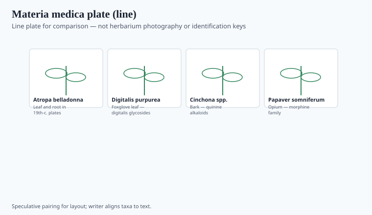

**Disclaimer.** Educational history only. Not medical advice. Past uses of plants do not prove safety or efficacy today. Do not use this series to self-treat or to market disease claims.

The *Caraka Saṃhitā* opens like a school, not like a market list. There are debates. Teachers lose. Substances (*dravya*) are sorted by rasa — taste as a technical term — by vīrya, by vipāka, by the three doṣas whose English gloss ("humors") causes as much trouble as it saves. The *Suśruta Saṃhitā* sits nearby with more surgery and its own plant lists. Later, Vāgbhaṭa's *Aṣṭāṅgahṛdaya* became the teaching book of many lineages.

Popular histories compress this into "ancient Indians used turmeric." They did, and so did other people. The saṃhitās are doing something more stubborn: building a system in which turmeric has a job among other jobs.

## Textual and archaeological context

<!-- graphics-pack:v1 -->

*Figure 1. Anchors for antiquity-to-modern framing — verify dates in draft.*

"Charaka" is a redaction in the lineage of Ātreya; Agniveśa is the student-compiler in the frame; Dṛḍhabala of Kashmir is the named repairer of lost chapters. The *Suśruta* frame names Dhanvantari and a surgical school at Kashi. Dating either man is a sport. Dating the compilations to layered centuries around the beginning of the common era is soberer. G. J. Meulenbeld's *History of Indian Medical Literature* is the specialist pile. The file's "tradition 1st c." is a teaching lock, not a carbon date. `[VERIFY]` any timeline that prints a single year for either saṃhitā.

Wujastyk's *Roots of Ayurveda* keeps the texts in the room and the airport manuals in the hall. A magazine that says "Ayurveda says" as if one mouth were speaking has already left the library. Metals and later rasashāstra workshops are a different, later file with a modern toxicology problem (lead and mercury in some market samples). This essay will not teach those preparations. It will say the workshop can poison when it is sloppy, and that fact is a laboratory fact, not a slur.

## Plants named in the surviving record

<!-- graphics-pack:v1 -->

*Figure 2. Comparative materia medica plate — illustrative line art, not botanical ID.*

Harītakī, āmalakī, bibhītaka — the three myrobalans — appear as a group (triphala) in later common use. The saṃhitā literature discusses them with a precision that advertising flattens into "detox." Detox is not a Caraka word. If a contemporary product uses the Sanskrit, DSHEA still governs what a U.S. label may claim. The old book does not issue that license.

Figure 2 will silhouette plants the colonial floras later painted (Roxburgh, Wight). The plate is colonial science. The name in the saṃhitā is older than the plate. Neither is a dose. The classical pharmacy is full of combinations (*yoga*). The airport pharmacy is full of singles, because singles photograph well.

Caraka's physician is trying to keep courtly and household medicine going, and he is willing to say some diseases are not worth treating. Wellness branding never quotes the limit. This series needs the school. The list is already on a thousand blogs, most of them converting rasa into a five-star cure.

## After the airport

Triphala is a household word in a dozen cities. The saṃhitā is not a household word. The gap is the history. AYUSH as a ministry is a gazette fact. It is not a meta-analysis. Rasashāstra's mercury and lead problems are laboratory facts when assays find them. Hold the sophistication and the assay in one paragraph.

Suśruta's knives and Caraka's debates are two professions that later patriotism tried to make one "Ayurveda." Let them stay two books. A capsule of turmeric with a Sanskrit word is a third book, usually written in a marketing department and filed, in the United States, under DSHEA. The *dravya* does not file itself. Editors should not pretend it does. Meulenbeld dates the layers; Wujastyk keeps the airport manual in the hall. `[VERIFY]` any single-year timeline before a caption treats either saṃhitā as a carbon-dated object.

