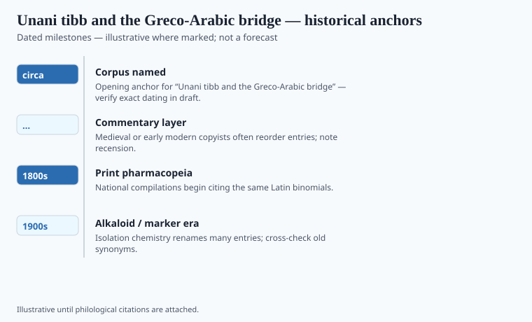

**Disclaimer.** Educational history only. Not medical advice. Past uses of plants do not prove safety or efficacy today. Do not use this series to self-treat or to market disease claims.

*Unani* means Ionian — Greek — in the mouths of the people who kept the word. The medicine it names in India and Pakistan is Greco-Arabic: humors, faculties, the *Canon*, the habit of the compound. It is also Indian in the only way that matters for a shop: the plants on the mat are often the plants of the subcontinent.

A *hakim* in nineteenth-century Lucknow or Hyderabad was not doing "alternative medicine." He was doing medicine. The Nawabs' and Nizams' courts paid him that way. The alternative arrived later, when the colonial college and then the postcolonial ministry drew the lines. Delhi's Sharifi family, Lucknow's Azizi line, Hyderabad's dawakhana culture: proper names, not a mist called "the East."

## Textual and archaeological context

<!-- graphics-pack:v1 -->

*Figure 1. Anchors for antiquity-to-modern framing — verify dates in draft.*

"Circa 1000 CE" marks the *Canon*'s world, not the birth of Unani as an Indian profession. The transmission is usually told as a relay: Greek to Syriac to Arabic to Persian to Urdu. Relays hide ships. The Indian Ocean carried *materia* as well as texts. Persian remained a learned clinic language into the colonial period; Urdu lithography — Munshi Naval Kishore's Lucknow presses among them — made the *Qānūn*'s grandchildren cheap.

Attewell treats this as social history rather than a decline-from-Avicenna story. Alavi follows families through the Company and the Raj. Decline narratives are a colonial hobby. They need a golden past and a dirty present. A lithograph is how a humoral pharmacy enters a railway century.

The Indian Medicine Central Council Act (1970) and the later AYUSH ministry licensed a version of Unani. They did not invent it. A licensed *hakim* and a family shop that never sought a number are not the same profession even when they share a *majun*. Pakistan and Bangladesh kept their own boards.

## Plants named in the surviving record

<!-- graphics-pack:v1 -->

*Figure 2. Comparative materia medica plate — illustrative line art, not botanical ID.*

The working Unani object is often a *qarābādin* — a formulary — not a single leaf. Indo-Persian shops compounded *majūn*, *jawārish*, *khamīra*, and *sharba* from pepper, sandal, saffron, senna, and a long vernacular synonymy. Calcined-metal *kushta* lines sit in the same cabinets as plant electuaries; they are a historical category, not a method this magazine will teach. Hakim Ajmal Khan’s Hindustani Dawakhana in Delhi is a named early-twentieth-century factory-and-college object. India’s later *National Formulary of Unani Medicine* (first volume in the early 1980s — `[VERIFY]` the imprint year) is a ministry book. It does not issue a U.S. label.

Classical Unani pharmacy loves the compound: *majun*, *khamira*, *sharbat*, *raughan*. Figure 2 shows simples because plates show simples. The historical object is often the electuary. Opium as a known tool, cannabis in some compounds, metals in some lines, a huge vernacular synonymy: the shelf is mixed on purpose.

A modern capsule of a single "Unani herb" is a factory-and-export object. If that capsule is sold in the United States as a dietary supplement, it lives under DSHEA, not under the *Canon*. The label's "ancient Unani" is a marketing tense. The monsoon is a climate and a shipping calendar. The jar is the subject. The rest is tourism.

## After AYUSH

A Bradford or Jackson Heights bottle that says Unani is often a DSHEA object if it sits on a U.S. shelf, and a different object if it sits under an Indian license. The *Canon* issues neither. Lithography issued the cheap manual. The monsoon issued the plants. The court issued the salary.

Attewell and Alavi are the historians to keep on the desk so the courtyard myth stays off the page. A *majun* is a compound with a house reputation. Reputation is data of a kind. It is not a trial. This series will not collapse those sentences. It will also not print a hookah. The jar is enough.

