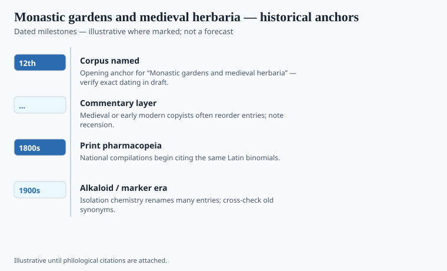

**Disclaimer.** Educational history only. Not medical advice. Past uses of plants do not prove safety or efficacy today. Do not use this series to self-treat or to market disease claims.

Editorial shell **#12** in the herbal-medicine history pack. Grok writer replaces stub paragraphs with sourced prose.

## Textual and archaeological context

<!-- graphics-pack:v1 -->

*Figure 1. Anchors for antiquity-to-modern framing — verify dates in draft.*

Draft shell for the Grok writer pass. Replace this paragraph with sourced narrative, primary citations, and `[VERIFY]` tags where print-ready dates are required.

## Plants named in the surviving record

<!-- graphics-pack:v1 -->

*Figure 2. Comparative materia medica plate — illustrative line art, not botanical ID.*

Draft shell for the Grok writer pass. Replace this paragraph with sourced narrative, primary citations, and `[VERIFY]` tags where print-ready dates are required.
