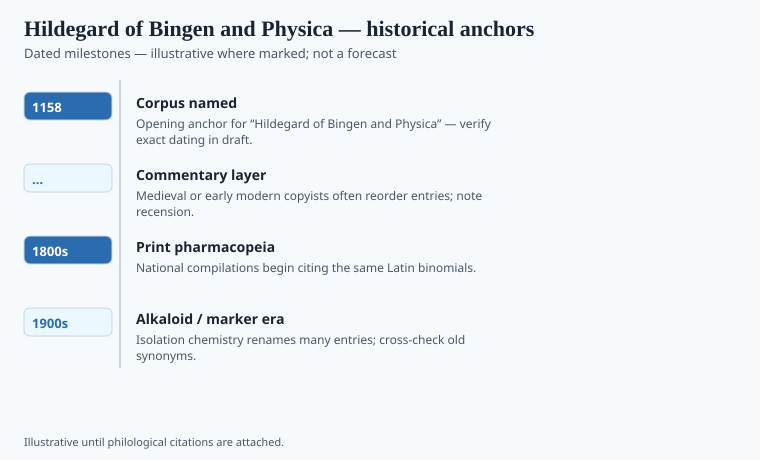

**Disclaimer.** Educational history only. Not medical advice. Past uses of plants do not prove safety or efficacy today. Do not use this series to self-treat or to market disease claims.

Hildegard of Bingen (1098–1179) saw visions, bullied abbots, wrote music that still fills churches, and compiled *Physica*, a book of things: plants, elements, trees, stones, fish, animals, each with a short, forceful paragraph. She will say that a herb is hot and dry, that it is good against a named sadness or a fever, that it should be taken in beer or as a mash. She writes like a person who has watched a garden and a sick dormitory in the same week.

She does not write like a 1980s naturopath. That voice was added later, mostly in German popular medicine after Gottfried Hertzka, then in American translation. The file date 1158 is a conventional midpoint of her writing life, not a colophon on *Physica*. `[VERIFY]` against the edition you cite; transmission of *Causae et curae* is messier still.

## Textual and archaeological context

<!-- graphics-pack:v1 -->

*Figure 1. Anchors for antiquity-to-modern framing — verify dates in draft.*

Hildegard was elected magistra at Disibodenberg and later founded Rupertsberg near Bingen; Eibingen is the later house. *Scivias* is the vision book. The music is a body of work that needs no herbal defense. *Physica* (*Liber simplicis medicinae*) is the plant, animal, and stone book. The 1158 flavor date in this pack is a teaching lock — `[VERIFY]` against Flanagan or Newman if a caption needs a composition year. She will sound, at moments, like the *Circa instans* because that was the international Latin style, not because she secretly attended Salerno.

Disibodenberg, then Rupertsberg, then Eibingen: Rhine houses in a country already full of Roman leftovers and German names. *Physica* mixes Latin labels and local uses. The twelfth century was also Constantine the African and Salerno. Hildegard is not a Salernitan. She is a German abbess with a Latin toolkit and a garden. She will sound, at moments, like the *Circa instans* because that was the international style, not because she secretly attended a college in Italy.

*Viriditas* — greenness as a name for living vigor — is a mystical and ecological idea. It is easy to print on a tea tin. The tin is brand work. The visions are visionary work. Keep them in different sentences. She cannot consent to a trademarked spelt biscuit.

## Plants named in the surviving record

<!-- graphics-pack:v1 -->

*Figure 2. Comparative materia medica plate — illustrative line art, not botanical ID.*

*Physica*’s plant book runs a repeated grammar: a name, a temperament (hot, cold, dry, moist), a use, a vehicle — wine, honey, a poultice. Fennel, sage, and spelt sit in a Rhine kitchen that was already growing them. Galangal and pepper sit there as bought goods that had walked from other climates. *Causae et curae* is the companion medical file; specialists still argue how much of it is hers — `[VERIFY]` against a Hildegard handbook before a caption treats both titles as one autograph. Quote a paragraph in that grammar if you honor her. Do not turn “for the fever” into a license.

Spelt (*Dinkel*) is in her dietetic world as a grain among grains. Sage, fennel, the Rhine weeds a house already grew: Figure 2 will look like the monastic plate because it is the same ecology. The difference is a named author with a political life. Quote a plant paragraph in full — heat, use, vehicle — then say, plainly, that a twelfth-century indication is a historical sentence, not a license to treat a disease.

If a magazine wants to honor her, it could stop photographing wimples at golden hour and start admitting which paperback is Hertzka. The plants belong to a humoral vocabulary and a river valley. They are not waiting to complete anyone's protocol.

## After the trademark

German bookshops still sell "Hildegard-Medizin" as if the abbess had a clinic in Bingen with a till. Hertzka and his heirs built a twentieth-century system and hung her name on it. Flag that in any photo caption that includes a modern bottle. She wrote *Physica*. She did not write a barcode.

Rupertsberg burned and was rebuilt in memory. The music is the part of her that needs no herbal defense. The plant paragraphs need the opposite of defense: a full quote, a humoral vocabulary, a refusal to treat a twelfth-century "for the fever" as a license. If this pack has a house style for saints, it is that. No golden hour. No wimple stock. A parsley bed and a page.

