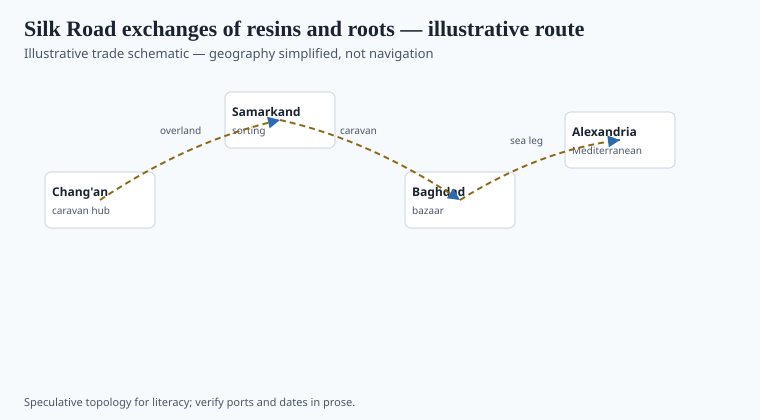
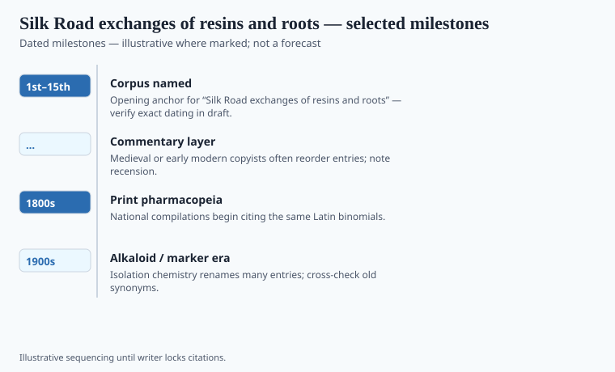

**Disclaimer.** Educational history only. Not medical advice. Past uses of plants do not prove safety or efficacy today. Do not use this series to self-treat or to market disease claims.

Ferdinand von Richthofen coined *Seidenstraße* in the nineteenth century. The caravans did not need the name. They needed water, protection, and a market for things that weighed little and sold high: silk, yes, and also musk, camphor, rhubarb, myrrh, incense woods, mineral blues. A physician in Chang'an or in Baghdad met those goods as drugs and as luxuries in the same hour. The oasis did not sort them into faculties.

This essay is not a map you could march with. Figure 1 is a schematic. Real routes braided, died, and reopened with dynasties and droughts.

## Routes and ports in the record

<!-- graphics-pack:v1 -->

*Figure 1. Illustrative trade schematic for “Silk Road exchanges of resins and roots” — simplified geography, not navigation or modern routing.*

Hansen's *Silk Road* is the book that replaces a single highway with documents: contracts, passports, the Astana graves, the fact that much "Silk Road" trade was local hops. Schafer's *Golden Peaches* is the Tang appetite: what a capital wanted from the west and the south. Camphor from the Malay world, not from a desert; rhubarb from Chinese highlands moving west; "Roman" glass and Mediterranean coral moving east. Pharmacy is a subset of that appetite.

Dunhuang and Turfan fragments name drugs in several scripts. A Sogdian merchant and a Chinese official could disagree about a synonym and still close a sale. The disagreement is the historical texture. A modern "Silk Road wellness" collection is a trademark that skipped the synonym fight.

Maritime routes (next essay) carried more bulk in some centuries than the overland braid. The two files belong together. This one stays with the oases and the Tarim, and with the overland prestige that later European maps exaggerated.

## What changed when the cargo landed

<!-- graphics-pack:v1 -->

*Figure 2. Dated beats to verify in draft — not a clinical efficacy chart.*

When a resin landed in a Tang official herbal or in an Arabic *mufradāt*, it gained a temperament and a job. That is a category change, not a chemical one. Rhubarb as a cathartic in Greek and Arabic texts and rhubarb as a Chinese simple are related careers of a plant that grew in particular hills. The hills did not move. The indications did.

Figure 2's beats should stay documentary: Han foreign-goods notes, Tang *bencao* enlargements, Mongol-period traffic, Timurid and Ming interruptions. `[VERIFY]` any year that looks too round. Efficacy charts do not belong here. A resin that "opened" a blockage in Galenic language is a historical claim about a school, not a trial endpoint.

Empires taxed the high-value load. Bandits took it. Monasteries stored it. The leftover historical fact is ordinary: **a drug is often a trade good that learned a medical sentence.** The sentence can be forgotten. The trade route, when it dies, takes the sentence with it unless a book was copied. This pack is a pile of those books.

## After the oasis

A "Silk Road" tea in a mall is a twentieth-century flavor word. The oases moved resins that later *bencao* and *mufradāt* had to file. Filing is the historical event. Camphor did not become Chinese because a caravan wished it. It became a named simple in a book that had to decide whether last year's name still pointed at this year's sack.

Hansen's hop-by-hop road is the corrective to the highway poster. Schafer's peaches are the corrective to a grim-only ledger: capitals wanted beauty and scent as well as catharsis. Wanting is not a trial. The leftover work for an editor is to keep Figure 1's arrows from looking like a tour. They are a tax problem and a synonym problem. Those are the two problems pharmacy inherited from trade.

<!-- prose-expand:v1 14-silk-road-medicinals.md -->
## Schafer's peaches, Hansen's hops, a rhubarb hill

Edward H. Schafer's *Golden Peaches of Samarkand* (1963) is still the Tang exotic-goods book: aromatics, gems, and the court's appetite. Valerie Hansen's *Silk Road* (2012) insists on hop-by-hop oases instead of a highway poster. Camphor (*Cinnamomum camphora* and the Borneo *Dryobalanops* fight), storax, myrrh, and Chinese rhubarb (*Rheum*) are the teaching cargoes. Rhubarb's Greek and Arabic cathartic career and its Gansu/Qinghai hillside are related sentences about a plant that did not move.

Han *fangwu* notes, Tang *bencao* enlargements, Mongol-period traffic, Ming interruptions: Figure 2's documentary beats. `[VERIFY]` round years. The Sogdian letters and the Astana graves are the archaeological tone: a sack, a name, a tax. Monasteries stored aromatics as liturgy and as medicine. Bandits took the same load.

A mall "Silk Road" tea is a flavor word. Figure 1's arrows are a synonym problem and a customs problem. Pharmacy inherited both.
