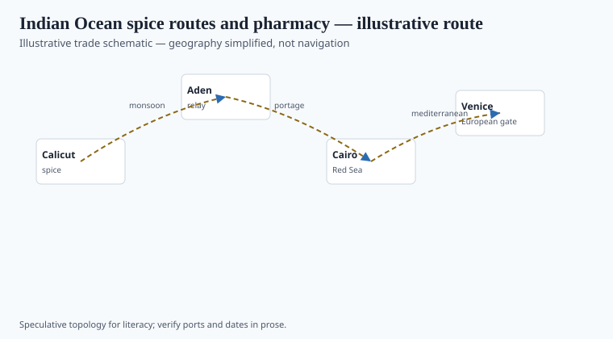
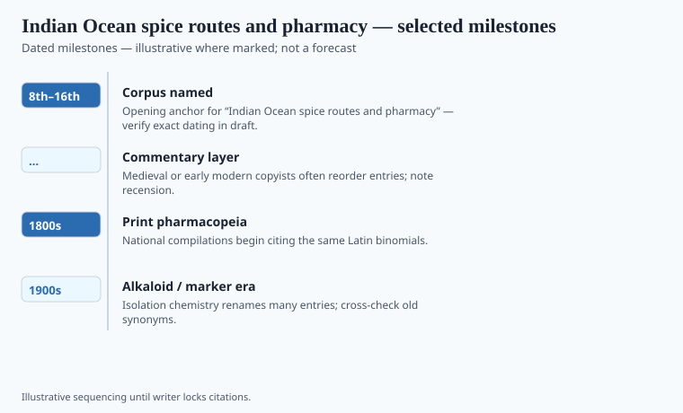

**Disclaimer.** Educational history only. Not medical advice. Past uses of plants do not prove safety or efficacy today. Do not use this series to self-treat or to market disease claims.

Editorial shell **#15** in the herbal-medicine history pack. Grok writer replaces stub paragraphs with sourced prose.

## Routes and ports in the record

<!-- graphics-pack:v1 -->

*Figure 1. Illustrative trade schematic for “Indian Ocean spice routes and pharmacy” — simplified geography, not navigation or modern routing.*

Draft shell for the Grok writer pass. Replace this paragraph with sourced narrative, primary citations, and `[VERIFY]` tags where print-ready dates are required.

## What changed when the cargo landed

<!-- graphics-pack:v1 -->

*Figure 2. Dated beats to verify in draft — not a clinical efficacy chart.*

Draft shell for the Grok writer pass. Replace this paragraph with sourced narrative, primary citations, and `[VERIFY]` tags where print-ready dates are required.
