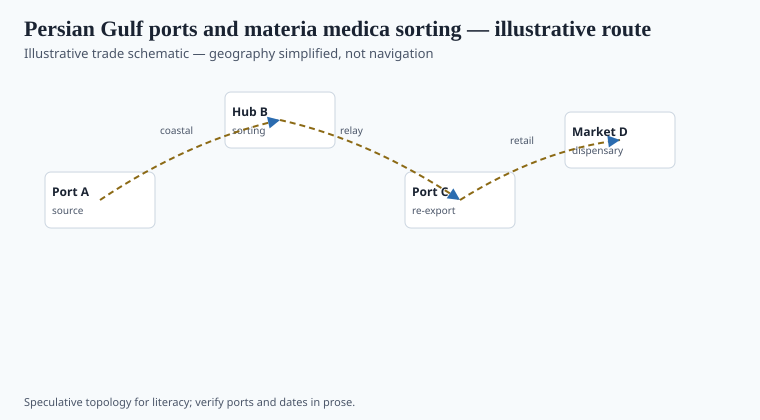
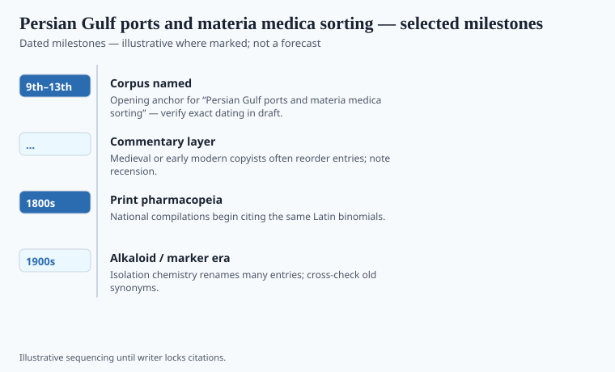

**Disclaimer.** Educational history only. Not medical advice. Past uses of plants do not prove safety or efficacy today. Do not use this series to self-treat or to market disease claims.

Basra and Siraf in the ninth and tenth centuries were places where a sack could change languages in an afternoon. Frankincense and myrrh from the Arabian south, Indian pepper and metals, East African goods, Chinese and Southeast Asian camphor: the Gulf is a sorting table. Baghdad's hospitals and bookshops ate what the table passed. A *mufradāt* compiler who never took ship still wrote Gulf sentences because the market did.

Hormuz later took more of the choke-point fame. The file's 9th–13th century window is the Abbasid-to-Mongol stretch when Arabic pharmacy books thickened with goods that had passed a customs house.

## Routes and ports in the record

<!-- graphics-pack:v1 -->

*Figure 1. Illustrative trade schematic for “Persian Gulf ports and materia medica sorting” — simplified geography, not navigation or modern routing.*

Siraf's excavations (Whitehouse and successors) are the archaeological check on the literary port: a city that lived by the sea and died by earthquake and shifting routes. Figure 1 is not a pilot book. It is a reminder that "Arabian pharmacy" in a caption is often a Gulf warehouse plus a Persian and Indian hinterland.

Ibn al-Bayṭār, walking in the thirteenth century from al-Andalus to the Levant and Egypt, still had to account for Gulf names. Al-Kindī's earlier *Aqrābādhīn* (Levey's edition) shows compounds that assume imported simples. The port is present even when the author is not standing on a quay.

## What changed when the cargo landed

<!-- graphics-pack:v1 -->

*Figure 2. Dated beats to verify in draft — not a clinical efficacy chart.*

Sorting means grade: which frankincense, which camphor, which "Indian" root is last year's cheat. Pharmacognosy is a dock skill before it is a university skill. When the same sack reached a Galenic shop in Cairo, it gained degrees. When it reached a hospital chest, it gained a lock.

Figure 2's beats: Abbasid Basra, Siraf's peak, Fatimid and then Ayyubid redistribution through the Red Sea as a rival funnel, Mongol-period shocks, Hormuz's later rise. `[VERIFY]` Siraf destruction dates against the excavation reports. Do not print an efficacy curve for myrrh. Print a grade argument. The argument is the history.

A modern "frankincense supplement" sold under DSHEA is a legal object in a different funnel. The Gulf medieval funnel was a customs house and a hospital. They do not share a label, only a tree.

## After the customs house

Baghdad's books are why we remember the Gulf as a pharmacy. Siraf's stones are why we should remember it as a city that could fail. A compiler who lists "Indian" and "Yemeni" grades is doing dock work in a study. Ibn al-Bayṭār walking is the same work with mud on the shoes.

Modern frankincense capsules are a different funnel: often DSHEA if they sit on a U.S. shelf, with a structure/function sentence that would have puzzled a *bīmāristān*. The tree is old. The sentence is new. Figure 2's beats should stay ports and dynasties. If a designer wants a "wellness" tint on the resin, kill the tint. Grade arguments are the history. Glow is the lie.

<!-- prose-expand:v1 16-arabian-gulf-pharmacy.md -->
## Siraf's Friday mosque, Hormuz, a grade

David Whitehouse's excavations at Siraf (1960s–1970s) made a Gulf entrepôt archaeologically visible: a Friday mosque, merchants' houses, Chinese stoneware in the fill. Decline after tenth- and eleventh-century earthquakes and political shocks is an excavation argument — `[VERIFY]` the destruction sentence against the reports. Basra earlier and Hormuz later are the other funnels. The Red Sea (Aydhab, then Jedda) is the rival.

Ibn al-Bayṭār (d. 1248) compiled simples by walking and by reading; his *Jāmiʿ* is dock work in a study. Sohar and later Hormuz customs houses sorted frankincense (*Boswellia*) by color and fracture the way a modern pharmacognosist sorts a voucher. "Indian" as a medieval grade is a direction, not a species. When the sack reached a Cairo shop it gained Galenic degrees. When it reached a *bīmāristān* it gained a lock.

A U.S. frankincense capsule is usually a DSHEA sentence. A Fatimid customs clerk had no such sentence. They share a genus. Figure 2 stays ports and dynasties. Kill any wellness tint on the resin.
