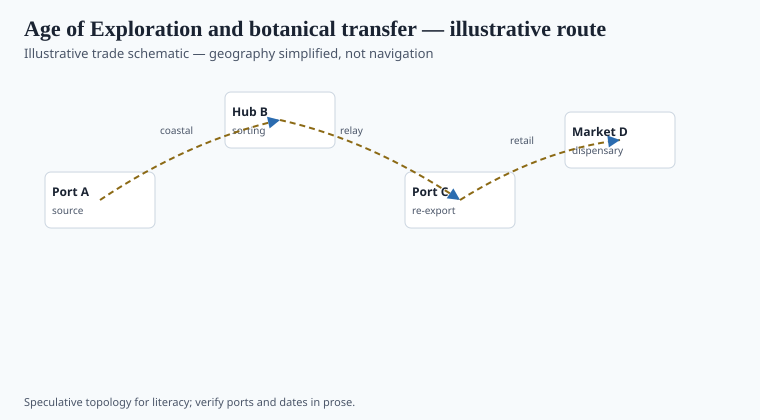
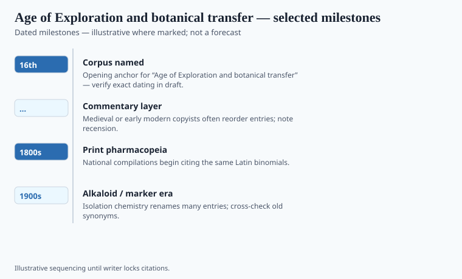

**Disclaimer.** Educational history only. Not medical advice. Past uses of plants do not prove safety or efficacy today. Do not use this series to self-treat or to market disease claims.

"Age of Exploration" is a European filing for a century when Iberian ships made other people's gardens into European problems. The plants were already known to the people who grew them. What changed in the 1500s was who could move a living specimen, who printed the name, and who taxed the dried bark.

Orta in Goa (1563) and Monardes in Seville (1565–74) are the two printed mouths of that change: one arguing from an Indian bazaar, one advertising New World goods to a Spanish public. Clusius rearranged both for a northern Latin public. Rearrangement is a kind of shipping.

## Routes and ports in the record

<!-- graphics-pack:v1 -->

*Figure 1. Illustrative trade schematic for “Age of Exploration and botanical transfer” — simplified geography, not navigation or modern routing.*

Lisbon, Seville, Antwerp, Amsterdam, London: the European nodes. Goa, Melaka, Manila, Veracruz, Cartagena: the other nodes. Figure 1 will look like a triumph. Caption it as a set of armed routes. Schiebinger's *Plants and Empire* keeps asking who taught the plant and which knowledge (the abortifacient peacock flower is her famous case) did not transfer because the empire did not want it to. Non-transfer is part of extraction.

The peacock flower is *Caesalpinia pulcherrima*. Name it. Enslaved and Indigenous women held the abortifacient use; European printed herbals often declined to carry it. That refusal is a historical event sitting inside the same ports the schematic treats as arrows.

Padua's 1545 *orto*, Leiden's garden, the later Chelsea Physic Garden (1673) and Kew: living catalogs for students and for states. John Tradescant the Elder hauled living curiosities toward London for Buckingham and then for Charles. A labeled bed is a check on a merchant's sack. It is also a trophy case.

## What changed when the cargo landed

<!-- graphics-pack:v1 -->

*Figure 2. Dated beats to verify in draft — not a clinical efficacy chart.*

Garcia de Orta’s *Colóquios* (Goa, 1563) argues plant by plant against Pliny from a garden and a bazaar: clove, cinnamon, tamarind, the betel quid, a pepper he could buy on the dock. Carolus Clusius’s *Aromatum et simplicium* (Antwerp, 1567) is that book in Latin dress for the north. Nicolás Monardes, in Seville, sold sassafras and tobacco as New World courses. José de Acosta’s *Historia natural y moral de las Indias* (1590) is a Jesuit attempt to file the same cargo as natural history. The cargo did not change. The sentence did: a Nahuatl plant gained a Galenic temperament; an Asian plant gained a Latin synonym war.

Figure 2’s beats should stay documentary: 1492 as a political date (not a botanical one), 1563 Orta, 1570s Hernández in Mexico, Dutch VOC gardens. `[VERIFY]` Hernández expedition years. Do not add an efficacy column. The historical remainder is a ledger: who collected, who printed, who was paid, who was not named. Vinca and cinchona later in this pack are the same remainder with different centuries.

## After the Wardian case

The glazed case that later made seedlings survivable on a wet deck is a nineteenth-century machine sitting just outside this 16th-century file. Mention it as a sequel, not as a 1500s fact. Sixteenth-century transfer was seed, slip, and dried sack, plus a lot of death in the hold.

Monardes sold the New World to a Spanish reader who wanted a course for the pox. Orta sold an Indian bazaar to a Portuguese reader who still believed Pliny. Both sales were books. Both books moved because ships moved. Schiebinger's non-transfer — the knowledge that stayed in the colony — is the caption Figure 1 cannot draw. Draw it in prose. A garden with paths is still a warehouse. `[VERIFY]` Hernández expedition years against a modern Hernández bibliography before Figure 2 prints a single 1570s box as gospel.

