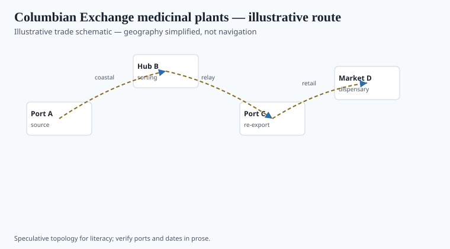
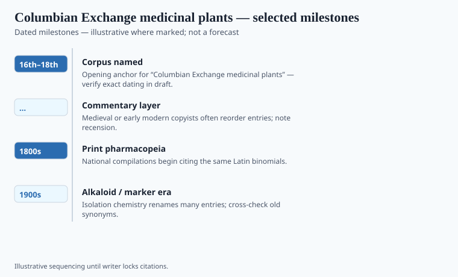

**Disclaimer.** Educational history only. Not medical advice. Past uses of plants do not prove safety or efficacy today. Do not use this series to self-treat or to market disease claims.

Alfred Crosby named the Columbian Exchange in 1972. The ships had been moving the cargo for four and a half centuries. Maize, potato, and tomato get the food chapters. This essay wants the shop: *Capsicum*, tobacco, guaiacum (the wood Europeans turned into a syphilis fashion), cinchona bark, coca leaf, ipecacuanha. In the other direction: Old World weeds, sugar, horses, and the disease load — smallpox first in the usual telling — that emptied cities. Hispaniola's Taíno world is the teaching emptiness. A medicinal plant crossing an ocean does not cancel it. Seville's *Casa de Contratación* tried to make the new jars an official Spanish product. The jars filled. The towns did not.

## Routes and ports in the record

<!-- graphics-pack:v1 -->

*Figure 1. Illustrative trade schematic for “Columbian Exchange medicinal plants” — simplified geography, not navigation or modern routing.*

The *Casa de Contratación* in Seville licensed pilots and tried to license knowledge. Treasure fleets ran a *flota* toward Veracruz and *galeones* toward Nombre de Dios and later Portobelo. Andrés de Urdaneta’s 1565 *tornaviaje* made the Manila galleon a yearly Pacific stitch. Lima and the Andean *yungas* fed the same funnels from the south. The Imperial College of Santa Cruz de Tlatelolco (1536) is where Martín de la Cruz and Juan Badiano made the 1552 *Libellus* — now Vatican Barb. lat. 241 — as a presentation gift, not a free ethnography. The paintings are among the century’s best plant portraits. The Latin is the passport. The college sat on a conquered market.

Sahagún's *Florentine Codex*, book 11, is the larger warehouse from the same generation. Hernández's royal expedition in the 1570s tried to do the job with a Spaniard's authority. Read them as colonial files that still hold Indigenous labor.

## What changed when the cargo landed

<!-- graphics-pack:v1 -->

*Figure 2. Dated beats to verify in draft — not a clinical efficacy chart.*

Ulrich von Hutten advertised guaiacum as a pox course in 1519; Caribbean *Guaiacum officinale* and *G. sanctum* paid for that fashion in trees. Ipecacuanha entered European dysentery files as a Brazilian root; Helvetius later sold a Paris secret that was the same root with better publicity. Tobacco became a vice, a medicine, and a tax (later essay). Cinchona became Jesuit's bark and then a plantation crop. Albert Niemann isolated cocaine from coca leaf in Göttingen in 1860. The leaf’s Andean life did not wait for Göttingen. Each landing is a different sentence.

Figure 2: 1492, 1552 Badianus, 1560s–70s Monardes, 1630s Jesuit bark in Rome, 18th-century cinchona arguments. `[VERIFY]` the first European cinchona dates against Honigsbaum and the countess legend's collapse (Haggis). No efficacy chart. The exchange was not a gift exchange. It was a set of ships with guns and a set of shops with new jars. The jars are still on the timeline. So are the empty towns.

## After the gift

The Badianus manuscript left for court and sat in the Vatican. Mexico got a famous facsimile in the twentieth century. Nationalism embraced it as proof of a scientific past. The embrace saved it from being only a curiosity. It also flattened it into a monument. A monument does not argue. The *Libellus* argues on every painted page: this name, this use, in a city under a new king.

Norton's *Sacred Gifts, Profane Pleasures* is the tobacco file if you need a named monograph beside Crosby. Crosby's category is useful if you let disease and food sit next to the shop. It is harmful if you make 1492 a botanical birthday. The plants had birthdays. The ships had flags. Guaiacum, tobacco, cinchona, coca: four later careers, four later statutes. This essay only opens the crate. The other essays in this pack file the contents one statute at a time. `[VERIFY]` first European cinchona dates against Honigsbaum before a caption revives the countess legend as fact.

