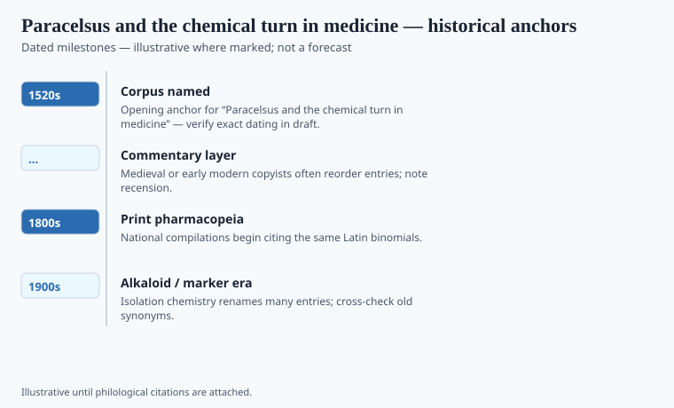

**Disclaimer.** Educational history only. Not medical advice. Past uses of plants do not prove safety or efficacy today. Do not use this series to self-treat or to market disease claims.

Theophrastus Bombastus von Hohenheim (c. 1493–1541), who called himself Paracelsus, made a career of insulting dead physicians and living apothecaries. He wanted chemistry in the clinic: metals, mineral acids, distilled oils, antimony, mercury, opium in his own laudanums. He wanted, loudly, to be right.

Later toxicology printed him on posters: *Sola dosis facit venenum* — the dose makes the poison. The sentence is a fair compression of things he wrote. It is not a license to take a poison carefully at home. It is not, by itself, a modern dose-response curve. The "1520s" in the file is the decade of his Basel theatrics (1527–28) and the wandering that made the legend.

## Textual and archaeological context

<!-- graphics-pack:v1 -->

*Figure 1. Anchors for antiquity-to-modern framing — verify dates in draft.*

<!-- under-fig:v2 -->
He lectured in Basel in 1527 in German, insulted the faculty, and did not last. The *Paragranum* and *Opus paramirum* are the theoretical files; the *Grosse Wundarznei* is the wound book. The dose-and-poison sentence later printers made portable (*sola dosis facit venenum*) is a tag, not a compliance program. Iatrochemistry’s academic heirs — van Helmont, Sylvius, the mineral section of the 1618 *London Pharmacopoeia* — are a committee digesting a fighter. He died in Salzburg in 1541. Later engravings guess at the face.

He looked at theriac and saw a coward's pantry. Why seventy ingredients if one *arcanum* will do? The attack on Galenic compounding is the part that still feels modern. It is also unfair. A compound can be a delivery system. He preferred a philosophy in which a disease had a specific chemical enemy. Specificity would later feed the isolate era. He lived in a world of impure salts and grand claims.

His mercury and antimony courses killed and saved in ratios we cannot audit. Iatrochemistry after him — van Helmont, the London pharmacopeia's uneasy mineral pages — kept the argument going until something like chemistry arrived to make it testable. The 1618 *London Pharmacopoeia* already had to decide which of his heirs to officialize.

## Plants named in the surviving record

<!-- graphics-pack:v1 -->

*Figure 2. Comparative materia medica plate — illustrative line art, not botanical ID.*

He used opium. So did everyone with a night practice. Figure 2 will still show plants because this pack's plate habit is plants. His turn is toward the mineral and the distilled oil. The historical move is to keep a vegetable drug inside a chemical rhetoric rather than only a Galenic one.

Quoting only the dose line is how you turn a sixteenth-century prophet into a safety officer. When a supplement advert says "it's the dose that matters" next to a leaf, it is borrowing his prestige to dodge whether the capsule does anything and whether it is a DSHEA object. He cannot answer DSHEA. He is dead, and he was not in the Senate.

Keep the fight with Galen. Keep the stubborn idea that a single active might beat a paste of prestige. Then walk into Withering and Sertürner, who had the bad manners to measure. The dose makes the poison. The archive makes the historian. Neither sentence tells you how much of anything to swallow.

## After Basel

He died in Salzburg in 1541. The face on later engravings is often a printer's guess. The *London Pharmacopoeia* of 1618 had to decide which mineral heirs to keep. That decision is a committee's Paracelsus. His own Paracelsus is a fighter with a cosmology a chemistry department would not fund.

The isolate era later made his specificity look prophetic. Prophecy is cheap after the crystal exists. What he actually did was insult a gravy of names and put mercury in a rhetoric of reform. Patients paid. The shop changed, slowly. Withering and Sertürner measured. Measurement is the sequel that does not need his hood. If you illustrate this essay, use a title page, not an alchemist stock photo. The title page is how he fought. The hood is how we made him cute.

<!-- prose-expand:v1 19-paracelsus-chemical-medicine.md -->
## Basel 1527, a dose sentence, 1618 heirs

He lectured in Basel in 1527 in German, insulted the faculty, and did not last. The *Paragranum* and *Opus paramirum* are the theoretical files; the *Grosse Wundarznei* is the wound book. The dose-and-poison sentence lives in later Latin tags (*sola dosis facit venenum*) that printers made portable. Patients still paid for mercurials. Iatrochemistry's later academic life (van Helmont; Sylvius; the 1618 *London Pharmacopoeia*'s mineral section) is a committee digesting a fighter.

He used opium laudanum in a chemical rhetoric. So did night practice generally. The historical move is specificity: a single active against a Galenic paste of prestige names. That move looks prophetic after Sertürner's crystal. Prophecy is cheap after the crystal. He died in Salzburg in 1541. Later engravings guess at the face.

A supplement line that quotes the dose sentence next to a leaf is borrowing a dead reformer to dodge whether the capsule does anything and whether it is a DSHEA object. He was not in the Senate. Use a title page if you illustrate. Not a cute hood.
