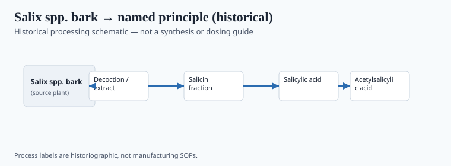
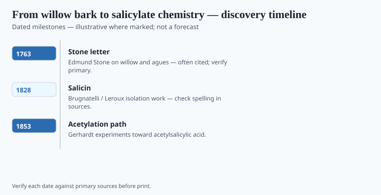

**Disclaimer.** Educational history only. Not medical advice. Past uses of plants do not prove safety or efficacy today. Do not use this series to self-treat or to market disease claims.

In 1763 the Reverend Edward Stone of Chipping Norton wrote to the Royal Society about the bark of white willow. He had dried it, powdered it, and given it to people with agues, on a hunch that a bitter bark from damp ground might stand in for expensive Peruvian bark. The letter is modest and specific. It is not a molecule.

A hundred years of chemistry later, salicin and salicylic acid were named objects. In 1897 Felix Hoffmann, at Bayer in Elberfeld, acetylated salicylic acid; in 1899 the firm sold "Aspirin." Whether Hoffmann or Arthur Eichengrün deserves the credit is a live fight. The trademark is not in doubt.

## From materia medica to named principle

<!-- graphics-pack:v1 -->

*Figure 1. Historical processing schematic — not synthesis instructions or dosing guidance.*

Figure 1 may show bark → a named crystal → a factory powder. Read it as a change of economy, not as a method. This essay will not list reagents. Henri Leroux isolated salicin from willow in 1829; Raffaele Piria pushed toward salicylic acid; Hermann Kolbe, in the 1850s–60s, gave industry a coal-tar route that made the tree optional. Physicians were already using salicylates for rheumatic fever in the 1870s (MacLagan; Stricker and others) before Bayer's tin. Acetylation was a commercial answer to a known stomach complaint.

Dioscorides and Hippocrates get dragged into aspirin ads the way they get dragged into wine ads. Check the passage. Often you are looking at a general astringent bark, not a prophecy of cyclooxygenase. John Vane's 1971 prostaglandin paper explains a powder already on the market. Mechanism is not origin.

Meadowsweet (*Filipendula ulmaria*, the older *Spiraea*) gave the *spir-* in the trade name and had its own fever-tea folklore. Two plants, one tin.

## Laboratory milestones readers should know

<!-- graphics-pack:v1 -->

*Figure 2. Laboratory and regulatory dates to cite — no fabricated effect sizes.*

<!-- under-fig:v2 -->
Edward Stone’s letter ran in the *Philosophical Transactions* for 1763. Henri Leroux isolated salicin from willow bark in 1828–1829. Raffaele Piria moved from salicin toward salicylic acid in the 1830s. Hermann Kolbe’s 1859–1860 industrial synthesis made the tree optional. Felix Hoffmann’s 10 August 1897 notebook acetylation is Bayer’s official romance; Arthur Eichengrün’s later claim that he directed the work remains contested because 1933 wrote a Jewish chemist out of a firm’s memory. Heinrich Dreser pushed the 1899 Aspirin tin. Figure 2 carries those dates, not a pain-score bar. A U.S. willow-bark capsule is a DSHEA powder. Acetylsalicylic acid is a drug. Keep the letter, the crystal, and the tin in separate rooms.

1763 Stone; 1829 Leroux; Kolbe's synthesis years; 1897 acetylation; 1899 trademark; later generic life and cardiology debates that do not belong here as advice. Figure 2 should carry those dates, not a bar chart of pain scores. The Eichengrün claim (a Jewish chemist written out after 1933) is contested; say so rather than settling it in a caption.

Willow bark as a modern dietary-supplement powder is a DSHEA object in the United States, variable as plant material. Aspirin is a defined compound and a drug. Confusing them is how people get a gastritis and a story. Stone asked the Royal Society to look. Bayer asked pharmacists to stock a tin. Keep the letter, the crystal, and the tin in separate rooms.

## After the tin

Aspirin became generic, then a cardiology object, then an argument about prevention. None of that is advice here. Jeffreys's book is usable if you watch Bayer's shine. The Eichengrün file stays open. Kolbe's coal-tar route is the moment the tree became optional. Optional trees are the modern condition of many "natural" drugs: the isolate works, the leaf does the myth.

A U.S. willow-bark capsule is a DSHEA object with variable bark. Aspirin is a drug. Stone's letter is a country experiment. Three rooms. Figure 1 should never be read as a home process. If a designer adds a "try this at home" tint, kill the tint. The Royal Society was asked to look. Looking is the whole invitation. Swallowing is another essay, and not this magazine's job.

<!-- prose-expand:v1 20-willow-salicylate-path.md -->
## Stone, Leroux, Kolbe, a contested 1897

Edward Stone, vicar of Chipping Norton, wrote the Royal Society in 1763 about willow bark and the doctrine of signatures he claimed he was not using — he was using it, a little, and also a country trial. Henri Leroux isolated salicin in 1828–1829. Raffaele Piria made salicylic acid from it. Hermann Kolbe's 1860 industrial synthesis made the tree optional. Felix Hoffmann's 10 August 1897 notebook acetylation is Bayer's official romance. Arthur Eichengrün later said the work was his direction; the file is contested because 1933 made a Jewish chemist disappear from a firm's memory. Say contested.

Heinrich Dreser pushed the tin. Aspirin became a trademark (1899), then a generic word, then a cardiology object. None of that is advice. Jeffreys's *Aspirin* is usable if you watch the shine. A U.S. willow-bark capsule is a DSHEA powder. Acetylsalicylic acid is a drug. Three rooms: letter, crystal, tin. Figure 1 is not a home process.
