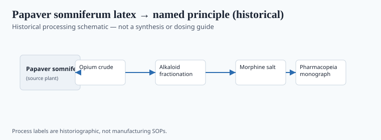
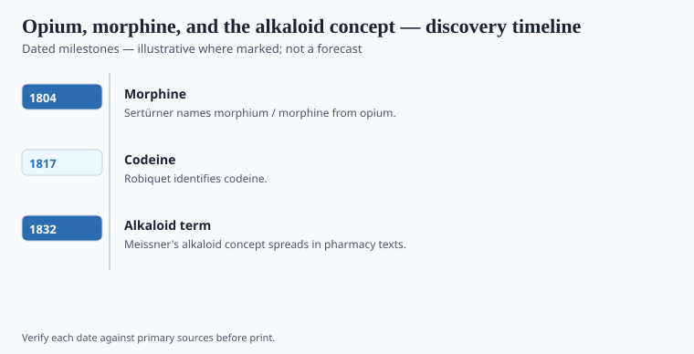

**Disclaimer.** Educational history only. Not medical advice. Past uses of plants do not prove safety or efficacy today. Do not use this series to self-treat or to market disease claims.

Friedrich Wilhelm Sertürner, a young apothecary in Paderborn and then Einbeck, worked with the official sticky cake called opium — dried latex of *Papaver somniferum*. Pharmacopeias already told him how to make tinctures. They did not tell him which part of the tar put a patient under. In work he dated to 1804 and published more fully later (the 1817 paper is the one that traveled), he separated a crystalline substance he named after Morpheus.

He tried it on himself and on dogs. That sentence is not a dare. It is a record of how isolation ethics looked before boards. This essay will not describe how to separate anything.

## From materia medica to named principle

<!-- graphics-pack:v1 -->

*Figure 1. Historical processing schematic — not synthesis instructions or dosing guidance.*

Opium is a mixture. A tincture made in January is not a tincture made in July if the raw cake differs. A crystal with a name can be weighed. Weighing is the beginning of modern dose, of overdose as a number, of industrial production, of the later hypodermic century. Figure 1 is a historical cartoon of that change. It is not a process sheet.

Meissner coined *Alkaloid* in 1819 for plant bases that could be salted and sold. Pelletier and Caventou took the habit to nux vomica (strychnine, 1818) and cinchona (quinine, 1820). Runge isolated caffeine in 1819. The 1804–1832 window in the file is the concept's birth decade, not a complete census of isolates.

Dioscorides already knew the poppy's juice as a sleep and a killer. Sydenham had his laudanum. The crystal did not invent the plant. It invented a second object.

## Laboratory milestones readers should know

<!-- graphics-pack:v1 -->

*Figure 2. Laboratory and regulatory dates to cite — no fabricated effect sizes.*

For this pack: Sertürner isolated morphine in the first years of the nineteenth century and convinced the wider chemical world around 1817. If a caption needs one year, 1817 is the year the news behaved like news. C. R. A. Wright's 1874 diacetylmorphine, later Bayer's Heroin, is just outside the file window and belongs in the administrative sequel (Harrison 1914; Single Convention 1961). Figure 2 should not print a "strength" bar. Strength is why the lock was invented.

A hospice ward and a street market share a plant and do not share a world. History that pretends they do is propaganda. History that pretends they do not share a molecule is sentiment. No cultivation notes. No slang tutorial. The poppy's administrative life is forms. Forms are less pretty than petals. They are the truth of how a medicine becomes a controlled substance without the plant changing its mind.

## After the crystal

The hypodermic mid-century and the American Civil War taught a generation the alkaloid's mercy and its hook. Harrison (1914) and the 1961 Single Convention are administrative sequels. A hospice can still run short of oral morphine while a treaty system congratulates itself. That sentence is not an argument for a kitchen garden. It is an argument that administration has side effects.

Sertürner wanted a cleaner drug. He got one. Clean is not the same as kind in the long run. Once you believe the useful part of a plant is a molecule, the rest becomes "impurity" or, a century later, "entourage," depending on the marketing decade. Both words are arguments. Figure 1 is not allowed to become a methods poster. The 1817 paper and the poppy's older life are the file. The rest is police and hospital business, separately.

<!-- prose-expand:v1 21-opium-alkaloid-discovery.md -->
## 1817, a hypodermic, two statutes

Sertürner's papers in 1805–1806 did not travel. The 1817 *Annalen der Physik* piece, and Gay-Lussac's attention, did. If a caption needs one year, use 1817. Robiquet isolated codeine in 1832. C. R. A. Wright made diacetylmorphine in 1874; Bayer trademarked Heroin in 1898. Alexander Wood's hypodermic work (1850s) and the American Civil War taught a generation intramuscular mercy and a hook.

The Harrison Narcotic Act (1914) and the Single Convention on Narcotic Drugs (1961) are administrative sequels. A hospice can still run short of oral morphine while a treaty system congratulates itself. That is not a kitchen-garden argument. It is an administration side effect. "Impurity" and "entourage" are later marketing words for the same leftover plant. Both are arguments.

Figure 1 is not a methods poster. Figure 2 gets no strength bar. Forms are the truth of how a medicine becomes a controlled substance without the poppy changing its mind. No slang tutorial. No cultivation.
