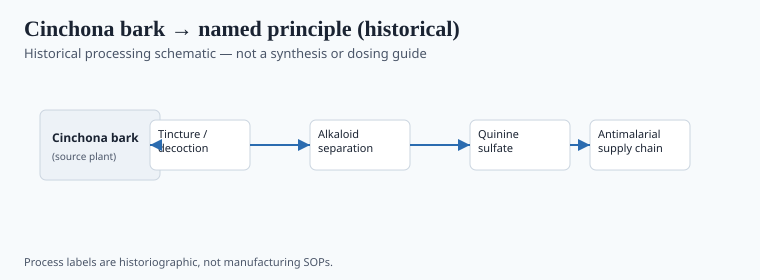
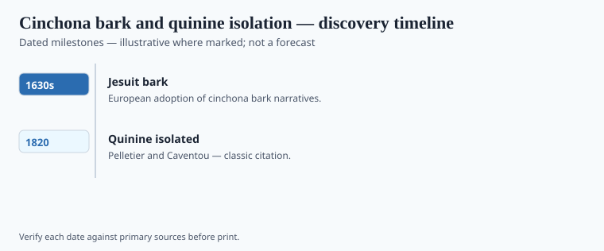

**Disclaimer.** Educational history only. Not medical advice. Past uses of plants do not prove safety or efficacy today. Do not use this series to self-treat or to market disease claims.

The story everyone likes is this: the Countess of Chinchón, dying of fever in Lima, is saved by a bark; she brings it to Spain; Linnaeus names the genus (and misspells the title). A. W. Haggis and later historians chased the countess through archives and came back with almost no contemporary body. What we do have is bark, Jesuits, a Roman distribution in the 1630s–40s, Protestant suspicion of a "Popish" powder, and — by the nineteenth century — ounces measured against a parasite that was eating armies.

Pierre-Joseph Pelletier and Joseph Bienaimé Caventou isolated quinine in Paris in 1820. The isolate did not invent the bark's use. It made a dose reproducible and a tree more valuable.

## From materia medica to named principle

<!-- graphics-pack:v1 -->

*Figure 1. Historical processing schematic — not synthesis instructions or dosing guidance.*

Cardinal Juan de Lugo and other Jesuits made “Jesuit’s bark” a Roman and then a European shop object in the 1630s and 1640s. Quechua *quina-quina* and the Andean *cascarilleros* who peeled it sit in a thinner European file — a silence that is itself a record. Londa Schiebinger has written about how expertise gets stripped when a remedy becomes a title. Later plantation language split trees into *Cinchona officinalis*, *C. calisaya*, *C. ledgeriana*. Hipólito Ruiz and José Pavón’s *Flora Peruviana et Chilensis* and Charles-Marie de La Condamine’s 1730s notes are how a French and Spanish public got drawings. The crystal in Figure 1 is a Paris object. The peelers are an Andean labor file the title page does not pay.

Robert Talbor sold a secret English remedy that was, underneath the wine, bark. Thomas Sydenham argued about when to give it. Secrecy and bark went together because the bark was a business. Figure 1 is bark to crystal as a historical cartoon. No processing instructions.

## Laboratory milestones readers should know

<!-- graphics-pack:v1 -->

*Figure 2. Laboratory and regulatory dates to cite — no fabricated effect sizes.*

Pelletier and Caventou’s 1820 announcement in the *Annales de chimie* made a crystal a Paris product. Pelletier’s later factory made it a commodity. Justus Hasskarl’s 1850s Dutch seed run, Clements Markham’s British attempt, and Charles Ledger’s *calisaya* seed — gathered with Manuel Incra Mamani in Bolivia — made Java the mountain that actually produced. Mamani did lethal hillside work; Ledger’s name stuck. Tell it that way or do not tell it. Japan’s 1942 occupation of the Indies is why wartime quinacrine (Atabrine) enters Figure 2’s 1940s end. Quinidine is the sister alkaloid in the same bark. Quinine was issued. It failed when the parasite or the logistics failed. It poisoned when the dose was clumsy. None of that is a home protocol. The countess, if she ever took the bark, is allowed to rest. The counting house is the truer monument.

## After Java

Synthetic antimalarials and then artemisinin entered a market the bark had already made. Tu Youyou's story is a different plant and a different state. This essay stays with the Andean tree and the Paris crystal and the Dutch mountain of bark. Kew's conscience, such as it had, is in Drayton. Markham's memoir is the British planting story told by a participant who wanted credit. The counting house is in Honigsbaum.

A traveler's "fever bark" souvenir is how the ledger stays open. Do not collect. The historical remainder is ounces, fevers, and ships — and a countess who probably never sat for the story Linnaeus misspelled. Figure 2 can carry 1820 without carrying a cure rate. Malaria's numbers belong to epidemiologists with denominators. This magazine has a tree and a statute of limitations on romance. Mamani's hillside work and Ledger's seed deserve the same sentence in print; `[VERIFY]` spellings against Drayton and Honigsbaum before a caption picks a hero.

