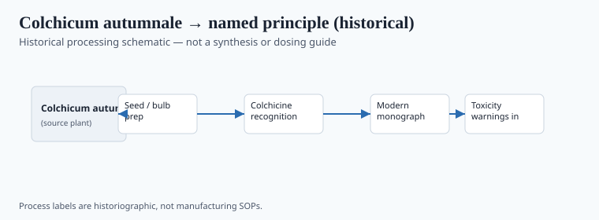
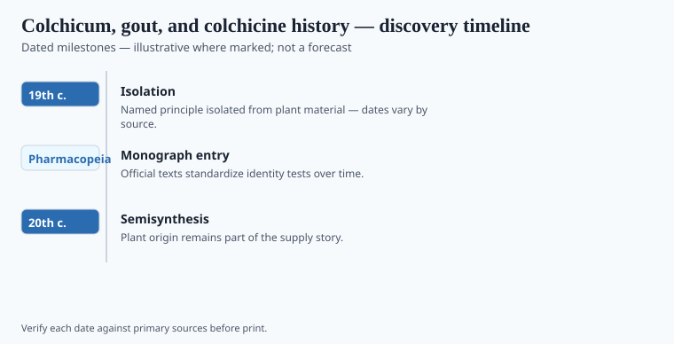

**Disclaimer.** Educational history only. Not medical advice. Past uses of plants do not prove safety or efficacy today. Do not use this series to self-treat or to market disease claims.

*Colchicum autumnale*, the autumn crocus of European meadows, is a pretty poison. Greek and later Latin writers knew a hermodactyl and a colchicum that later botanists have spent careers trying to lock to this species. The identifications are often **soft**. What is not soft is the plant's long European reputation in the gout file — a reputation that made nineteenth-century chemists look, and that made twentieth-century regulators treat the isolate as a drug with a narrow window.

Pelletier and Caventou, already famous for quinine, described colchicine in the early 1820s. The file window runs to the 1950s, when the alkaloid's official life and its toxicity were both ordinary textbook facts. This essay will not convert any of that into a tea.

## From materia medica to named principle

<!-- graphics-pack:v1 -->

*Figure 1. Historical processing schematic — not synthesis instructions or dosing guidance.*

Figure 1 may show a corm and a name. It is not a kitchen card. Dioscorides and the Arabic compilers list related bulbs among dangerous drugs. Early modern European physicians used wine of colchicum with the usual mixture of faith and funerals. Anton von Störck in eighteenth-century Vienna is one of the names later histories attach to a "revival." `[VERIFY]` Störck's dates against a medical-history handbook before a caption makes him a discoverer. He was working in a toxicological style that also touched aconite. That style killed people. That is the point of the later isolate: a number instead of a country wine.

Gout itself is a historical disease-word that later biochemistry sorted into urate and other pictures. Do not write that "the ancients treated gout with colchicine" as if they had the crystal and the assay. They had a plant and a pain.

## Laboratory milestones readers should know

<!-- graphics-pack:v1 -->

*Figure 2. Laboratory and regulatory dates to cite — no fabricated effect sizes.*

1820s naming; later purification; pharmacopeia monographs; mid-twentieth-century hospital use as a defined drug. Figure 2 should carry those beats without a pain-score chart. Colchicine's modern U.S. life includes a branded-drug controversy (the 2009 Unapproved Drugs Initiative episode) that belongs in a regulation essay if you have the Federal Register in hand. `[soft: cite the FR if you lock that paragraph]`.

A garden colchicum remains a poison. A tablet in a hospital is a different object. Folklore and the official monograph cannot share a verb. This pack will not give you a dose. It will give you a plant that taught chemists to be careful, late.

## After the official tablet

Gout memoirs are a literary genre. The plant is not. A garden autumn crocus is a poison with a pretty flower. A hospital colchicine tablet is a defined drug with a file. Folk wine of colchicum is a third object, historically real and medically indefensible as advice.

If the 2009 U.S. branding fight enters a revision, it enters with a Federal Register cite or it stays out. Soft remains soft. Figure 1 must not look like a kitchen card. The hermodactyl identification fight can stay in a footnote the CMS might strip — so say in the body that Greek-to-Linnaeus is often a wish. Wishes do not get doses. They get `[VERIFY]` tags.

<!-- prose-expand:v1 23-colchicum-gout-alkaloids.md -->
## Störck, Pelletier, a 2009 docket

Anton von Störck in 1760s Vienna published hospital trials of autumn crocus that later gout writers treated as a founding. **Soft** by modern lights: small series, eighteenth-century endpoints. Pelletier and Caventou's 1820s colchicine neighborhood, later crystallizations, pharmacopeia monographs: Figure 2's cleaner beats. Greek *hermodactylus* is often a wish laid on Linnaean *Colchicum*. Say so.

In 2009 FDA's Unapproved Drugs Initiative and URL Pharma's Colcrys exclusivity made a very old alkaloid a very new pricing fight. If that paragraph stays, it stays with a Federal Register / docket cite. Soft remains soft. Gout memoirs (Sydenham; later literary gout) are a genre. The plant is not.

Garden *Colchicum* kills. A hospital tablet is a defined drug. Folk colchicum wine is a third object, historically real and indefensible as advice. Figure 1 is not a kitchen card. No dose.
