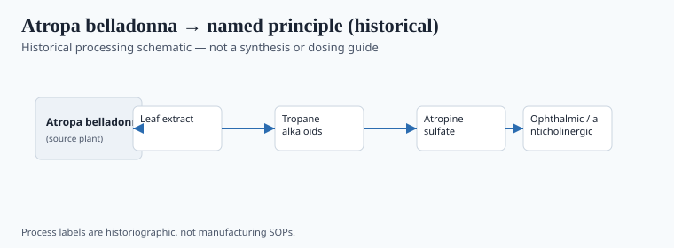
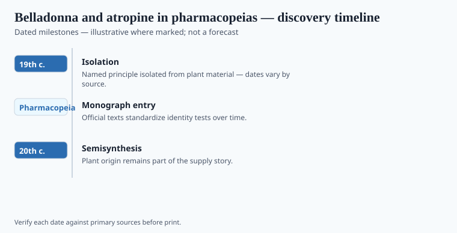

**Disclaimer.** Educational history only. Not medical advice. Past uses of plants do not prove safety or efficacy today. Do not use this series to self-treat or to market disease claims.

Editorial shell **#24** in the herbal-medicine history pack. Grok writer replaces stub paragraphs with sourced prose.

## From materia medica to named principle

<!-- graphics-pack:v1 -->

*Figure 1. Historical processing schematic — not synthesis instructions or dosing guidance.*

Draft shell for the Grok writer pass. Replace this paragraph with sourced narrative, primary citations, and `[VERIFY]` tags where print-ready dates are required.

## Laboratory milestones readers should know

<!-- graphics-pack:v1 -->

*Figure 2. Laboratory and regulatory dates to cite — no fabricated effect sizes.*

Draft shell for the Grok writer pass. Replace this paragraph with sourced narrative, primary citations, and `[VERIFY]` tags where print-ready dates are required.
