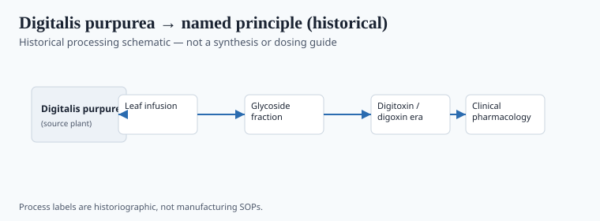
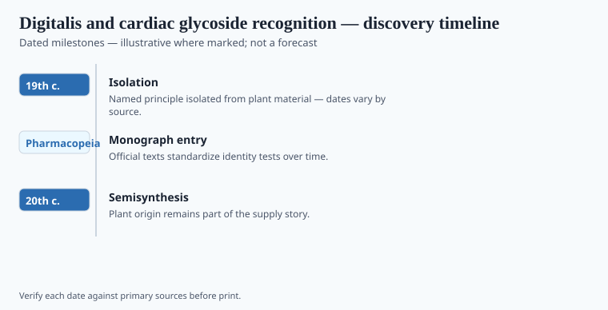

**Disclaimer.** Educational history only. Not medical advice. Past uses of plants do not prove safety or efficacy today. Do not use this series to self-treat or to market disease claims.

William Withering was a Birmingham physician, a Linnaean botanist, and a man who did not like to be gulled. In the 1770s he heard of a Shropshire woman whose dropsy brew included twenty herbs. He decided the only one that mattered was foxglove, *Digitalis purpurea*, a plant every farmer already knew could kill a sheep and a child. In 1785 he published *An Account of the Foxglove*.

The book is famous because it is careful. It is careful because the plant is not. He numbered cases. He reported the dead. He tried to find a form and a stopping rule. Those pages are about titration as an ethic. They are not a protocol for a reader.

## From materia medica to named principle

<!-- graphics-pack:v1 -->

*Figure 1. Historical processing schematic — not synthesis instructions or dosing guidance.*

<!-- under-fig:v2 -->
Withering practiced in Birmingham, sat in the Lunar Society with Watt and Boulton, and hunted the leaf after a Shropshire family recipe for dropsy. He preferred leaf gathered and dried with care because he had seen what a sloppy sample did. “Dropsy” was swelling and breathlessness — later filed under heart failure and renal disease. In his hands the leaf seemed to move urine and ease some of the drowned. The 1785 *Account* numbers cases — later readers count more than a hundred, including the dead; `[VERIFY]` 163 if a caption wants a single integer. Taking a folk brew and subtracting nineteen herbs is a kind of theft and a kind of science. The unnamed woman had a working, dangerous combination. He had case notes and a printer. Erasmus Darwin and others then argued about credit. Both worries can sit in the same paragraph. *D. lanata* later became an industrial source. Digoxin became a prescription object with a narrow window. Figure 1 may run from leaf to glycoside. It is not a recipe.

## Laboratory milestones readers should know

<!-- graphics-pack:v1 -->

*Figure 2. Laboratory and regulatory dates to cite — no fabricated effect sizes.*

<!-- under-fig:v2 -->
Claude-Adolphe Nativelle crystallized a “digitaline” in the late 1860s and early 1870s. Sydney Smith, at Burroughs Wellcome, characterized digoxin from *Digitalis lanata* in 1930. Digitoxin is the other official glycoside. Powdered digitalis leaf stayed in the USP and BP while chemists argued which molecule the leaf had been. This pack’s 1957 beat is a mid-century official box — `[VERIFY]` whether the artist meant a USP or BP monograph year before print. Withering’s 1785 *Account* remains the bedside book: pulses, xanthopsia, a leaf he will not romanticize. Figure 2 should not grow a survival curve. Hospital digoxin is a prescription object. Garden foxglove is a poison a child can reach.

If you grow foxglove because it is pretty, good. If you grow it because a blog mentioned Withering and your ankles, stop. The Shropshire secret was never a secret from the plant.

## After the Midlands

Cardiology textbooks still nod at 1785. Nodding is not repeating his infusions. The glycosides later named are prescription objects. The garden foxglove is a 999 call waiting for a curious child. Withering called the plant a vegetable, not a miracle. That tone is why the book lasted.

The unnamed Shropshire woman remains unnamed. Historians have worried the ethics both ways. Keep both worries. Figure 1 is not a tea card. The 1957 beat on Figure 2 needs a publisher check before print. If the artist meant a USP digitalis monograph year, say so. If no one knows, say `[VERIFY]`. Inventing a discovery year to fill a box is the one thing this pack's bibliography forbids.

<!-- prose-expand:v1 25-digitalis-cardiac-glycosides.md -->
## Shropshire, Nativelle, a 1957 box

Withering practiced in Birmingham and hunted the leaf after a Shropshire family recipe for dropsy. The 1785 *Account* lists patients, pulses, and toxic signs including xanthopsia. He will not let the plant become a miracle. The unnamed woman's ethics file still argues: credit, class, and whether a printed elite stole a cottage. Keep the argument.

Claude-Adolphe Nativelle isolated a crystalline "digitaline" in the 1860s–1870s neighborhood. Sydney Smith at Burroughs Wellcome characterized digoxin in 1930. Digitoxin is the other official glycoside. This pack's Figure 2 locks 1957 as a mid-century official beat — `[VERIFY]` whether the artist meant a USP or BP monograph year before print. Do not invent a discovery to fill a box. Do not print a survival curve.

Hospital digoxin is a prescription object. Garden *Digitalis purpurea* is a poison a child can reach. Folklore tea cannot share a verb with either. Cardiology's nod at 1785 is a nod. It is not an infusion recipe.
