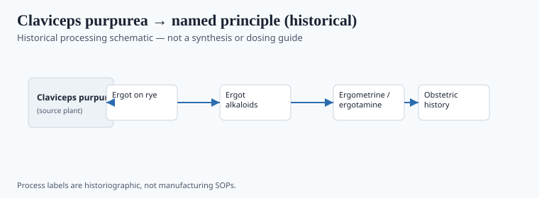
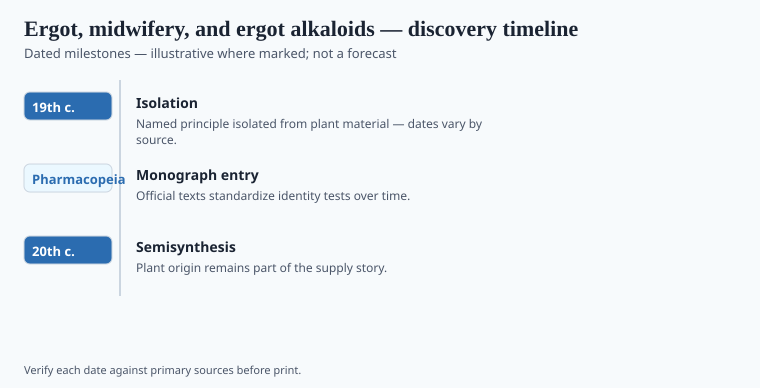

**Disclaimer.** Educational history only. Not medical advice. Past uses of plants do not prove safety or efficacy today. Do not use this series to self-treat or to market disease claims.

Ergot is a dark spur on an ear of rye, the sclerotium of *Claviceps purpurea*. Eaten in enough bread, it closes vessels and burns limbs. The medieval name, Saint Anthony's fire, attached to a hospital order that tried to care for the gangrenous and the convulsed. Outbreak numbers in the older literature are **soft**. The disease is not a myth.

Midwives also knew a different, smaller, terrible use: a bit of ergot to force a uterus. The window between a living birth and a catastrophe was narrow. Adam Lonicer's 1582 herbal is the date this pack's graphics locked for a printed midwife's spur. `[VERIFY]` the edition before a caption treats 1582 as the invention of the practice. The practice is older talk. The print is a date.

## From materia medica to named principle

<!-- graphics-pack:v1 -->

*Figure 1. Historical processing schematic — not synthesis instructions or dosing guidance.*

Adam Lonicer's 1582 *Kreuterbuch* printing is this pack's lock for a midwife's printed use of the spur. John Stearns's 1808 letter in the *Medical Repository* told American physicians about *pulvis parturiens* — Withering's foxglove story in a darker key: a country doctor admitting he took a midwife's powder. Official medicine then adopted "ergot of rye" with the same narrow window. Figure 1 is spur to named alkaloid. Not a method. Not agricultural advice. The file ends at 1938, Hofmann's first quiet year, not the bicycle.

Nineteenth-century chemists poked at the spur and got messes. Tanret crystallized ergotinine in the 1870s; Barger's circle began to sort bases. Arthur Stoll at Sandoz isolated ergotamine in the 1920s. Albert Hofmann, looking at lysergic acid derivatives in 1938 and again in 1943, found LSD-25 — a story he told in a memoir. The memoir is not a methods appendix. This essay will not supply one. The file ends at 1938, which is Hofmann's first, quiet year, not the bicycle ride. Keep it there if the graphic does.

## Laboratory milestones readers should know

<!-- graphics-pack:v1 -->

*Figure 2. Laboratory and regulatory dates to cite — no fabricated effect sizes.*

Medieval writers called the convulsive and gangrenous bread-sickness St. Anthony's fire. The Order of St. Anthony built hospitals for it. An 857 Rhine outbreak and later French years sit in the chronicle file — `[VERIFY]` a death total before a caption prints one. Louis René Tulasne named *Claviceps purpurea* in 1853; the spur became a fungus with a binomial. Henry Dale and George Barger sorted ergot bases in the 1900s–1910s. Arthur Stoll isolated ergotamine at Sandoz in 1918–1921. Albert Hofmann's 1938 lysergic-acid derivative is this pack's stop. Figure 2 should not print outbreak death totals you cannot source. Witchcraft-and-ergot readings of Salem are **soft**. Ergotism is a sufficient horror without conscripting every convulsion in the archive.

A fungal contaminant of bread became a line of named compounds. Medicine kept some. Control statutes took others. The fungus remained a field problem for agronomists. Milligrams are progress. They are not innocence. No "how Hofmann did it." If the magazine needs a last line, use the Antonines: a religious order as a public-health response to a plant disease. The plant as a plague, not as a gift.

## After the Antonines

Hofmann's later fame ate Stoll's isolation paper in the popular mind. This pack's 1938 end-date is a chance to stop before the bicycle. Take it. Obstetrics kept a defined alkaloid with a narrow window. Neurology kept another, then narrowed it. Agronomy kept a toxin limit. Culture kept a bomb. Four afterlives. One spur.

Pont-Saint-Esprit (1951) is outside the file and full of theories. Leave it unless you have a historian you trust. Witchcraft-and-ergot is soft. Figure 1 is not agricultural advice. The midwife's powder and the Basel milligram are the same plant pathology at two scales of paper. Paper is progress. It is not innocence. The saint's order remains the minor-key ending: a hospital named for a fire a fungus lit.

