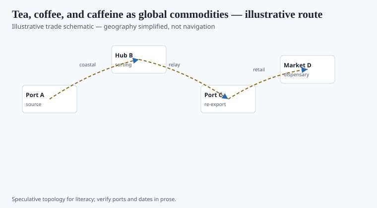
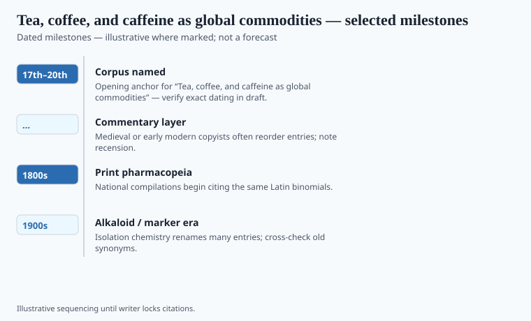

**Disclaimer.** Educational history only. Not medical advice. Past uses of plants do not prove safety or efficacy today. Do not use this series to self-treat or to market disease claims.

A coffee house in seventeenth-century London and a tea warehouse in Canton were already arguing about nerves, wit, and revenue before anyone had a crystal called caffeine. Friedlieb Ferdinand Runge isolated the alkaloid from coffee in 1819, in Goethe's orbit if you like the anecdote. The anecdote is pretty. The commodity is the history.

Tea (*Camellia sinensis*), coffee (*Coffea* species), and later the kola and maté files are plants that states taxed because people would not stop wanting them. Courtwright puts them next to alcohol, tobacco, and opium as careers. This essay stays with the cup and the isolate, not with a wellness "focus blend."

## Routes and ports in the record

<!-- graphics-pack:v1 -->

*Figure 1. Illustrative trade schematic for “Tea, coffee, and caffeine as global commodities” — simplified geography, not navigation or modern routing.*

Chinese tea to Dutch and then British tables; Japanese tea as a different ceremonial and export file; Yemeni and then colonial coffee (Java, the Caribbean, later Brazil) as a transplanted shrub with a labor system attached. Figure 1 will look like arrows of pleasure. Caption the labor. Sugar, Mintz's subject, is the pairing that made the cup a working-class fuel in Britain. The cup is not innocent.

Smuggling, the 1773 Boston tea politics, the Opium Wars as a tea-and-silver problem: caffeine plants sit inside those files without being their only cause. Do not flatten 1773 into a health story.

## What changed when the cargo landed

<!-- graphics-pack:v1 -->

*Figure 2. Dated beats to verify in draft — not a clinical efficacy chart.*

When tea landed in a Galenic or later official shop, it gained "nervous" indications. When it landed in a drawing room, it gained etiquette. When caffeine landed in a nineteenth-century laboratory, it gained a weight. Coca-Cola and the later soda-and-tablet industry are a third landing: a branded dose of the isolate plus sugar plus advertising. Figure 2 should carry 1610s European coffee houses, 1650s London, 1819 Runge, plantation dates you can defend — not a chart of "alertness scores."

A caffeine tablet sold as a dietary supplement in the United States is a DSHEA or OTC-drug question depending on the label. A cup of tea is food. The statute cares about the box. The plant does not. This series cares about the box and the ship.

## After the cup

Temperance movements moralized tea and coffee in some decades and praised them as the anti-alcohol in others. Both moralities are historical. Neither is a nutrition study. Runge's crystal let later tablet firms sell a morning without a leaf. The leaf remained a farm good with a labor system. Brazil's coffee and Assam's tea are plantation files, not café décor.

A "focus" gummy with caffeine is a DSHEA or candy-law object depending on the label. A pot of tea is a pot of tea. Figure 2 should not grow an alertness axis. The ship, the tax, the crystal, the advertisement: four landings. This pack has been counting landings since the first resin on the Silk Road schematic. Caffeine is only the loudest ordinary one.

<!-- prose-expand:v1 27-caffeine-tea-coffee-trade.md -->
## Runge, a VOC cup, Wiley's soda fight

Friedlieb Ferdinand Runge isolated "Kaffein" in 1819 after Goethe handed him coffee beans — the teaching story. `[VERIFY]` the paper year. Tea had already been a Chinese and then a Company good; coffee a Yemeni, then a Javan and then a Brazilian plantation good; cacao a Mesoamerican drink the Spanish sweetened. The VOC and later Assam tea (Bruce brothers; 1830s–1840s) are labor dates. London's coffee houses (1650s) are social dates. Temperance sometimes damned the cups and sometimes praised them as the anti-gin. Both speeches are historical.

Wiley's Bureau went after caffeine in Coca-Cola (*United States v. Forty Barrels and Twenty Kegs of Coca-Cola*, 1911). The company changed the formula's cocaine-leaf fraction earlier; caffeine stayed. A soda and a tea pot became legally different objects. A 2020s "focus" gummy is a DSHEA or candy-law object depending on the label. A cup of tea is food.

Figure 2 may carry 1610s, 1652 London, 1819, plantation years you can defend. It may not grow an alertness axis. Four landings: ship, tax, crystal, advertisement.
