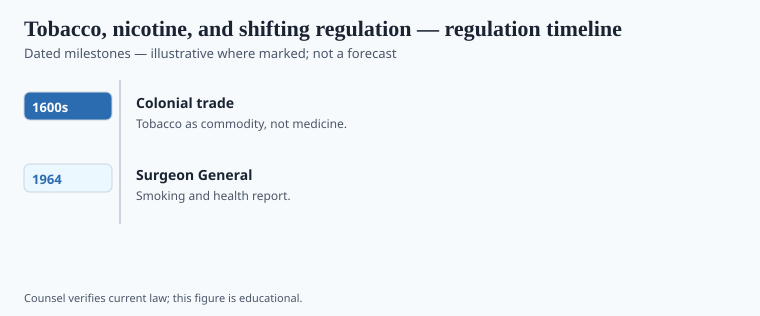

**Disclaimer.** Educational history only. Not medical advice. Past uses of plants do not prove safety or efficacy today. Do not use this series to self-treat or to market disease claims.

*Nicotiana tabacum* and its kin left the Americas as part of the Columbian Exchange and arrived in European shops as a medicine, a curiosity, and then a habit states learned to tax. Jean Nicot's name stuck to the genus. Monardes advertised New World plants to Seville. Physicians wrote tobacco into humoral courses they later regretted. The plant did not ask to be a drug. The shop did.

Posselt and Reimann isolated nicotine in 1828. `[VERIFY]` the paper year before a caption treats it as folklore. The isolate made a poison weighable. It did not invent the pipe.

## Statute and agency context

<!-- graphics-pack:v1 -->

*Figure 1. Statutory milestones — legal history, not treatment recommendations.*

Jean Nicot sent seed and a diplomatic name toward France in the 1560s. The plant was already an Indigenous American agricultural and ceremonial object; those nations’ files are not a brand prologue. Posselt and Reimann isolated nicotine in Heidelberg in 1828. Humoral “courses of smoke,” Virginia staple, James Bonsack’s 1880s cigarette machine, and the twentieth-century advertising state made a farm good into an industry. Tobacco sat outside the 1906 discloseable-drug list that caught opium and cannabis on the bottle. It was taxed instead.

Tobacco sat outside the 1906 drug-label logic that caught opium and cannabis on the bottle. It was a farm good and a vice good. Advertising, agricultural supports, and later warning labels made a twentieth-century American career that health historians have written without needing this magazine to repeat the body-count posters.

The 2009 Family Smoking Prevention and Tobacco Control Act gave FDA a tobacco center and a new box: not a drug approval, not a dietary supplement, a product category with its own statute. E-cigarettes and nicotine pouches then arrived as objects that look like consumer goods and behave like the old alkaloid. Figure 1 should carry 16th-century medical fashion, 1828 isolation, warning-label dates, 2009 — not a cessation protocol.

## Operator timeline (US-focused where noted)

<!-- graphics-pack:v1 -->

*Figure 2. Illustrative agency questions — not a filing checklist.*

Luther Terry’s 1964 Surgeon General report, *Smoking and Health*, is the American public-health date that later warning labels stand on. The 1965 Federal Cigarette Labeling and Advertising Act put words on the pack. Broadcast advertising died in 1971. The 1998 Master Settlement Agreement is a state-litigation date. The 2009 Family Smoking Prevention and Tobacco Control Act created FDA’s Center for Tobacco Products — not a drug NDA, not DSHEA, a third box. Posselt and Reimann’s 1828 nicotine paper is the alkaloid constant under those statutes. Figure 2 is a map of rooms a leaf has occupied. It is not a launch canvas and not a cessation plan.

Figure 2's "operator" questions — what is the product, who may sell it, what may the label say — are the same questions DSHEA asks of a capsule, asked here of a leaf that became an industry. Do not treat the figure as a how-to for bringing a nicotine product to market. Treat it as a map of why a plant can be medicine, food-adjacent, tax staple, and regulated tobacco in four different centuries.

Indigenous American ceremonial and agricultural uses are a separate file and are not a prologue to a brand. This essay will not print ritual. It will say the category fight is the history. The alkaloid is a constant. The statute is not.

## After the tax stamp

Public-health campaigns earned their images. This magazine does not need to reprint a blackened lung to say the category moved. It needs to say a plant can be medicine, farm staple, vice, and FDA-center object without changing its alkaloid. The 2009 Act is a date. Warning labels are dates. 1828 is a date. Sixteenth-century humoral courses are a date. Line them up. Do not turn the line into a cessation plan.

Indigenous cultivation and ceremony are not a brand origin story. They are other nations' files. Figure 2 is not a product-launch canvas. If a designer wants a "journey from leaf to pod," kill the journey word — it is on the ban list — and keep the statute names. The statute names are the prose.

