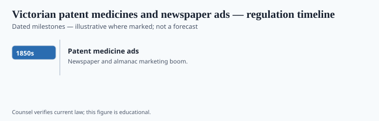

**Disclaimer.** Educational history only. Not medical advice. Past uses of plants do not prove safety or efficacy today. Do not use this series to self-treat or to market disease claims.

"Patent medicine" in the United States usually meant a secret-formula nostrum with a trademark, not a patent. If you knew it was forty percent alcohol and a bitter, you might make it yourself. If you thought it was Lydia E. Pinkham's unique vegetable wisdom, you wrote to Lynn, Massachusetts, and you bought the bottle.

The British file is parallel: Holloway's pills, Beecham's, the newspaper column as a clinic. This essay uses "Victorian" as an Anglo-American advertising weather, not as a palace mood. James Harvey Young named the American sellers toadstool millionaires. He was being accurate about the margin.

## Statute and agency context

<!-- graphics-pack:v1 -->

*Figure 1. Statutory milestones — legal history, not treatment recommendations.*

Before 1906 a U.S. bottle could lie in a particular way: it could hide morphine, cannabis, cocaine, and alcohol behind a floral name. Adams's *Collier's* series named the math for a mass readership. The 1906 Pure Food and Drug Act (next essay) made certain lies and omissions federal matters. It did not require that a drug work. Efficacy as a legal demand arrives later.

Figure 1: mid-century cheap paper and rural ads; Pinkham's career (she died in 1883; the letters kept coming); 1905–06 muckraking; 30 June 1906. No treatment recommendations. The buyers had pain, shame, no antibiotics, and a postal service. Mock the sellers who knew they were selling whiskey as a female tonic. Do not mock the mailbox.

## Operator timeline (US-focused where noted)

<!-- graphics-pack:v1 -->

*Figure 2. Illustrative agency questions — not a filing checklist.*

What is on the label? What crosses a state line? Who printed the testimonial? Figure 2 is the inspector's mind, not a startup canvas. Hostetter's bitters ran like a whiskey with a medical alibi. Mrs. Winslow's Soothing Syrup put opium in the nursery. Clark Stanley's snake oil, analyzed after the new law, was mineral oil and theater. The Chinese railroad workers' liniment that American English stole and ruined is a different object. Say so.

The emotional box — a story, a bottle, a hope the regular doctor is too proud or too costly to offer — is the ancestor of the supplement aisle. DSHEA is a different statute. The feeling is related. Voice warning: a little dryness is earned. The women who wrote to Mrs. Pinkham as if she were still alive are not a joke. They are the archive of a need.

## After the almanac

Young's second volume, *The Medical Messiahs*, follows the radio century. Hadacol proved the form could survive a microphone. 1906 did not empty the shelf. It changed the bottle. Newspaper ads took longer to clean. The emotional box survived into DSHEA's aisle with better lawyers.

Pinkham's face outlived Pinkham. That is the caption for any trade-card figure this pack might later add. Figure 1 and Figure 2 are already the inspector's mind. Keep them dull. Dull is how a statute looks. The almanac was colorful on purpose. Color was the product as much as the fluid. An editor who gets too funny on this material has started mocking the mailbox. Stop.

<!-- prose-expand:v1 29-victorian-patent-medicines.md -->
## Pinkham's mailbox, Adams's series

Lydia E. Pinkham began advertising her Vegetable Compound from Lynn, Massachusetts, in the 1870s. After her death the company kept answering letters in her voice. Those letters are an archive of gynecological need and of a face that outlived a person. Hostetter's Bitters were a whiskey alibi with a stamp. Mrs. Winslow's Soothing Syrup put morphine or opium in the nursery until analysis and then law made the habit visible. Clark Stanley's snake-oil liniment, analyzed after 1906, was mineral oil, turpentine, and theater. The Chinese railroad workers' *sheyou* liniment that American English stole is a different object.

Samuel Hopkins Adams named the shelf. James Harvey Young's *Toadstool Millionaires* (1961) and *Medical Messiahs* (1967) remain the historians. Britain's Pharmacy Act 1868 and the later British patent-medicine stamp are a parallel file. Hadacol, in Dudley LeBlanc's postwar radio, proved the emotional box could survive a microphone.

1906 changed the carton more than the newspaper. DSHEA later rented a new utterance for a related feeling. Figure 1 and Figure 2 should stay dull: label, state line, testimonial. Color was the almanac's product. Do not mock the mailbox.
