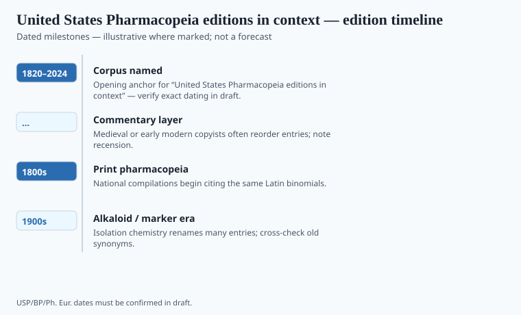

**Disclaimer.** Educational history only. Not medical advice. Past uses of plants do not prove safety or efficacy today. Do not use this series to self-treat or to market disease claims.

In 1820 a convention of physicians issued the first *Pharmacopoeia of the United States*. It was a bid to make American practice less of a dialect problem: the same name, the same preparation, from Boston to Charleston. Lyman Spalding is the organizer the official memory likes. The book was voluntary in the way a profession's standard is voluntary until a statute points at it.

Later, the Food and Drug law would treat USP standards as a legal yardstick for official drugs. That is a category change. A 1820 recipe for a tincture and a 2020s monograph for an isolate do not share a world, only a publisher's descendant.

## How the monograph is organized

<!-- graphics-pack:v1 -->

*Figure 1. Comparative plate for reading monographs — line art only, not herbarium IDs.*

Lyman Spalding convened physicians in Washington in January 1820. Samuel Latham Mitchill and a short list of state delegates wanted a republic to speak one recipe language. The first *United States Pharmacopeia* printed that year is a thin official book: Latin drug names, English directions, a shop already full of botanicals. Revisions in 1830 (New York) and later decades stuffed the book with crude-drug monographs because the American shelf was a plant shelf. A classical monograph names the part, the look, the test, the preparation. Figure 1 is that reading order, not a backyard key. *Cannabis indica* entered in the 1850s and left in 1942 — political weather as much as a scientific one.

A classical crude-drug monograph names the plant part, the look, the test, the preparation. Figure 1 is a schematic of that reading, not a field key. Do not identify a backyard leaf from it. The nineteenth-century USP was full of botanicals because the American shop was full of botanicals. The twentieth century emptied many of those monographs as tablets replaced tins.

*Cannabis indica* entered the USP in the 1850s and left in 1942. That in-and-out is a political weather as much as a scientific one (see the later scheduling file). Digitalis, opium, belladonna: the official leaf was a standard, then a problem, then a memory.

## Edition-to-edition shifts worth tracking

<!-- graphics-pack:v1 -->

*Figure 2. Edition and harmonization beats — verify against official publishers.*

The Convention that owns the book still meets. USP incorporated in 1900 as a nonprofit. The *National Formulary* began in 1888 under the American Pharmaceutical Association; USP acquired it in 1975, which is why the spine now says USP–NF. The 1906 Act and the 1938 Act pointed at official compendia as legal yardsticks for official drugs. Harmonization talks with Ph. Eur. and the Japanese Pharmacopoeia sit in the Pharmacopoeial Discussion Group. Figure 2’s 2024 end is a living date. `[VERIFY]` a revision number against USP’s own history pages. This magazine will not pirate a current assay table.

1820 first; later revision cycle; 1906 and 1938 statutes pointing at official compendia; USP–NF merger; harmonization talks with the European and Japanese pharmacopoeias. Figure 2's "2024" is a living end-date, not a final edition. `[VERIFY]` any specific revision number against USP's own history pages before a caption.

The current USP–NF is a licensed book. This magazine will not pirate a monograph. It will say that **a pharmacopeia is a social machine for making a name behave**. Dietary supplements have a different machine (DSHEA, plus USP's voluntary verification programs — a private seal, not an FDA approval). Do not confuse a USP Verified mark with a drug monograph. The public already does. An editor should not.

## After the convention

1820 was physicians trying to make a republic speak one recipe language. 1906 and 1938 made that language a legal yardstick for official drugs. The supplement aisle later hired a different language: Supplement Facts, disclaimer, structure/function. USP's voluntary verification programs sit in the gap as a private seal. A seal is not an NDA.

Cannabis's in-and-out is the teaching monograph. Digitalis is the teaching poison. Crude-drug jars in old colleges are the teaching absence: the habit of looking, stored in a basement. Figure 2's 2024 end is a reminder that a pharmacopeia is still being argued. Argue with the publisher's page, not with a blog's memory of a botanical. This magazine will not pirate a current monograph. It will keep saying that a name behaving is a social machine.

