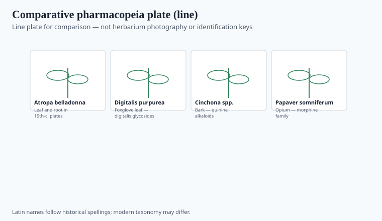
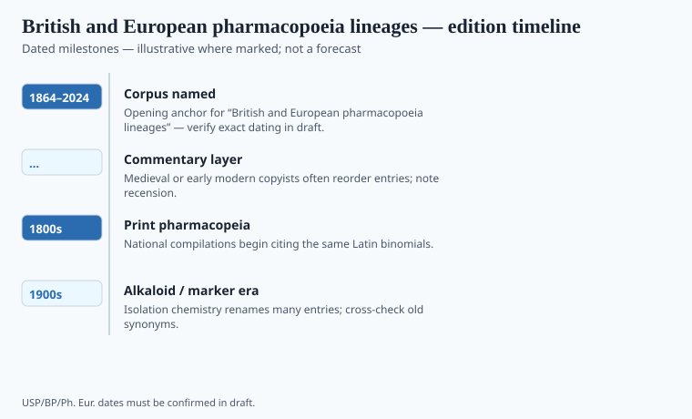

**Disclaimer.** Educational history only. Not medical advice. Past uses of plants do not prove safety or efficacy today. Do not use this series to self-treat or to market disease claims.

The 1618 *London Pharmacopoeia* was a College of Physicians' attempt to discipline apothecaries in one city. The 1864 *British Pharmacopoeia* was a kingdom's attempt to stop England, Scotland, and Ireland from meaning three things by the same tincture. The *European Pharmacopoeia*, a Council of Europe project with EDQM as publisher, is a later attempt to make a name behave across member states. Three scales. One habit.

The file starts at 1864 because that is when Britain got a national book. The habit is older. Valerius Cordus's Nuremberg *Dispensatorium* (1546, posthumous) and the *Ricettario Fiorentino* (1498) are the continental ancestors.

## How the monograph is organized

<!-- graphics-pack:v1 -->

*Figure 1. Comparative plate for reading monographs — line art only, not herbarium IDs.*

<!-- under-fig:v2 -->
The Society of Apothecaries took its London charter in 1617; the 1618 *Pharmacopoeia Londinensis* is the next year’s College stick. Edinburgh issued its own book in 1699; Dublin’s official book is usually dated 1807 — `[VERIFY]` against a catalog. A living BP or Ph. Eur. herbal-drug monograph asks for definition, macroscopic look, microscopic cells, and a chromatographic fingerprint that would have been a smell in 1864. The British book long carried imperial crude drugs — cinchona, nux vomica, senna — because the empire’s ships did. Those nouns are quality nouns. They are not a traditional-use dossier and not a WHO review. Figure 1 is line art for reading, not for picking a hedge. If a caption says "how to identify in the field," rewrite it. Identification without a voucher is how this pack's soft plant-IDs got soft.

## Edition-to-edition shifts worth tracking

<!-- graphics-pack:v1 -->

*Figure 2. Edition and harmonization beats — verify against official publishers.*

<!-- under-fig:v2 -->
The first *British Pharmacopoeia* (1864) is the General Medical Council’s book after the Medical Act 1858. Later editions historians keep listing — 1867, 1885, 1898, 1914, 1932 — dropped and added crude drugs as ships and then the synthetic bench changed the shop. `[VERIFY]` a botanical list against the BP Commission before a caption treats one edition as a garden. The Medicines Act 1968 made the BP a statutory yardstick for official UK medicines. The Convention on the Elaboration of a European Pharmacopoeia opened on 22 July 1964; volume-one print years wander in secondary lists (1969 is often cited — EDQM is the check). The United Kingdom joined the EEC in 1973 and remained a Ph. Eur. party after Brexit. Figure 2’s 2024 is a living end. Official publishers, not a blog, are the check.

The EU's Traditional Herbal Medicinal Products Directive (2004/24/EC, later essay) is a different box: a medicine registration path that uses traditional use as a door. A Ph. Eur. monograph can sit under that door without being a WHO endorsement or a DSHEA label. Three boxes, one plant, three burdens. This series exists to keep the burdens from stealing each other's verbs.

## After Westminster and Strasbourg

The 1618 London book was a city fight between physicians and apothecaries. The 1864 BP was a kingdom tired of three dialects. Ph. Eur. is a continent tired of border names. Each scale leaves someone out: a folk name, a colonial synonym, a plant the ships no longer bring.

Harmonization with USP and JP is a late bureaucratic peace. It does not make a herbal a supplement or a traditional-use medicine. Those are other doors (DSHEA; 2004/24/EC). Figure 1 is for reading a page, not a hedge. If a caption says "how to identify," rewrite it to "how a monograph is arranged." Identification without a voucher is how this pack's soft plant-IDs got soft. Stay arranged. Stay official. Stay dull enough to be true.

<!-- prose-expand:v1 31-british-european-pharmacopoeias.md -->
## Charters, commissions, and a convention

The Society of Apothecaries took its London charter in 1617. The *Pharmacopoeia Londinensis* of 1618 is the next year's stick: a College book aimed at a new company. Edinburgh issued its own pharmacopoeia in 1699; Dublin's official book is a nineteenth-century object (1807 is the usual first — `[VERIFY]` against a library catalog before a caption). Three cities, three fluids, one Latin name. That is why 1864 exists.

The Medical Act 1858 created the General Medical Council. The first *British Pharmacopoeia* (1864) is the Council's language. Later editions — 1867, 1885, 1898, 1914, 1932 are the ones historians keep listing — dropped and added crude drugs as the empire's ships and then the synthetic bench changed what a shop needed. `[VERIFY]` any single edition's botanical list against the BP Commission's own history. The Medicines Act 1968 later made the BP a statutory yardstick for official UK medicines.

The Convention on the Elaboration of a European Pharmacopoeia opened on 22 July 1964. Volume-one print years wander in secondary lists; EDQM is the check, not a blog. After Brexit the United Kingdom remained a Ph. Eur. party and the BP still carries European texts plus national remainders. A 2020s London herbal-drug page can therefore be a Strasbourg sentence in a British binding. That is implementation, not romance.
