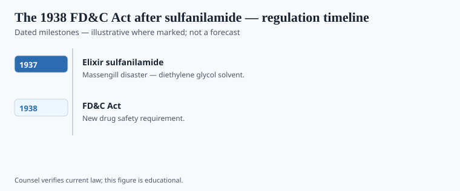
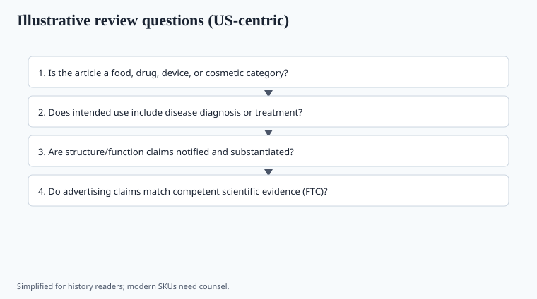

**Disclaimer.** Educational history only. Not medical advice. Past uses of plants do not prove safety or efficacy today. Do not use this series to self-treat or to market disease claims.

In 1937 the S.E. Massengill Company put sulfanilamide into a raspberry elixir using diethylene glycol as the solvent. People died — more than a hundred, the usual count in the FDA's own history. The drug was a useful sulfa. The solvent was antifreeze's cousin. No federal statute then required a safety file before a new drug went to market. Frances Oldham Kelsey is a later heroine (thalidomide, 1960s). The 1937 dead are why 1938 looks the way it does.

This is not a herbal disaster. It is why herbal bottles, after 1938, lived in a house built around industrial chemistry's worst month.

## Statute and agency context

<!-- graphics-pack:v1 -->

*Figure 1. Statutory milestones — legal history, not treatment recommendations.*

The Federal Food, Drug, and Cosmetic Act required that new drugs be shown safe before interstate marketing — a pre-market gate 1906 did not have. It also reached cosmetics and tightened labels. Efficacy as a requirement waits for the 1962 Kefauver–Harris Amendments, after thalidomide's European lesson and a near-miss in the United States. Senator Royal S. Copeland, a physician from New York, is the named shepherd of the 1938 bill. The new-drug application is the machine the bill added. Ruth deForest Lamb's *American Chamber of Horrors* (1936) had already given the public a tour of the pre-file shelf. The elixir made the tour count.

Figure 1: 1906, 1937 elixir, 1938 Act, 1962 efficacy. No treatment recommendations. The herbal remainder: a botanical preparation that was an old drug in the shop might sit in a different pocket than a new chemical entity. Lawyers ate well. The category fight is the history.

## Operator timeline (US-focused where noted)

<!-- graphics-pack:v1 -->

*Figure 2. Illustrative agency questions — not a filing checklist.*

In October and November 1937, FDA inspectors chased remaining raspberry elixir across state lines. The legal hook under the 1906 Act was often misbranding: “elixir” implied alcohol the bottle did not contain. S.E. Massengill paid a fine on the order of $26,000 — `[VERIFY]` the exact judgment against the FDA history office — because that was the tooth the old statute had. Harold Watkins, the chemist who chose diethylene glycol, died by suicide. Walter G. Campbell used the bodies in testimony the way Wiley had used borax. Figure 2’s questions — new drug, solvent, hidden label — are 1938’s questions. They are not a current filing guide and not a parable about “untested herbs.” The dead were killed by a solvent around a useful sulfa.

Is it a new drug? What is the solvent? What does the label hide? Figure 2 is the 1938 question set, not a current filing guide. Walter Campbell and the FDA of that year used the disaster in testimony the way Wiley had used borax. Agencies need bodies, unfortunately, to get statutes.

A "natural" solvent is not the lesson. Glycol is not natural in the marketing sense, and honey has killed infants for other reasons. The lesson is **process and file**. DSHEA later moved many botanicals into a lane with less file. That lane is a 1994 political fact. It does not repeal 1937. It just files the plant in another drawer.

## After the glycol

Kelsey and thalidomide are 1960s weather. Mention them as the efficacy shoe, not as 1938. The 1937 dead were killed by a solvent, not by a lack of double-blind. Safety files and efficacy files are different drawers. 1938 opened the first. 1962 opened the second.

Herbal bottles lived in the house anyway. "Old drug" arguments kept lawyers employed. DSHEA later opened a side door for many botanicals. The side door does not un-kill 1937. It files a plant in a drawer with less paper. Figure 1 should show 1906–1937–1938–1962 without a skull-and-crossbones cartoon that turns a disaster into décor. The disaster is already enough. Names, a solvent, a statute. That is the prose.

