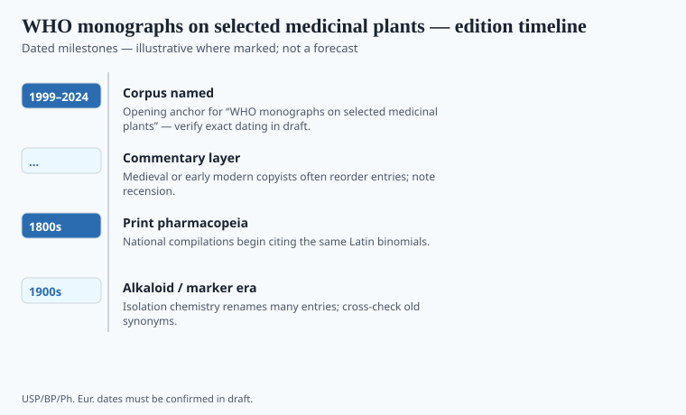

**Disclaimer.** Educational history only. Not medical advice. Past uses of plants do not prove safety or efficacy today. Do not use this series to self-treat or to market disease claims.

In September 1978, at Alma-Ata, WHO and UNICEF declared that primary health care included working with what people already used. The later *Traditional Medicine Strategy* documents are the bureaucratic grandchildren. The *monographs on selected medicinal plants*, whose first volume the file dates to 1999, are a different genre: botany, chemistry, uses, a cautious clinical paragraph, a regulatory paragraph.

They are **soft** as proof. They are useful as a map of what an international committee was willing to type. Treating "WHO monograph" as "WHO endorsement of a cure" is a marketing move. Treating them as invisible is a different provincialism.

## How the monograph is organized

<!-- graphics-pack:v1 -->

*Figure 1. Comparative plate for reading monographs — line art only, not herbarium IDs.*

<!-- under-fig:v2 -->
A WHO plant monograph is an expert review: botanical identity, chemistry, major uses, a cautious clinical paragraph, a regulatory paragraph. Volume 1 (1999) set the headings later volumes copied. It is not a Ph. Eur. quality monograph, not a USP drug monograph, and not an EMA traditional-use registration. German Commission E assessments and EMA HMPC community monographs are sibling expert genres, not stamps. The clinical paragraph is often a thin file described as thin. Inflating it into a cure is theft. Deleting it to make a tradition look like a rumor is a different theft. Figure 1 will not identify a roadside weed.

A WHO plant monograph is not a Ph. Eur. quality monograph and not a USP drug monograph. It is an expert review with a public-health accent. Figure 1 is a reading schematic. It will not identify a roadside weed. The clinical paragraph, when it exists, is often a thin file honestly described. Do not inflate it. Do not delete it to make a tradition look like a rumor.

Volume 1 (1999) set the headings later volumes copied: identity, chemistry, uses, a cautious clinical paragraph, a regulatory paragraph. German Commission E assessments and EMA HMPC community monographs are sibling expert genres, not stamps. A roadside weed still needs a voucher. This plate will not give you one.

The evidence fight inside WHO — RCTs as the only door versus "traditional use" as a door — is the same fight as German Commission E versus the FDA, in a building with flags.

## Edition-to-edition shifts worth tracking

<!-- graphics-pack:v1 -->

*Figure 2. Edition and harmonization beats — verify against official publishers.*

<!-- under-fig:v2 -->
The Alma-Ata declaration (September 1978) made primary health care a planning problem that included what people already used. Halfdan Mahler was Director-General. The *Traditional Medicine Strategy* papers (2002–2005; 2014–2023) are the bureaucratic grandchildren. *WHO monographs on selected medicinal plants* began with volume 1 in 1999; later volumes followed (four is the usual completed set in secondary lists — `[VERIFY]` against WHO before a caption says “complete”). The 2019 *Global Report on Traditional and Complementary Medicine* is a survey flavor, not a stamp of efficacy. Integration programs standardize formulas and leave some old practitioners outside the fence. Name the fence. Do not pick a ministry’s side for a caption.

1978 Alma-Ata; 1999 volume 1; later volumes; the 2002–2005 and 2014–2023 strategies; a 2019 global report flavor. Figure 2's 2024 is a living end. `[VERIFY]` volume counts against WHO's own list before a caption says "complete." Nothing here is complete. Integration, when a state attempts it, standardizes formulas and leaves some old practitioners outside the fence. WHO documents tend to sound like hugs. Historians should not.

A plant can be a village object, a DSHEA object, an EMA traditional-herbal object, and a WHO-monograph object in the same decade. The objects have different burdens. Name the burden. Do not pick a ministry's side for a caption.

## After Geneva

Mahler's generation wanted systems that were not only cathedrals of specialty care. Traditional practitioners were already in the empty places. Critics said WHO laundered unproven drugs. Supporters said a nurse in a four-room clinic cannot ignore the market next door. Both can be true in one district.

A monograph volume is not a hug and not a stamp. It is an expert genre with a cautious paragraph. Marketing that prints the WHO logo next to a cure claim is stealing. This pack will not help the theft. Figure 2's living end means another volume may appear. When it does, add a row. Do not add an efficacy axis. Policy has to live with a late truck of amoxicillin without lying about the root. Lying about the root is the one thing this series refuses to help with.

<!-- prose-expand:v1 34-who-monographs-herbal.md -->
## Alma-Ata, then a genre

Halfdan Mahler was WHO Director-General when the 1978 Alma-Ata declaration made primary health care a planning problem that included what people already used. Critics in medical journals called it a lowering of standards. District nurses called it the market next door. Both can be true on one road. The *Traditional Medicine Strategy* papers (2002–2005; 2014–2023) are the grandchildren. ICD-11 later grew a traditional-medicine chapter as a **classification** tool — `[VERIFY]` scope against WHO. Classification is not a trial and not a logo for a bottle.

Volume 1 of *WHO monographs on selected medicinal plants* (1999) set the genre: botanical identity, chemistry, major uses, a cautious clinical paragraph, a regulatory paragraph. Later volumes added plants. `[VERIFY]` a complete count on WHO's own list. The clinical paragraph is often a thin file described as thin. German Commission E, EMA HMPC community monographs, and these WHO reviews are three expert genres. They do not stack into a planetary stamp.

Integration programs — China's later hospital TCM, India's AYUSH colleges, African ministry desks — standardize formulas and leave some old practitioners outside the fence. WHO documents tend to sound like hugs. A historian should type the fence. Marketing that prints the WHO emblem next to a cure claim is stealing a public letterhead. This pack will not help the theft.
