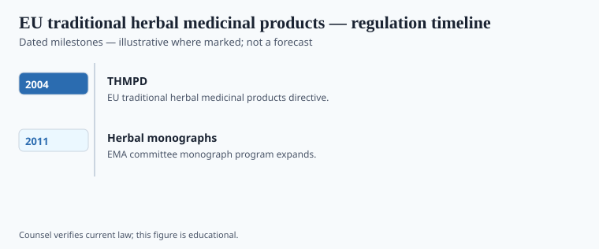

**Disclaimer.** Educational history only. Not medical advice. Past uses of plants do not prove safety or efficacy today. Do not use this series to self-treat or to market disease claims.

In 2004 the European Union added a path for traditional herbal medicinal products — Directive 2004/24/EC, amending the community medicines code. The idea was to stop a useful, long-used herbal medicine from having to pretend it was a new chemical entity, without letting it pretend it was a candy. Thirty years of traditional use (fifteen in the Community, with extra-Community years allowed under conditions) became a door. Quality and safety still had to walk through.

This is a **medicine** box. It is not DSHEA. A U.S. capsule that says "supports" and a German registered traditional herbal that lists an indication are not one object. Caption them apart or do not caption them.

## Statute and agency context

<!-- graphics-pack:v1 -->

*Figure 1. Statutory milestones — legal history, not treatment recommendations.*

<!-- under-fig:v2 -->
Directive 2004/24/EC of 31 March 2004 inserted a simplified registration into the community medicines code (2001/83/EC, Article 16a and neighbors). The teaching clocks are thirty years of traditional use and fifteen years in the Community — `[VERIFY]` the consolidated articles before a caption treats the numbers as folklore. Products already on the market were given a deadline (30 April 2011 is the date operators still recite). Quality of the herbal substance still sits on the table. The product is a **medicine**. German Commission E (published assessments, 1978–1994 neighborhood) was an earlier national expert door, **soft** if you treat it as a pile of randomized trials. Kava withdrawals around 2002 were weather the directive inherited.

The Herbal Medicinal Products Committee (HMPC) at the EMA writes community monographs and list entries that member states use, argue with, and sometimes ignore. Kava's earlier German/Swiss withdrawals (c. 2002) sit just before the directive as weather: Europe had already shown it could un-license a plant medicine. St. John's wort lives in this world as a medicine with interaction warnings, not as a checkout mood candy.

Figure 1: national herbal medicines before 2004 (Germany's Commission E as a famous, **soft**-as-trial expert system); 2004/24/EC; later implementing years; Brexit as a UK-file split. `[VERIFY]` UK's post-2020 traditional-herbal path before a caption says "EU only."

## Operator timeline (US-focused where noted)

<!-- graphics-pack:v1 -->

*Figure 2. Illustrative agency questions — not a filing checklist.*

<!-- under-fig:v2 -->
EMA’s HMPC writes community herbal monographs and a shorter list of herbal substances. List entries bind more tightly than monographs; member states still argue. After Brexit the MHRA kept a traditional herbal registration scheme with THR numbers on the pack — `[VERIFY]` a London bottle against the current MHRA page. The United States is not on this path. A U.S. firm takes DSHEA or an NDA. The EU also still has a food-supplement box that is not this door. Figure 2’s questions — tradition evidence, quality, medicine labeling — are European operator questions. They are not a filing kit and not a U.S. org chart.

The H2 says "US-focused where noted." Note it: the United States is not on this path. A company that wants a U.S. bottle usually takes DSHEA or an NDA, not an EU traditional registration. Figure 2's questions — traditional use evidence, quality of the herbal substance, labeling of a medicinal product — are European operator questions. They are not a filing kit this magazine will complete.

The historical claim is small and sharp: **after 2004, "herb" in the EU can be a registered medicine with a tradition door.** After 1994, "herb" in the U.S. is often a supplement with a disclaimer door. The plant does not know. The lawyer does.

## After the door

Commission E was Germany's earlier expert door, **soft** if you treat it as a pile of RCTs. The 2004 directive is a community door. Member states still argue. Kava and St. John's wort taught Europe that a plant medicine can be withdrawn or warned. The U.S. aisle learned different lessons (ephedra rule; interaction letters) under a different statute.

Figure 2's "operator" flow is not a how-to. A company that wants both an EU traditional registration and a U.S. supplement is living in two boxes and should hire two lawyers. This magazine will not be the third lawyer. It will keep saying medicine-box versus disclaimer-box until a caption writer gets it. The plant does not get it. The plant is a plant.

<!-- prose-expand:v1 35-eu-traditional-herbal-registration.md -->
## 2004/24/EC, HMPC, a clock

Directive 2004/24/EC opened a simplified registration inside the community medicines code (2001/83/EC). The teaching clocks are 15 years of use in the Community and 30 years of traditional use, including time outside — `[VERIFY]` the consolidated articles before a caption treats the numbers as folklore. Quality of the herbal substance and a safety file still sit on the table. The product is a **medicine**. EMA's Committee on Herbal Medicinal Products writes community monographs and list entries. Member states implement, argue, or sit beside them.

German Commission E (published assessments, 1978–1994 neighborhood) was an earlier national expert door. **Soft** if you treat those assessments as a pile of randomized trials. Kava-kava liver-injury weather and St. John's wort interaction weather taught Europe that a plant medicine can be withdrawn or warned. After Brexit, the MHRA kept a traditional herbal registration scheme. `[VERIFY]` a London bottle against the current MHRA page, not against a 2015 EU caption.

A firm that wants a U.S. bottle takes DSHEA or an NDA, not this door. Two boxes. Two lawyers. This magazine is not the third. Figure 2's questions stay European: tradition evidence, quality, medicine labeling.
