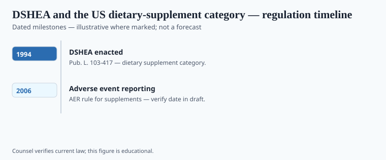

**Disclaimer.** Educational history only. Not medical advice. Past uses of plants do not prove safety or efficacy today. Do not use this series to self-treat or to market disease claims.

Editorial shell **#36** in the herbal-medicine history pack. Grok writer replaces stub paragraphs with sourced prose.

## Statute and agency context

<!-- graphics-pack:v1 -->

*Figure 1. Statutory milestones — legal history, not treatment recommendations.*

Draft shell for the Grok writer pass. Replace this paragraph with sourced narrative, primary citations, and `[VERIFY]` tags where print-ready dates are required.

## Operator timeline (US-focused where noted)

<!-- graphics-pack:v1 -->

*Figure 2. Illustrative agency questions — not a filing checklist.*

Draft shell for the Grok writer pass. Replace this paragraph with sourced narrative, primary citations, and `[VERIFY]` tags where print-ready dates are required.
