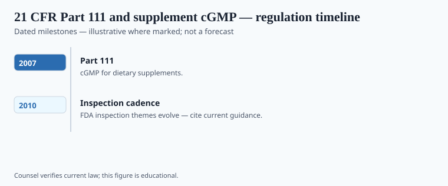

**Disclaimer.** Educational history only. Not medical advice. Past uses of plants do not prove safety or efficacy today. Do not use this series to self-treat or to market disease claims.

DSHEA created a category. 21 C.F.R. Part 111, finalized in 2007, told the people who make that category's bottles to keep records, test identity, and not treat a warehouse like a hobby. The rule phased in by firm size; "2007–2024" in the file is the living enforcement weather, not a second statute.

This is not pre-market approval. It is a manufacturing ethic written as law. A plant can still be the wrong plant if the identity test is a shrug. Part 111 is the shrug's enemy, on paper. Warning letters are how you see whether the paper bites.

## Statute and agency context

<!-- graphics-pack:v1 -->

*Figure 1. Statutory milestones — legal history, not treatment recommendations.*

1994 DSHEA authorized GMPs for supplements. The 2007 final rule (72 Fed. Reg. 34752, 25 June 2007) is the book. Small firms got more time. Figure 1 should carry those dates plus the 2004 ephedra adulteration rule as a different, safety-risk tool (21 U.S.C. § 342(f)). cGMP is about process. The ephedra rule was about a class of alkaloids in a class of products. Do not merge them in a caption.

Adulteration and misbranding remain the hooks. A beautifully documented file can still be a disease-claim case. A sloppy file can be a cGMP case even when the label is shy. Two hooks. One aisle.

## Operator timeline (US-focused where noted)

<!-- graphics-pack:v1 -->

*Figure 2. Illustrative agency questions — not a filing checklist.*

Who manufactures? What is the identity test for a powdered leaf? Where are the batch records? Figure 2 is illustrative. It is not a consultant's checklist and not a way to "pass FDA." This magazine will not help anyone design a 483 response.

The historical claim: **after 2007 the U.S. supplement aisle was told to look like an industry.** Some firms already did. Some did not. The botanical remainder is old: a name on a sack is not a species. Pharmacognosy, which this pack has been following since Dioscorides snapped a resin, is what Part 111 is trying to buy at industrial scale. Whether it succeeds is an inspection file, not a brand story.

## After the warning letter

483s and warning letters are how the public sees Part 111 bite. They are also a skewed sample: the messy firms, the loud claims, the identifications that failed. Quiet competent manufacturers do not trend. Historians should not pretend the letter file is the whole aisle. They should also not pretend the aisle was already competent in 1995.

Identity of a powdered leaf is pharmacognosy at industrial scale. Dioscorides snapping a resin is the ancestor joke. Figure 2 is not a consultant deck. If this magazine ever grows a "how to comply" sidebar, delete it. Compliance is a trade. History is a date: 25 June 2007, a Federal Register, a phase-in. The botanical remainder is the old one. A name on a sack is not a species until someone checks.

<!-- prose-expand:v1 37-fda-dietary-supplement-cgmp.md -->
## Federal Register, phase-in, identity

The final rule is 72 Fed. Reg. 34752 (25 June 2007). Large firms went first; smaller firms later. 21 C.F.R. 111.75 is the identity-testing neighborhood inspectors actually argue about — `[VERIFY]` the current paragraph if a caption cites a number. Master manufacturing records, batch records, and a quality unit are the industrial nouns. They are not an NDA.

21 U.S.C. 350b (new dietary ingredients) is the other drawer: ingredients without a 15 October 1994 marketing history need a notification FDA may object to. 21 C.F.R. 101.36 is Supplement Facts. 21 C.F.R. 119 is the 2004 ephedra adulteration rule. Warning letters about "identity of a powdered leaf" are how the public sees Part 111 bite. They are a skewed sample. Quiet competent plants do not trend.

Pharmacognosy at this scale is microscopy, HPTLC, DNA barcoding arguments, and a supplier qualification file. Dioscorides snapping a resin is the ancestor joke. This magazine will not design a Form 483 response. History is the date and the phase-in. The botanical remainder is older than 2007: a name on a sack is not a species until someone checks.
