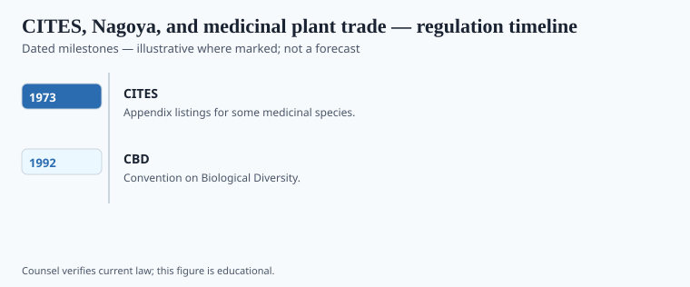

**Disclaimer.** Educational history only. Not medical advice. Past uses of plants do not prove safety or efficacy today. Do not use this series to self-treat or to market disease claims.

The 1973 Convention on International Trade in Endangered Species is a permit system for listed animals and plants. The 2010 Nagoya Protocol, under the Convention on Biological Diversity, is a later attempt to make access to genetic resources and traditional knowledge a contract with benefit-sharing. Medicinal plants sit in both when they are rare, pretty, or worth a patent.

This is not a hug. It is paperwork after a long shrug. Cinchona seed, vinca from a cosmopolitan flower, Pacific yew bark: earlier essays in the wider history file show what the shrug cost. Nagoya does not rewrite 1950s Ontario. It tries to change the next methods section.

## Statute and agency context

<!-- graphics-pack:v1 -->

*Figure 1. Statutory milestones — legal history, not treatment recommendations.*

1973 CITES; 1992 CBD (Rio); 2010 Nagoya; entry into force 2014 for Nagoya — `[VERIFY]` the in-force date against the CBD secretariat before a caption. The United States is a CITES party and not a CBD/Nagoya party in the usual way; say so if the figure looks global. Figure 1 is legal history. It is not a collecting permit.

Hoodia and the San–CSIR fight, Peyote's conservation-and-church file, American ginseng's CITES listing: teaching cases with names. Do not turn them into a safari. Do not publish harvest sites.

## Operator timeline (US-focused where noted)

<!-- graphics-pack:v1 -->

*Figure 2. Illustrative agency questions — not a filing checklist.*

Is the species listed? Who holds the traditional knowledge? What crosses a border? Figure 2 is a cartoon of those questions. It is not a how-to for bioprospecting. A U.S. dietary-supplement firm that buys a powdered root still sits under DSHEA for the label and under wildlife and customs law for the sack. Two offices. One plant.

The honest caption for a "from the rainforest" bottle is the invoice and the appendix, if any. The molecule is real. So is the cubic meter. This pack will keep saying that until the methods section learns to fill in the ellipsis after *plant material obtained from…*

## After the appendix

CITES appendices and Nagoya contracts are incomplete answers to a complete history of taking. Incomplete is still better than a shrug. The U.S. not being a CBD party matters when a caption looks global. Say it.

Peyote's conservation-and-church file, American ginseng's permits, Hoodia's contract fight: name them or leave them. Do not make a collage "sacred plants of the world." Figure 2 is not a bioprospecting canvas. A methods section that still writes *obtained from…* and stops is the silence this essay exists to teach a reader to hear. Hear it. Do not fill it with a rainforest stock photo.

<!-- prose-expand:v1 38-biodiversity-medicinal-plants.md -->
## Appendices, a cherry, a cactus

CITES entered into force on 1 July 1975. Appendix I is a commercial-trade ban for listed taxa; II is a permit; III is a party's special list. Medicinal plants show up when a hillside can be emptied: *Panax quinquefolius* (American ginseng), *Aquilaria* (agarwood), *Prunus africana* (African cherry / pygeum bark), some *Taxus*. In the United States, Fish and Wildlife and plant-health offices split the paperwork. The Lacey Act is an older domestic stick for illegally taken plants. None of that is a collecting map.

*Hoodia gordonii* and the San–CSIR benefit-sharing fight is a named contract story. *Lophophora williamsii* (peyote) is a conservation file and a church file at once — do not collage it into "sacred plants of the world." Pacific yew bark and taxol (Goodman and Walsh) and Ghanaian *Cryptolepis* (Osseo-Asare, *Bitter Roots*) are remainder stories: a molecule, a cubic meter, and a methods section that used to stop at *obtained from…*.

Nagoya (adopted 29 October 2010; in force 12 October 2014) tries to make the next methods section a contract. The U.S. Senate never consented to the CBD; say so when Figure 1 looks planetary. A powdered-root capsule can still be a DSHEA label object and a CITES-permit object in one carton. Invoice plus appendix, if any. No rainforest stock photo.
