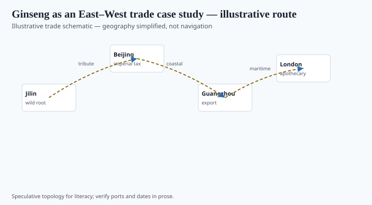
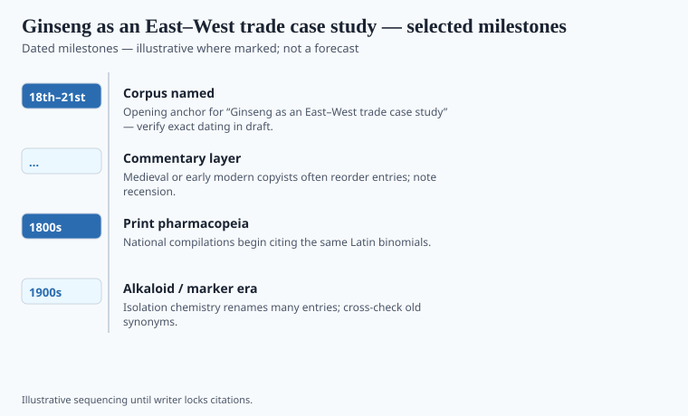

**Disclaimer.** Educational history only. Not medical advice. Past uses of plants do not prove safety or efficacy today. Do not use this series to self-treat or to market disease claims.

*Rénshēn* sits in the upper grade of the reconstructed *bencao* and in every later export story. Linnaeus's *Panax* locked a Greek "all-heal" onto an East Asian root. American *Panax quinquefolius*, gathered in Appalachian and northern woods and shipped to China from the eighteenth century, is the reverse current: a New World root sold into an Old World grade. Jesuits and later Philadelphia merchants sit in that file. The woods still remember the price.

"Siberian ginseng" is *Eleutherococcus*, not *Panax* — a Soviet adaptogen mascot that borrowed a famous word. Botanists hate the name. A box still moves.

## Routes and ports in the record

<!-- graphics-pack:v1 -->

*Figure 1. Illustrative trade schematic for “Ginseng as an East–West trade case study” — simplified geography, not navigation or modern routing.*

Korea, northeast China, and later Wisconsin farms; Montreal and Philadelphia as early American export nodes; Canton as the appetite. Figure 1 is a schematic, not a buyer's map. Wild American ginseng is a CITES-listed plant with state permits. This essay will not help anyone dig.

Tribute and gift economies in East Asia priced the root as prestige before they priced it as a capsule. A Ming or Qing grade is not a randomized trial. A Wisconsin field is not a wild hillside. Three objects, one word.

## What changed when the cargo landed

<!-- graphics-pack:v1 -->

*Figure 2. Dated beats to verify in draft — not a clinical efficacy chart.*

When Korean red ginseng landed in an early modern Chinese shop, it entered a *bencao* sentence. When American root landed in Canton, it entered a substitute-and-grade fight. When a U.S. capsule landed in a 1990s aisle, it entered DSHEA: structure/function, disclaimer, no disease claim if the lawyer is awake. Figure 2 should carry eighteenth-century export, later farm eras, CITES, 1994 — not an "energy" bar chart.

Clinical trials on *Panax* preparations exist and are mixed in quality and endpoint. Do not invent a meta-analysis here. Name a review if you lock one in revision. Until then, the historical claim is enough: **a prestige root became a global word, and the word now outruns the genus.**

No dosing. No "ancient secret." The secret, such as it was, was a hillside and a grade. The aisle is a statute.

## After the word

*Eleutherococcus* as "Siberian ginseng" is the Soviet sequel and a labeling fight. *Panax notoginseng* and other cousins thicken the word further. A shopper who thinks "ginseng" is one plant has already lost the *bencao* and the woods.

Wild American root is a permit problem and a poaching problem. This essay will not map a county. Farm Wisconsin and farm Korea are honest agricultural objects. A DSHEA capsule is a legal object. A tribute root is a historical object. Figure 1's arrows should not look like a buying guide. Figure 2 should not grow an energy axis. The word outran the genus. That is enough plot.

<!-- prose-expand:v1 39-ginseng-east-west-trade.md -->
## Jartoux, Canton, Wisconsin

Pierre Jartoux's 1711 Jesuit letter from Beijing described a prestige root and wondered about a Canadian cousin. Joseph-François Lafitau then hunted *Panax quinquefolius* near Montreal. By the 1780s American woods root was a Canton cargo — grade, weight, and a hillside that could be emptied. "Sang" hunting in Appalachia is folklore sitting on that export. Korean *P. ginseng*, including steamed red ginseng, is a different grade fight inside a *bencao* sentence.

CITES listed American ginseng on Appendix II. Wild and wild-simulated root still moves under permits; this essay will not map a county. Farm Wisconsin and farm Korea are agricultural objects with harvest calendars. *Eleutherococcus senticosus* as "Siberian ginseng" is a Soviet-era naming raid that U.S. labeling later had to police. *P. notoginseng* (sanqi) thickens the word again.

Trials on *Panax* preparations exist and are mixed. Do not invent a meta-analysis. A 1990s U.S. capsule is a DSHEA object: structure/function, disclaimer. Figure 2 may carry 1711, Canton export, farm eras, CITES, 1994. It may not grow an "energy" axis. The word outran the genus.
