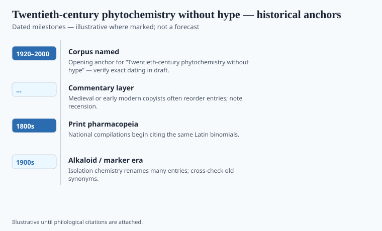

**Disclaimer.** Educational history only. Not medical advice. Past uses of plants do not prove safety or efficacy today. Do not use this series to self-treat or to market disease claims.

A twentieth-century phytochemistry bench is a place where a dried plant becomes a set of peaks and, sometimes, a name. Chromatography, better microanalysis, and institutional screens (the National Cancer Institute's plant program among them) changed the speed of the old shop question: which part matters? The H2s on this shell still say "textual" and "plants named" because the graphics pack reused a template. Read them as **lab context** and **named materials**. There is no archaeology here except the archaeology of notebooks.

This essay will not glow. No cinematic wet lab. No percentage of "drugs from plants" without a Newman and Cragg year and a denominator. The percentage moves when you change the counting rules.

## Textual and archaeological context

<!-- graphics-pack:v1 -->

*Figure 1. Anchors for antiquity-to-modern framing — verify dates in draft.*

<!-- under-fig:v2 -->
Mikhail Tswett’s early-1900s chromatography sat on the shelf until mid-century paper, gas, and then HPLC made “a peak” an ordinary noun. Norman Farnsworth’s NAPRALERT at the University of Illinois Chicago tried to make the world’s plant-constituent papers searchable. Monroe Wall and Mansukh Wani’s 1971 paclitaxel paper (from *Taxus brevifolia* bark) and their camptothecin work (*Camptotheca acuminata*) are NCI-adjacent named hits. The Ontario–Lilly vinca story (Noble, Beer, Cutts; Gordon Svoboda at Lilly) and China’s Project 523 / *Artemisia annua* are the other celebrity screens. Most fractions did nothing in the assay. That boredom is the science. 1920–2000 in this file is the window from alkaloid textbooks to “natural product” as a grant category.

1920–2000 in the file is a working window: from the late alkaloid-and-glycoside textbook to HPLC as ordinary and to the decade when "natural product" became a grant category. Farnsworth's NAPRALERT was a Chicago-area attempt to make the world's plant-use papers searchable. The existence of the database is the historical point. Scraping it into medical advice is not.

NCI–USDA collecting, Wall and Wani's paclitaxel and camptothecin, the Ontario–Lilly vinca story, Project 523 and qinghao: these are named institutional stories, already told more carefully in isolate essays. What this piece adds is the **form** — a screen, a fraction, a paper, a CRADA. Most fractions did nothing in the assay. That boredom is the science.

## Plants named in the surviving record

<!-- graphics-pack:v1 -->

*Figure 2. Comparative materia medica plate — illustrative line art, not botanical ID.*

Figure 2 will silhouette the same celebrity plants the rest of the pack has used. In a 1970s methods section they are "botanical material." The silence after the supplier's name is the ethical remainder. Pharmacognosy as a teaching subject — jars, microscopy, the look of a crude drug — faded in many pharmacy schools as the tablet won. Something was gained (reproducibility). Something was lost (the habit of looking).

A late-century "phytochemical" sold as a U.S. dietary supplement is a DSHEA object unless it is a drug. The lab that named a constituent did not automatically name a legal category. Category is a statute. The bench is a bench.

Close on that split, not on a sunrise over a flask. The flask, if you photograph one, should be a historical instrument with a museum number, not a generated "scientist holding a glowing leaf." This pack has been arguing that point since the first papyrus. The twentieth century did not repeal it. It gave us better peaks and the same temptation to lie about what they mean.

## After the peak

Newman and Cragg will give you a percentage if you give them a year and a rule for counting. Without those, do not print a percentage. Farnsworth's database is a monument to paper. NCI's screen is a monument to boredom and the occasional molecule. Vinca, taxol, qinghao: named stories with unpaid remainders.

Pharmacy schools that boxed the crude-drug jars boxed the habit of looking. HPLC does not restore looking. It restores a peak. Both are tools. Neither is a glowing leaf in a model's hand. Figure 2's celebrity silhouettes are a risk: they make phytochemistry look like a greatest-hits album. The hits were fractions that did something in an assay. The album is mostly silence. Silence is the science. The temptation to lie about the peaks is the marketing. This pack ends on that split because the twentieth century did not close it. It gave us better instruments for the same old lie and the same old check: a date, a name, a file, or a `[VERIFY]`.

<!-- prose-expand:v1 40-modern-phytochemistry-lab.md -->
## NAPRALERT, NCI screens, three remainders

Norman Farnsworth's NAPRALERT at the University of Illinois Chicago was a twentieth-century paper monument: who reported which constituent in which organ. The U.S. National Cancer Institute's plant-screening programs (1950s–1980s waves) were boredom plus the occasional hit. Newman and Cragg will give a percentage of drugs with natural-product ancestry if you give them a year and a rule. Without those, do not print a percentage.

*Catharanthus roseus* (vinca) alkaloids: Malagasy plant, Western isolation, unpaid remainder. *Taxus brevifolia* and taxol: Pacific Northwest bark, Goodman and Walsh's file. Project 523 and *Artemisia annua*: a Chinese wartime antimalarial program, Tu Youyou's cold-soak reading of Ge Hong. Three celebrity silhouettes. The album is mostly silence.

HPLC does not restore the crude-drug cabinet's habit of looking. It restores a peak. A "phytochemical" on a U.S. aisle is a DSHEA object unless it is a drug. Photograph a museum-numbered instrument. Not a glowing leaf.
