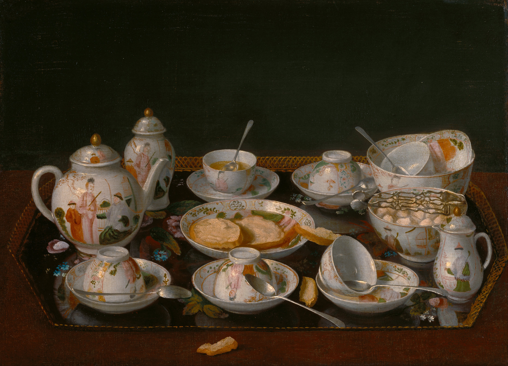

<!-- htf-figure:v1 -->
<figure class="htf-figure">
  
  <figcaption><strong>Fig. 1.</strong> Foodways live at the table — a domestic tea set still life, not a materia medica plate hunting an indication. <em>Rights:</em> Public domain; see <a href="https://commons.wikimedia.org/wiki/File:Liotard%2C_Jean-%C3%89tienne_-_Still_Life-_Tea_Set_-_Google_Art_Project.jpg">Commons</a> and RIGHTS.md.</figcaption>
</figure>
There is already a way to write about plants in water, and it has a Latin name that sounds like a library. Materia medica catalogs what a tradition said a plant was *for*. Pharmacopeias, herbals, bencao, nighantu — those are real genres. They have their own historians. This repo even has folders that sit nearer that literature, with their own fences. This folder is not trying to win that argument by arriving late and speaking softly.

Foodways is a different plot.

The word, as American folklorists and anthropologists have used it, points at the whole chain: how a plant is grown or gathered, how it is stored, who is allowed to cook it, who is served first, what it costs, what it replaces when the expensive thing is gone, what it means when you hand the cup across a threshold. Sidney Mintz, who spent a career refusing to let sugar be "just" a sweet, put the stubborn version on the table: meaning does not inhere in a substance. It arises from use, as people use substances in social relationships. A mint glass in Fès and a mint bag in a Midwestern cubicle share a plant family and almost nothing else.

If I write this series as materia medica, every plant will try to climax in an indication. Chamomile will not be allowed to be a cottage flower in a tin. Linden will not be allowed to be five o'clock in a French kitchen. Hibiscus will not be allowed to be Christmas in Kingston and a street glass in Dakar. The climax will always be a body complaint, and the fence will be a footnote. That is how a claims-guarded folder fails while congratulating itself.

If I write it as foodways, the climax is allowed to be a market, a tax, a name fight, a wartime cupboard, a wedding toast, a council shell cup, a roasted-grain substitute, a Protected Designation of Origin. Those are not lesser stories. They are the stories that do not need a disease to stand up.

I am not pretending the two literatures never touched. European stillrooms kept receipt books that mixed cookery and household physic in the same hand. A Maghrebi pot of herbs existed before Chinese green tea arrived in volume, and some of those herbs sat in a register that later writers would call "digestive." Dictionaries still define *tisane* with a sickroom aftertaste. I can say that a genre existed without turning this essay into that genre. The stillroom is a room in a house. The house also had a table.

Mintz is useful here because he will not let the table be a metaphor only. Sugar in Britain became a caloric staple for factory hours. Tea became the vehicle. The pair is a labor history before it is a flavor history. When I later write about Moroccan *atay*, I will need sugar as a commodity, not as a garnish. When I write about wartime "tea" in Britain, I will need rationing and substitution, not a wellness rebrand of rose-hip. When I write about hibiscus in the Atlantic world, I will need Judith Carney's kitchen gardens and Michael Twitty's insistence that a red drink can be joy and survival in one glass — which is already a foodways claim, and does not require a lab result to be true as a social fact.

There is a temptation, especially in a claims-guarded series, to become so frightened of the body that we write as if no one ever drank anything because they felt like drinking it. That would be a different lie. People drink because they are thirsty, because they are cold, because the guest walked in, because the fast has a permitted liquid, because the child is allowed the sweet tart glass, because the roasted barley is what the household has. Feeling like drinking it is a use. "Feeling" is not a diagnosis.

The method, then, is a set of questions I will keep asking the drafts:

- What plant part actually went in the pot?
- Was it infused, decocted, roasted, fermented, sweetened, chilled, bottled, or bagged?
- Who picked it, and were they paid?
- Who was not in the room?
- What did it stand in for — Camellia, coffee, wine, water that was not trusted, a taxed import?
- What name did the drinkers use before the export office renamed it?
- What year is actually attested, and what year is a brochure?

If a paragraph cannot answer at least two of those, it is probably warming its hands over an indication.

I will also keep a negative method. I will not translate *qi*, *rasayana*, or "cooling" food classification into a modern clinical sentence. Chinese chrysanthemum as a summer drink lives in a culinary theory of hot and cool foods; that theory is a food classification, and it is not a license to park a lab value next to the cup. Ayurvedic household tulsi lives in a courtyard and a ritual day; it is not waiting to be renamed by a mid-century laboratory class. Those refusals are not disrespect. They are how you avoid stealing a system and selling it as a sachet.

This draft does not treat, cure, or prevent. It is not medical advice. It is a jurisdiction claim. The rest of the folder will be easier to read if you accept the jurisdiction now: we are in the kitchen, the market, the ship, the stillroom-as-room, the café, the ration book. We are not in the clinic. If a later draft drifts, fail it by quoting the sentence. Do not let me tell you I meant foodways when the verb was doing someone else's job.

## Claims box

- Educational foodways and cultural history only.
- This draft does not treat, cure, or prevent.
- Materia medica is a real literature; this folder does not impersonate it.
- Not medical advice. Not a supplement label. Not a protocol.
