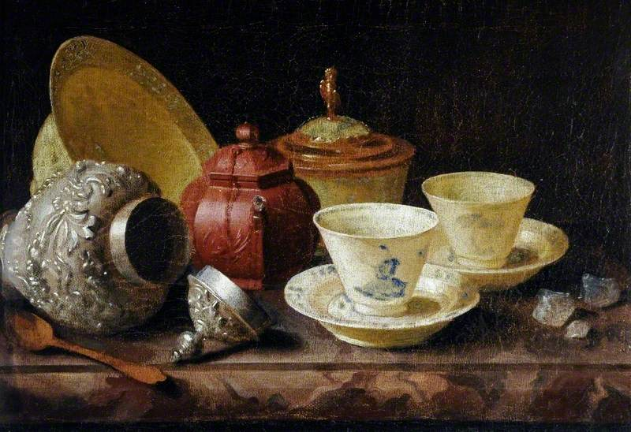

<!-- htf-figure:v1 -->
<figure class="htf-figure">
  
  <figcaption><strong>Fig. 1.</strong> A household receipt belongs to the same room as this table — instructions for a kitchen, not proof of a modern finding. <em>Rights:</em> Public domain; see <a href="https://commons.wikimedia.org/wiki/File:Pieter_Gerritsz._van_Roestraten_%281629-1630-1700%29_-_Still_Life_with_Tea_Cups_-_VIS.305_-_Sheffield_Galleries_and_Museums_Trust.jpg">Commons</a> and RIGHTS.md.</figcaption>
</figure>
A receipt, in the older English sense, is a recipe. The word sat in cookery books and in household books that did not bother to keep cookery and physic in separate bindings. That mixed binding is the trap. A modern reader opens a stillroom manuscript, sees "for the cough" in the margin, and decides the whole history of herbal infusions is a history of treatment. A different modern reader, frightened of that margin, pretends the household never wrote it down. Both readers are doing marketing: one for the wellness aisle, one for a purity that never existed.

I want a third way to read the page.

First, notice what the page *is*. A household receipt is a set of instructions for a particular kitchen: this much water, this plant as the writer could get it, this sweetening if the household had sugar or honey, this vessel, this length of time that is usually vaguer than a modern recipe blog. It is evidence that someone expected the drink to be made again. It is not a trial. It is not a label. It is not a promise that travels unchanged from a Yorkshire stillroom to a 2026 tin.

Second, notice who could write. Literacy, paper, and leisure were not evenly distributed. The surviving English and French receipt books over-represent households that could afford a bound book and a person with time to copy. Oral instructions — the ones that actually moved hibiscus across the Atlantic in someone's head, or yaupon from a coastal thicket to a council — leave thinner paper. If I treat the bound book as the whole past, I will write a history of people who owned desks.

Third, notice the neighboring recipes. A page that has a linden infusion next to a fruit conserve and a stain-remover is telling you something about the *room*. The stillroom was storage, scent, drink, and household chemistry. It was not a clinic that happened to have jam. When I say "stillroom" in later drafts, I mean that mixed room, not a cute synonym for pharmacy.

Fourth, notice the economic line. Sugar, tea, and spices in a British or Maghrebi receipt are not flavor notes only. They are prices. Cornwell's work on Moroccan tea and sugar in the nineteenth century is useful even when I am not in Morocco: the herbs were often local and the sweetening was not. A receipt that suddenly has cinnamon and cloves is a receipt that has a ship in it. Hibiscus sorrel in the Caribbean is a receipt with Africa, sugar, and a holiday table in it. If I delete the ship, I get a lifestyle caption.

Fifth, notice what the receipt does *not* say. It usually does not give a botanical authority. "Mint" might be several Mentha. "Balm" might be Melissa or Monarda, depending on the colony. "Sage" in a Maghrebi pot is not necessarily the same garden sage as a Tuscan bundle. Identity errors travel faster than essays. A claims-guarded foodways series has to say "as named in the source" more often than it says "the plant is."

Sixth — and this is the fence — notice when you are being invited to finish the sentence with a condition. The old margin may already have done it. You do not have to repeat it as if it were the point of the drink, and you do not have to launder it into "supports." This series will mention that household literature had a sickroom register, because pretending otherwise is a lie about the books. It will not use that register as the destination of a plant. The destination here is the table, the guest, the season, the substitute, the name.

A worked example, without turning into a monograph: barley water. The Greek and Latin words behind *tisane* point at peeled barley cooked into a drink. Later French and English pages keep the word while the barley quietly exits, and herbs enter. If I read that only as "they were treating," I miss the cheaper fact: cereal drinks are food. They fill a cup when milk is dear and wine is for someone else. If I read it only as "they were hydrating," I miss that the dictionaries kept a sickroom sense. The honest reading is mixed, and the mix does not authorize me to park a modern diagnosis next to a saucepan.

Another example: "Oswego tea." American popular history loves to say that colonists drank *Monarda* after refusing Camellia. Sometimes they did drink bee balm as a hot infusion. Sometimes the story is doing patriotic work. A receipt that says "Oswego" is a clue, not a flag. I will come back to that plant in a later draft as a substitution story. I will not come back to it as a protocol.

How, practically, should you read the rest of this folder when a draft cites a receipt?

- Believe the verb of making: boil, steep, roast, sweeten, strain.
- Be slower to believe the verb of healing, even when the source uses it.
- Ask what was expensive.
- Ask who is unnamed.
- Ask whether the same drink appears in a hospitality scene with no margin note at all. Those scenes are the ones this series prefers, not because they are prettier, but because they are the foodways object without a borrowed climax.

This draft does not treat, cure, or prevent. It is not medical advice. A method essay is allowed to be bossy. If a later draft quotes a receipt and then winks toward a condition, fail the wink. The receipt can stay. The wink cannot.

## Claims box

- Educational foodways and cultural history only.
- This draft does not treat, cure, or prevent.
- A household receipt is an instruction for a kitchen, not a finding.
- Not medical advice. Not a supplement label. Not a protocol.
