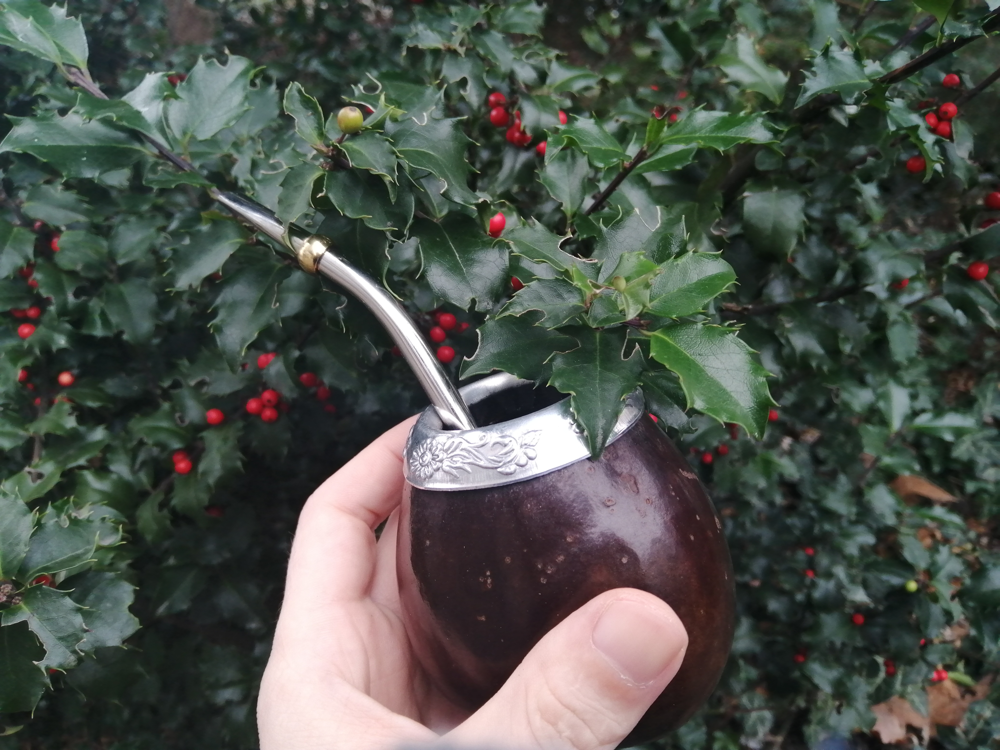

<!-- htf-figure:v1 -->
<figure class="htf-figure">
  
  <figcaption><strong>Fig. 1.</strong> Cup, pot, and strainer assign status — a gourd and bombilla are the social hardware of a drink. <em>Rights:</em> CC BY-SA 4.0; see <a href="https://commons.wikimedia.org/wiki/File:Mate_gourd_%28calabash%29_and_bombilla_held_against_a_European_Holly_%28Ilex_aquifolium%29_bush.jpg">Commons</a> and RIGHTS.md.</figcaption>
</figure>
A drink is an object before it is a plant.

I can say that without becoming a museum catalog. The object is usually cheap: a glass, a tin pot, a cracked cup, a gourd, a thermos, a strainer that used to be a fork. Foodways that only describe the leaf will miss why two households with the same mint do not make the same hour.

Start with the **pot**. Moroccan *atay* is inseparable from a metal teapot and a pour that wants height, foam, and a second filling of the same leaves. The pot is not a serving suggestion. It is how the drink is concentrated and how the host performs generosity. A Russian samovar — even when the zawarka is Camellia — taught a whole architecture of concentrate-plus-water that herbal substitutes had to live beside. A Japanese kettle for *mugicha* in summer may be a large barley pot meant to be drunk cold from the fridge, which is a different social object from a small kyusu. If I write "teapot" for all of these, I am writing a furniture ad.

The **cup** assigns status. A thick glass that can take sugar and heat is a Maghrebi and Levantine fact. A thin porcelain cup is a European parlor fact. A jar is an American porch fact. A marine shell cup in southeastern holly-drinking accounts is a ceremonial fact, and Crown and colleagues' Cahokia paper is, among other things, a paper about beakers — vessels with residue, not vibes. Mate's gourd and bombilla are so specific that calling the drink "tea" is almost a joke at the object's expense. I will give mate its own draft. Here I only need: if the vessel is famous, the drink is already a foodway.

The **strainer** is class in a small steel mesh. Loose blossom needs one, or needs teeth. A bag is a strainer that has been sewn shut in another country. A fork across a mug is a strainer for people who will not buy a gadget. A cloth bag that is reused is a different ecology from a single-use paper envelope. I have watched people apologize for the fork. I would rather they not. The fork is honest about what the household owns.

There are objects this series will keep meeting:

- The **street cooler** and the plastic bag of red drink, tied at the corner, in West African cities. Packaging is a vessel.
- The **wedding tray** that carries hibiscus in Egypt or Sudan in the stories people tell about toasts. I will hedge the "always" and keep the tray.
- The **office mug**, American, stained, microwave-scorched, in which a bag of something-not-Camellia does the work of a pause. Undignified. Real.
- The **thermos**, which moved infusion from the table to the shift.

Gender and age hide in the object. A child is handed the sweet glass, not the small bitter cup. An elder is poured first, or last, depending on the house. A guest gets the glass that matches. These rules are not universal. They are the sort of thing a travel writer flattens and a grandchild remembers. I have not done the ethnography for every town I will name. I will still insist that *someone* was poured for, and someone did the pouring, and that is already a history.

Material also travels. Enamelware followed armies and missions. Aluminum followed factories. Plastic followed oil. A "traditional" drink in a polyethylene bag is not a contradiction. It is Tuesday. Claims-guarded foodways should not require a handmade ceramic to take a drink seriously. Authenticity-as-clay is a boutique.

I will say the fence sentence before the objects get cute. This draft does not treat, cure, or prevent. It is not medical advice. A cup is not a delivery device in a clinical sense. It is a social device. If a later draft starts talking about "bioavailability" because a pot boiled longer, that sentence is in the wrong folder. If a later draft talks about the second pour in a Maghrebi pot, that sentence is at home.

When you are tired of plants, read for hardware. Hardware does not want to become a cure. Hardware wants to be washed.

## Claims box

- Educational foodways and cultural history only.
- This draft does not treat, cure, or prevent.
- Vessels assign hour, status, and labor; they are not delivery devices.
- Not medical advice. Not a supplement label. Not a protocol.
