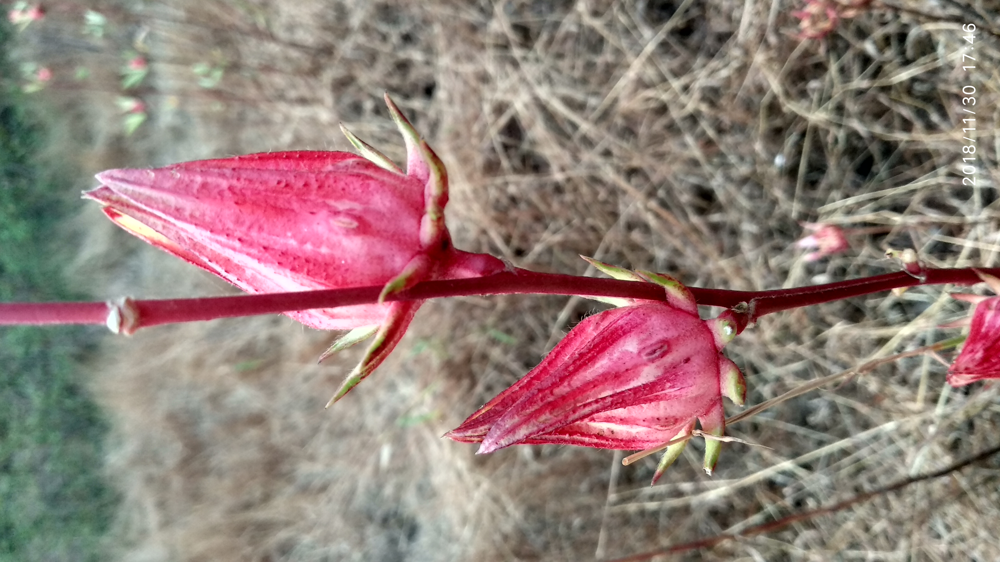

<!-- htf-figure:v1 -->
<figure class="htf-figure">
  
  <figcaption><strong>Fig. 1.</strong> Bissap, zobo, and sobolo share a calyx — street names before the English aisle says hibiscus tea. <em>Rights:</em> CC BY-SA 4.0; see <a href="https://commons.wikimedia.org/wiki/File:Hibiscus_sabdariffa_fruits.jpg">Commons</a> and RIGHTS.md.</figcaption>
</figure>
Street ice in Dakar does not wait for a Latin binomial. The cooler is already bleeding color into meltwater while the seller negotiates sugar.

That is the drink I want in this draft: a West African table and street object made from the fleshy calyces of *Hibiscus sabdariffa*, the plant English often calls roselle. The same calyx travels under other names. In Senegal and much of Francophone West Africa the common drink-name is *bissap*, widely given as a Wolof word that then sat comfortably in French. In Nigeria the boiled, spiced, sweetened version is *zobo*. In Ghana it is often *sobolo*. I am not doing a census of every market name from Bamako to Cotonou. I am saying the English aisle word "hibiscus tea" is a late compression of several kitchens that already had their own nouns.

The method is closer to a decoction than to a bag. Sellers and households boil the dried — sometimes fresh — calyces with water, often with ginger, sometimes with pineapple peel, cloves, or whatever the day's spice box holds. The liquid is strained. Sugar goes in while it is still hot enough to dissolve, or later, or both. The result is tart, ruby, and willing to be drunk cold from a plastic bag tied at the corner, from a glass with ice, or — less often in the heat, but not never — hot. Temperature is a meal decision. A cold street glass in Accra and a warm evening pot in a family courtyard are not the same hour just because the plant is the same.

I have not stood at every cooler I am about to mention. Travel writing and food pages repeat the street scene so often that it has become a stock photograph: the red drip, the ginger heat, the sugar argument. Stock photographs can still be true as a type. What I will not do is invent a particular seller's joke or a harvest figure out of Ouagadougou. The social fact is ordinary enough without embroidery. People buy the drink because they are thirsty, because it is cheap relative to imported soda, because a gathering wants a color, because the child is allowed the sweet tart glass and not the beer.

Social gatherings matter more than the aisle likes to admit. *Bissap* at a baptism or a naming, *zobo* at a campus party, *sobolo* at a street stall after work — these are hospitality and leisure objects. Sugar is not a garnish in that sentence. Sugar is the price and the pleasure. Sidney Mintz would recognize the structure even though he was writing about a different ocean: sweetness as a social relationship, not a molecule behaving "in itself." The spices vary by city and by seller the way a stew varies. That variation is the foodway. A German hibiscus sachet that tastes like a single sour note has already deleted the ginger negotiation.

Judith Carney and Richard Rosomoff's work on African plants in the Atlantic world is relevant here only as a light border. Roselle belongs among the kitchen-garden plants that moved with people, not only with companies. This draft is not the Middle Passage essay. The Caribbean Christmas pot and the Mexican *agua de jamaica* get their own pages. Here I want the West African street and table to stay first, not to be treated as a preface to the diaspora. The calyx was already a drink before it was an export story.

Export, though, sits in the crate even when the glass is local. Commodity notes and trade pages often name China and Thailand among the large producers of dried roselle calyces for the world market. Sudan and other African harvests appear in the same kind of sentence. I have not audited a customs ledger and I will not invent percentages. Treat that list as a reported geography of the dried flower as a commodity: the supermarket blend in Europe or North America may be an Asian or African harvest with a European cut. A Dakar cooler is not that crate. A Lagos pot of *zobo* made from a market bag of calyces may or may not be using a local harvest; I cannot tell from this desk. The honest foodways move is to keep the two objects separate: the street glass, and the sack that travels.

Names refuse the compression. If I write only "hibiscus," I have already chosen the Linnaean and the aisle. *Bissap*, *zobo*, and *sobolo* are not branding problems waiting for a translation. They are how drinkers order the thing. A claims-guarded series should prefer the order-word. "Herbal tea" is what a London tin says when it wants the kettle ritual without Camellia. Nobody at a Ouagadougou stall is trying to be a tin.

Household literature in more than one language has sometimes parked roselle in a sickroom register — a chapter, a dictionary sense, a "for when" margin. I can say the register existed. I will not make it the payoff. The drink I am describing is the one poured for thirst, for guests, for color on a plastic tablecloth. This draft does not treat, cure, or prevent. It is not medical advice. A ruby glass is a foodways object. It is not a finding.

Labor hides in the color. Someone grew the plant, picked the calyces, dried them, bagged them, hauled them, boiled them, sweetened them, and stood in the heat selling them. The Latin name does none of that work. If a later sentence in this folder talks about *Hibiscus sabdariffa* as if the plant arrived already bottled, fail the sentence. The Atlantic hibiscus belt is a belt of work before it is a belt of names.

I will keep one more refusal on the table. Do not let the tartness become a morality. Wellness copy likes a sour red drink to sound virtuous. Street *bissap* is allowed to be a sugar hit. Campus *zobo* is allowed to be a party. That is use. Use is the plot.

## Claims box

- Educational foodways and cultural history only.
- This draft does not treat, cure, or prevent.
- *Bissap*, *zobo*, and *sobolo* are street and table names, not a clinic class.
- Not medical advice. Not a supplement label. Not a protocol.
