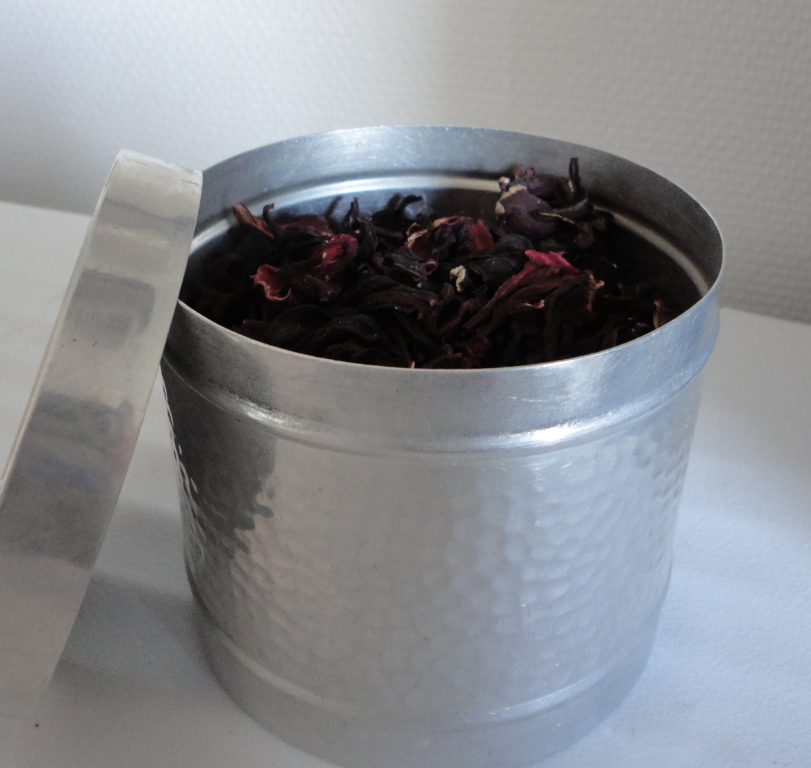

<!-- htf-figure:v1 -->
<figure class="htf-figure">
  
  <figcaption><strong>Fig. 1.</strong> Kinkeliba's English trail is thinner — the guest pot still matters even when the archive is quiet. <em>Rights:</em> CC0; see <a href="https://commons.wikimedia.org/wiki/File:Dried_hibiscus_flowers.jpg">Commons</a> and RIGHTS.md.</figcaption>
</figure>
A guest in the western Sahel is often poured for before anyone asks what the leaf is called in a language that prints well. The pot is already on, and the house already knows the bush.

The plant English-language labels sometimes bother to Latinize is *Combretum micranthum*. In much of Francophone West Africa the drink-name you will hear is *kinkeliba* — spellings wander, as drink-names do when they move between Wolof, Manding, French, and the aisle. I am staying with the pot and the guest. I am not turning the leaf into a specialty of a body part. English-language sources on this as a *foodway* are thinner than the sources on mint in Morocco or hibiscus in Dakar. I will say that in public. Thinness is not a license to invent a colonial officer's notebook, a neat first date, or a quotation I have not got.

What does "thinner" mean, practically? It means I am working from a scatter: botanical identifications, travel and food pages that mention a cafe glass or a household pot, Francophone grocery talk, the fact that the dried leaves are sold in markets from Senegal through Mali and beyond. It does not mean I sat in a Kayes courtyard and timed the steep. It does not mean I have a village census. A travel sentence is a traveler's sentence. A market bag is a market bag. Between them you can still see a hospitality object: leaves boiled or infused, often taken unsweetened or lightly sweetened, offered when someone sits down, sold in a cafe that also sells coffee and Maghrebi-style tea.

Hospitality is the plot because the plot is otherwise always stolen. Wellness copy that has heard of *kinkeliba* wants to assign the cup a job. Older household literature in the region, like household literature everywhere, had a register of "what we prepare when." I can admit the register. I will not finish it, and I will not translate it into a modern caption. The guest does not need a caption. The guest needs a chair and a glass. This draft does not treat, cure, or prevent. It is not medical advice.

Compare the hour with the other cups in this stage. *Bissap* is a red sugar argument in the street. Rooibos is a Cape commodity that learned European paperwork. *Kinkeliba* is, in the scenes I am willing to stand behind, a brown-green pot drink that marks welcome. It can be a morning habit. It can be what you order when you are not ordering attaya. It can be the cheap leaves in a tin beside the imported gunpowder tea. Substitution is in the room without a morality play: Camellia is a purchase; the bush is nearer.

I will not write "the tea of the Sahel" as if the Sahel had one tea. The western Sahel is a belt of drinks: strong sweet mint tea in some houses, hibiscus in others, coffee where the budget and the taste run that way, *kinkeliba* where the household likes it or where the cafe lists it. Flattening those into one ancestral kettle is how a brochure gets written. A claims-guarded essay prefers the boring version. Someone picked leaves. Someone dried them. Someone boiled water in heat that already makes boiling feel like extra work. Someone poured for a visitor because not pouring would be the stranger fact.

Names, again. If a Paris or Dakar supermarket shelf says *kinkeliba* in French and *Combretum* in small type, that shelf is a historical object: a Sahelian pot drink becoming a grocery category. If an English website then files it under "herbal tea," the aisle has done its usual theft — borrowed the kettle word, deleted the guest. I will use *kinkeliba* first. I will use the Latin when I need to say which plant I think I mean, because vernacular names can cover more than one bush. Identity errors travel faster than essays.

I have not got a reliable spice list to freeze. Some pots are plain leaf. Some households add mint or sugar because the house already adds mint or sugar to everything that looks like tea. I will not invent a "traditional recipe" with clove counts. Variation is what thin sources actually show, when they show anything: a drink people recognize, not a protocol they recite the same way twice.

Labor is seasonal and ordinary. A wild or semi-wild harvest is not a factory cut. Women and men who gather and sell leaves are doing a market day, not performing a documentary. I will not romanticize the bush or the walk. I will not invent a wage. The foodways fact is smaller: the drink is cheap enough, in many places, to be ordinary, and ordinary is how hospitality survives when imported leaves are dear.

If you came to this page because an English headline gave the plant a clinical job, you are in the wrong folder, and the folder will not become that headline. Stay with the pot. Stay with the guest. Stay with the honest sentence that the paper in English is thin. The kettle does not owe us a thicker story. We owe the kettle a refusal to pad.

## Claims box

- Educational foodways and cultural history only.
- This draft does not treat, cure, or prevent.
- English-language foodways sources on *kinkeliba* are thin; no invented officer's quotation fills the gap.
- The cup in this draft is hospitality — pot and guest — not a clinic caption.
- Not medical advice. Not a supplement label. Not a protocol.
