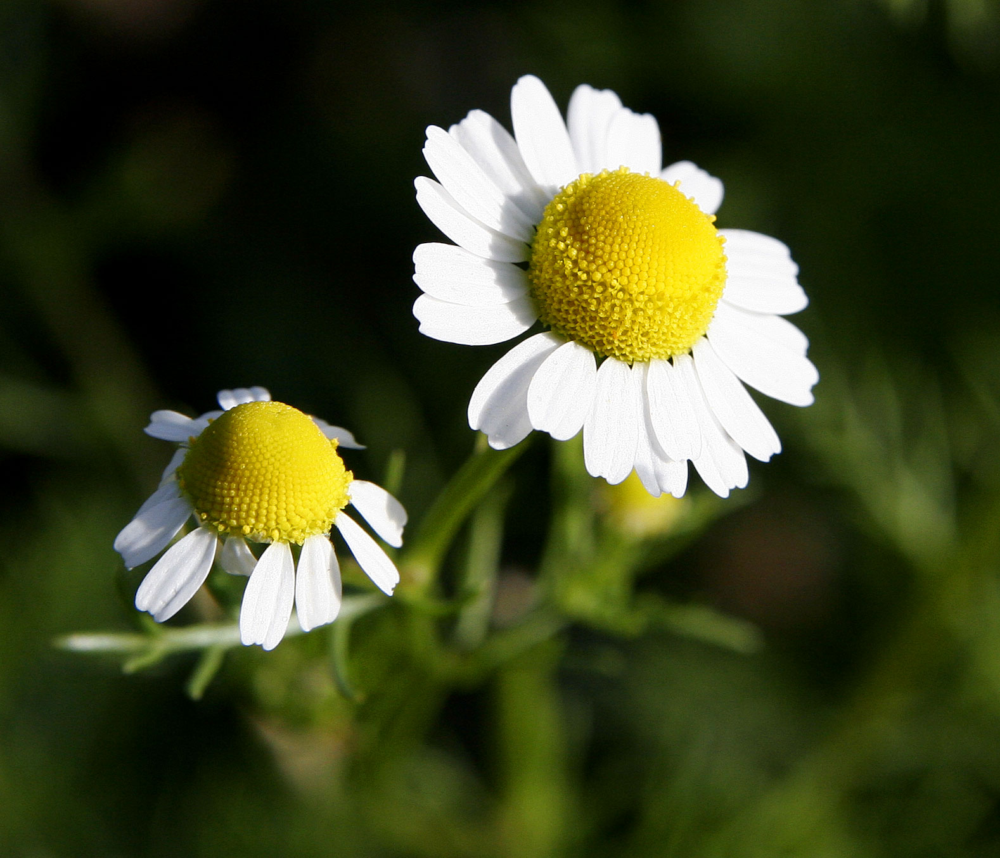

<!-- htf-figure:v1 -->
<figure class="htf-figure">
  
  <figcaption><strong>Fig. 1.</strong> Chamomile sits in cottage and cafe as a grocery category — a cup, not a bedtime indication chart. <em>Rights:</em> GFDL 1.2; see <a href="https://commons.wikimedia.org/wiki/File:Chamomile%40original_size.jpg">Commons</a> and RIGHTS.md.</figcaption>
</figure>
What the tin draws is a daisy with a yellow button. What the tin contains is a category. Grocery chamomile is not a single passport. It is a pile of small white heads that commerce has agreed to call one thing.

The naming mess is old and not cute. German chamomile — the upright annual that carries most of the world's tea-bag weight — is *Matricaria chamomilla*, also written *Matricaria recutita* and *Chamomilla recutita*, depending on which botanist won last decade. Roman or English chamomile — the low perennial that people plant between pavers and sometimes mow — is *Chamaemelum nobile*, formerly *Anthemis nobilis*. The Greek behind the English word is *chamaimēlon*, ground-apple, a smell note, not a brand. Field chamomiles and stinking chamomiles sit in neighboring genera and will ruin a pot if you are romantic about "wild." If a label prints no Latin at all, that silence is information. You are buying the category.

I am not going to pretend I have a customs ledger for every Egyptian or Eastern European field that now grows the annual for export. The foodways fact is simpler. The cottage picture on the box and the industrial field are not the same garden. *Chamaemelum* as a lawn and path plant is an English and western-European garden habit: a plant you walk on, a plant that scents a seat, a plant that looks like a storybook hedge even when the hedge is a paving joint. *Matricaria* as a crop is taller, seed-sown, harvested for heads. The cafe pot is usually the crop. The cottage illustration is usually the lawn. The tin is allowed to lie by compression. A history is not.

Cottage, cafe, sachet — three vessels, three labors. A cottage handful is picked, dried on a cloth, and looks uneven. A cafe pot of "camomille" in a French or Central European room is a hospitality move: the thing you offer when you are not offering coffee, often from a tin the waiter did not grow. A sachet is a factory decision about grams and dust. The late-twentieth-century American aisle taught chamomile to look like tea by putting it in the same envelope as Camellia. Once the envelope is identical, the plant has to be restated on purpose or it becomes a mood.

I will not make this a night essay. The aisle already did that work, loudly, with blend names this folder will not repeat as indications. People drink chamomile at night because the kettle is free and the coffee is over. They also drink it at four in a cafe because it is cheap, caffeine-free in the ordinary grocery sense, and smells like hay and apple. Hour is a use. A use is not a diagnosis. If I let "evening" become a clinical wink, I have failed the fence while sounding gentle.

Hospitality is the better plot. Chamomile is easy to serve badly. Too long in a metal pot and it goes bitter; too little flower and it is yellow water. A Central European cafe that is proud of its *Kamillentee* will still be prouder of its coffee. That second-class status is historical. Camellia is the unmarked hot drink. Chamomile is the marked one: the child's cup, the abstainer's cup, the guest who asked for something light. Temperance tables used herb infusions as social weapons against the dram shop — a later draft. Wartime cupboards used whatever daisy was in the garden. None of those scenes need a Latin monograph to be true as table facts.

Egypt as a modern supplier belongs in the sentence because the cottage drawing hides it. A great deal of the annual flower that fills European and American bags is grown as a crop far from the thatched roof on the sleeve. I will not invent a year for the first Egyptian crate. I will say the geography is ordinary commodity geography: a plant associated with a European cottage is often an African or Eurasian harvest with a European cut. THIE's herbal-infusions bin exists because that crate is an industry.

A last caution about identity. Pineappleweed (*Matricaria discoidea*) is a cousin people chew at the edge of a car park; it has no white rays. *Anthemis* species can look like the real heads and smell wrong. A claims-guarded series should say "as named on the tin" more often than "the plant is." The cottage is a picture. The cafe is a pot. The sachet is a portion. Chamomile, in English grocery, is the agreement that those three can share a daisy.

This draft does not treat, cure, or prevent. It is not medical advice. A yellow cup is a table object. If you came here for a bedtime protocol, you are in the wrong folder, and the folder will not become that protocol just because the flower is small and the marketing is soft.

## Claims box

- Educational foodways and cultural history only.
- This draft does not treat, cure, or prevent.
- Grocery chamomile is a category (*Matricaria* / *Chamaemelum*), not a single species and not a night clinic.
- Not medical advice. Not a supplement label. Not a protocol.
