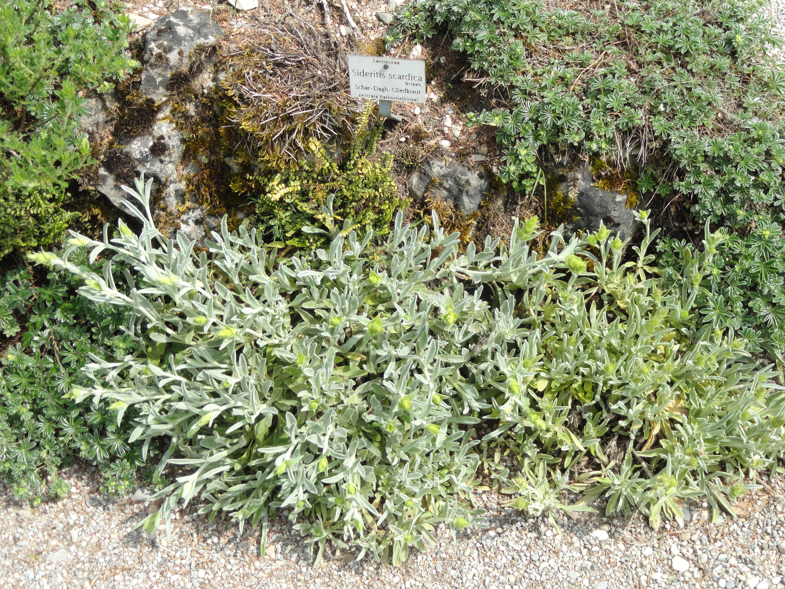

<!-- htf-figure:v1 -->
<figure class="htf-figure">
  
  <figcaption><strong>Fig. 1.</strong> Tsai tou vounou names a mountain breakfast table — harvest pressure and local nouns, not an export slogan. <em>Rights:</em> Public domain; see <a href="https://commons.wikimedia.org/wiki/File:Sideritis_scardica_-_Botanischer_Garten_M%C3%BCnchen-Nymphenburg_-_DSC07698.JPG">Commons</a> and RIGHTS.md.</figcaption>
</figure>
On a limestone slope the plant looks like a pale candle that forgot to be a shrub. Greeks have a household name for the drink that does not need an export office: *tsai tou vounou*, tea of the mountain. The Latin is a pile of species. *Sideritis raeseri*, *Sideritis scardica*, *Sideritis syriaca*, *Sideritis clandestina*, and their cousins grow on rocky ground with thin soil, often above the orchards, often where a goat has an opinion. The grocery phrase "Greek mountain tea" is a crate name. The mountain names are older.

Olympus, Parnassos, Taygetos, Athos, the White Mountains of Crete — these are not flavor notes. They are harvest geographies. *S. scardica* is the plant tourist copy likes to hang on Olympus and the northern ranges; *S. clandestina* is the one Peloponnesian talk ties to Taygetos; *S. syriaca*, in Crete, is *malotira*. *S. raeseri* is, in recent agricultural writing, the species most often planted when someone tries to take the plant off the cliff and into a field. I have not walked each massif with a vasculum. I am repeating the local map as it circulates in botanical and food-geography notes, and I am willing to be corrected on a ridge.

The name *sideritis* sits in the botanical tradition as a word from *sidēros*, iron. Theophrastus is the citation that garden and genus pages keep handing around. That is a naming etymology. I will not walk it into a battlefield or a clinic. Slow Food's Ark of Taste note on Cretan *malotira* even warns the reader not to confuse the modern mountain plant with the *Sideritis* Dioscorides discussed. Good. Modern *Sideritis* in a Cretan breakfast is not automatically an ancient author's plant. Continuity of a Greek noun is not continuity of a species.

The Ark note is usable where it stays at the table. Wild *malotira* grows on rock, eight hundred to two thousand meters in the version they print, abundant in the Lefka Ori, gathered as dried leaf and flower. The cup is boiled or very hot water on the woody stems — a decoction more than a polite infusion — and the household may add Cretan marjoram, dittany, sometimes cinnamon, honey. Traditional Cretan breakfast, in their sentence, is a cup of *malotira*, a bit of cheese, and barley toast. That is a foodways triad I am willing to carry: mountain drink, dairy, twice-baked grain. *Paximadi* is the rusk that makes the toast make sense. I have not sat at every western-Cretan table. The triad is a published hospitality picture, not a census.

Overgathering is also in that note, and in later Cretan agricultural papers: wild plants treated as rare because people pulled too much and because mountain pastures got crowded. Cultivation on plateaus — Omalos gets named in recent work — is the ordinary answer when a wild flavor becomes a shop flavor. Export likes the wild story. The slope likes a rest. A claims-guarded series can say both without turning rarity into a sales point.

How the drink is made matters because the plant is woody. You see whole stalks in a market bundle, pale and felted, sold by the fist. A saucepan, not a bag, is the older vessel. Honey and lemon are table decisions, not a protocol. In a village *kafeneio* the same bundle may sit next to coffee; the mountain cup is for the person who does not want coffee, or for the morning that wants a pot in the middle of the table. Tourist menus will italicize it. Italics are not a harvest.

I am refusing, on purpose, the payoff list that popular sources glue to this genus. You know the list. This folder will not quote it. A mountain breakfast does not need that glue. Neither does a shepherd's thermos, if the thermos is real and not a caption.

Labor on rock is slow. Someone walks up. Someone cuts in flower. Someone dries in the shade so the felt does not rot. Payment, when it exists, is not the postcard. When the plant moves to a field, the labor changes and the story tries not to. I would rather the story admit the field. A planted *Sideritis* is still *tsai tou vounou* if the drinkers say so. The drinkers own the name.

This draft does not treat, cure, or prevent. It is not medical advice. *Tsai tou vounou* is a set of mountain plants, a kettle of stalks, a breakfast with cheese and barley, and a wildness that is now an argument about how much to pick. It is not a panacea in a paper sleeve.

## Claims box

- Educational foodways and cultural history only.
- This draft does not treat, cure, or prevent.
- *Sideritis* here is landscape, local names, harvest pressure, and a table — not a payoff list.
- Not medical advice. Not a supplement label. Not a protocol.
