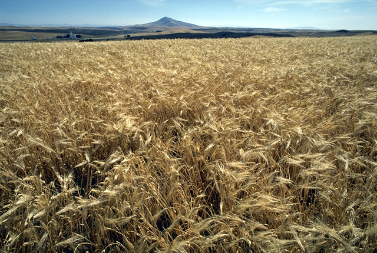

<!-- htf-figure:v1 -->
<figure class="htf-figure">
  
  <figcaption><strong>Fig. 1.</strong> Wartime cupboards learned to call roasted grain tea — stand-ins when the Camellia crate was dear. <em>Rights:</em> Public domain; see <a href="https://commons.wikimedia.org/wiki/File:Barley.jpg">Commons</a> and RIGHTS.md.</figcaption>
</figure>
When the leaf that needs a ship becomes dear, the cupboard starts answering. Roasted grain, a jar of dried apple peel, a paper of linden, a hip from the hedge — these are not discoveries. They are stand-ins. Pride and shame share the same kettle.

I am writing about Camellia and coffee as unmarked defaults under pressure, not about a secret European pharmacy that war "revealed." Napoleon's Continental System, the British blockade of Germany in 1914–18, and the later rationing states of 1939–45 are different politics. They rhyme as foodways. A taxed or blockaded import leaves a hole in the morning. The hole gets filled with whatever brown or floral thing the household can roast, dry, or collect.

Roasted grain is the oldest loud answer on the continental side. Prussian coffee monopolies in the late eighteenth century and the Continental System after 1806 made chicory and malt-barley businesses. Braunschweig became a chicory town; Kathreiner's malt-coffee factories are a later, named industrial chapter. Acorns, beet, rye — the list lengthens when the war is going badly. German *Ersatzkaffee* is a word that already contains the insult. Officials said the substitute was as good as the original. Palates wrote otherwise. Shame lives in that gap: you serve the brown drink and you call it coffee because calling it roasted barley admits the ship did not come.

Tea had its own ersatz. A National WWI Museum note mentions roasted plum leaves as a German stand-in; Dutch wartime plant lists put blackberry leaf in the teapot when Camellia was a luxury price. Linden blossom — the same *tilleul* that is a French peacetime hour — becomes, in a blockade cupboard, the thing you have because the tree is municipal and the crate is not. Dried apple peel shows up in British and continental "make-do" columns as a sweet-tart infusion when the caddy is empty. I have not got a single recipe as a universal. I have a pattern: fruit leather and hedge leaf learned to occupy the hour that "tea" had taught.

Britain's Second World War is the chapter with the best public paperwork for a plant people now want to medicalize. Tea itself was rationed; Ministry of Food flashes explained the ounces as if ounces were a moral. Rose-hip collection was a different program: County Herb Committees, *Hedgerow Harvest* leaflets, school parties paid a few pence a pound, hips taken to depots, syrup later sold as a wartime food when imported fruit — oranges in the official story — could not fill the same shelf. I am staying in that sentence. This is food-supply history. It is not a clinic, and I will not turn a children's hedge walk into a deficiency lecture. The hip was a state-organized stand-in for a missing crate of fruit. The children were a labor force with scratches and pocket money. Pride was the letter from the factory thanking the school. Shame was the taste, or the knowledge that the "real" thing was elsewhere.

Substitution has a class accent. A household that already drank linden did not feel the same loss as a household that had only ever bought a quarter of tea. A German family that had drunk chicory in peacetime was already trained. A British parlor that stretched the ration and then poured apple peel for guests was performing patriotism and apology at once. "Making do" is a slogan that flatters the maker. Guests can still tell.

I will not invent a Ministry minute I have not read. The Imperial War Museums keep the Food Flash films; *The Times* printed hip-campaign progress that later food historians quote. Those are public objects. A grandmother's story about blackberry leaf is also a public object if she told it. Neither object is a finding about a body I have not met.

After the ships return, some substitutes stay as poor-kitchen habit or as a taste someone learned to like. Most are shoved to the back of the cupboard and then into a museum leaflet. The aisle later sells roasted barley and rosehip as choices. Choice is not blockade. A claims-guarded series should keep the difference: wartime "tea" is a hole in a ration book. A peacetime sachet is a mood. They can share a plant. They do not share a meaning.

This draft does not treat, cure, or prevent. It is not medical advice. A stand-in is a stand-in. If a sentence needs a disease name to make a hip or a barley roast interesting, the sentence is doing the aisle's wartime cosplay, and it does not belong here.

## Claims box

- Educational foodways and cultural history only.
- This draft does not treat, cure, or prevent.
- Rationing and blockade make cupboard stand-ins; rose-hip collection is a wartime food program, not a clinical story.
- Not medical advice. Not a supplement label. Not a protocol.
