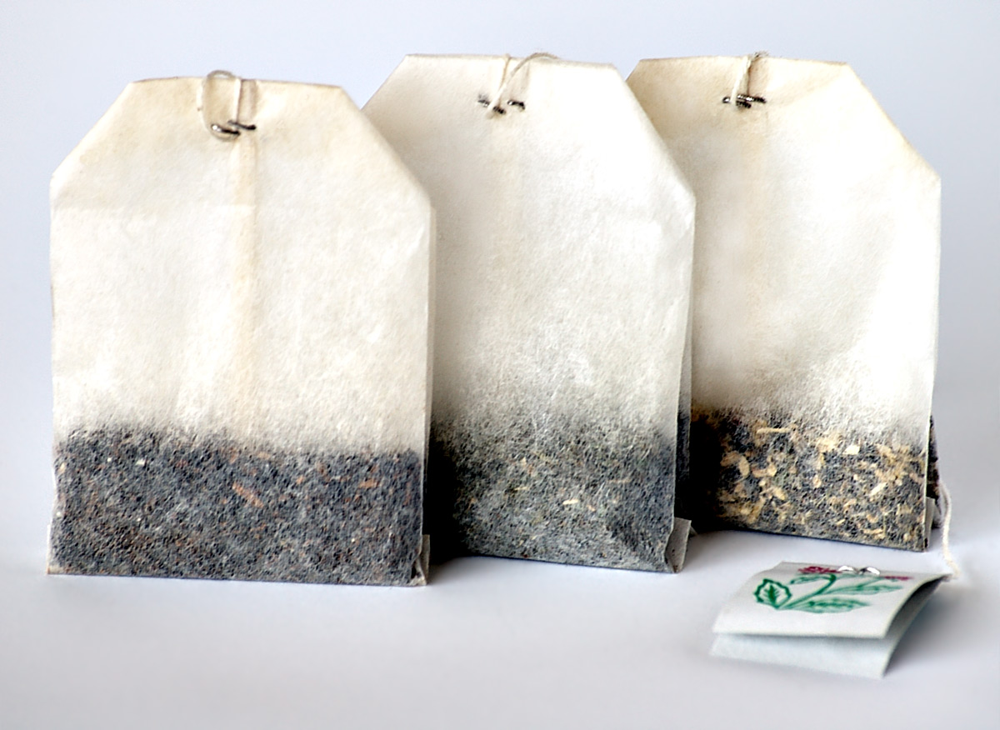

<!-- htf-figure:v1 -->
<figure class="htf-figure">
  
  <figcaption><strong>Fig. 1.</strong> Temperance meetings weaponized the herbal cup against the dram shop — a social hour, not a liver chart. <em>Rights:</em> CC BY-SA 2.5; see <a href="https://commons.wikimedia.org/wiki/File:Tea_bags.jpg">Commons</a> and RIGHTS.md.</figcaption>
</figure>
The dram shop had a counter and a smell. Reformers answered with a table and a pledge, then had to invent something hot to put on the table, because a movement cannot live on cold water and sermons. The nineteenth-century "herbal tea" in this story is a social weapon. It is not a health-claim essay wearing a bonnet.

Teetotalism needed rooms. Inns had been the default meeting hall; if you would not meet in a room whose business was gin and beer, you had to build another room. Preston's early temperance hotel in the 1830s, the hundreds of halls counted by mid-century, the British Workman in Leeds in 1867 — a pub bought and reopened "without the beer" — and the coffee-tavern boom of the 1870s are architecture. Joseph Livesey's circle and the word *teetotal* are the English origin story the plaques like. I have not sat with their minute books. I am using the public building history: coffee palaces, cocoa rooms, temperance hotels, billiard halls that sold a cup instead of a dram.

What was in the cup? Coffee, when they could get it and when the point was to mimic the pub's heat and bitterness. Cocoa, which filled British working-class rooms with a sweeter steam. Camellia tea, the unmarked default, poured as the respectable stimulant. And then the cheaper shadows: roasted grain and chicory when coffee was dear, garden infusions when tea was dear or when the table wanted to show that pleasure did not require a plantation or a still. Herb teas and coffee substitutes were not the movement's glamour. They were how you kept a hall open on a Tuesday for people who had signed a pledge and still wanted a place to sit.

The pledge is a foodways object. A signature, a card, sometimes a medal, a public performance at a meeting-house. After the performance you need a hospitality hour that does not undo it. A pot of mint, sage, or meadow mix is a way to keep hands busy. So is a hymn. I am more interested in the pot. The pot says: we will still have an evening. The dram shop's threat, as reformers framed it, was not only moral. It was a stolen wage and a stolen table. A counter-table with a non-alcoholic hot drink is a political technology. American WCTU rooms and later soda fountains rhyme with the British cocoa room even when the plants differ. Australia's coffee palaces, built as businesses rather than charities, rhyme again.

I will not baptize the reformers as nutritionists. Some of them talked about "wholesome" cups in a moral key; that adjective is theirs, and it is not a finding I am offering. Some of them were snobs about working-class pleasure. Some of them were working-class teetotalers who knew the dram from the inside. A claims-guarded series can hold the cup without holding their sermons. The cup is: hot water, a plant or a roast, sugar if the hall can afford it, a shared table that is trying not to be a bar.

Gender sits in the pour. Women organized a great deal of the pledge work and a great deal of the kettle work. Men appear in the engraved speeches. A foodways reading notices who rinsed the pot. Children in Band of Hope meetings got the sweet version and a song. That is hospitality as recruitment. It is not a clinic.

Substitution, again, but moral rather than naval. Camellia and coffee were already entangled with empire and price. A hall that served chicory was making a virtue of a cheaper brown. A hall that served garden herbs was making a virtue of the local. Either virtue can turn smug. Either can be a kindness at the end of a shift. I would rather describe the room than award the halo.

When the movement thinned, the rooms changed jobs. The Old Vic had been a coffee music hall; it became a theatre. Temperance hotels became ordinary hotels or vanished. The grocery aisle later sold "herbal tea" as a nightgown mood and forgot the pledge card. That forgetting is why this draft exists. The aisle's ancestor, in one British and American line, is not a monastery. It is a meeting-house that needed a drink that would not break a promise.

This draft does not treat, cure, or prevent. It is not medical advice. A temperance infusion is a table strategy against the dram shop. If a sentence needs a disease to make the pledge interesting, the sentence has left the hall.

## Claims box

- Educational foodways and cultural history only.
- This draft does not treat, cure, or prevent.
- Herb teas and coffee substitutes here are social weapons and hospitality, not indications.
- Not medical advice. Not a supplement label. Not a protocol.
