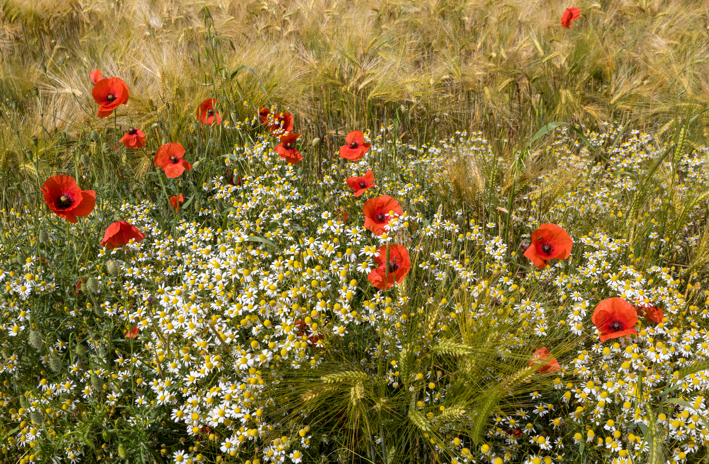

<!-- htf-figure:v1 -->
<figure class="htf-figure">
  
  <figcaption><strong>Fig. 1.</strong> Shaker and Moravian herb gardens dried for trade reputation — communal lofts, not secret cures. <em>Rights:</em> CC BY-SA 4.0; see <a href="https://commons.wikimedia.org/wiki/File:Camomille_sauvage_%28Matricaria_chamomilla%29%2C_coquelicots_%28Papaver_rhoeas%29_au_bord_d%27un_champ_d%27orge_%28Hordeum_vulgare%29.jpg">Commons</a> and RIGHTS.md.</figcaption>
</figure>
The loft comes before the label.

Someone has to cut, haul, spread, and wait for water to leave a leaf. American communal-religious households — Shakers in their villages from New Lebanon to Sabbathday Lake, Moravians in Bethlehem and the Wachovia towns — organized that waiting. They dried plants in quantity, sold them to neighbors, and earned a reputation for a clean count. A later antique market likes to call the Shakers proto-pharmacists. This folder will not. A communal garden that put sage in a canister is a foodways factory. The stillroom mix is real. The climax here is labor and packaging.

Start with the Shaker dry house, because it is an honest building. Harvard's stone Dry House of 1848, as the village's own historians tell it, was meant to be nearly fireproof: herbs and fruits up in the heat, a hillside letting light into a lower story. Sabbathday Lake still points to an 1824 Herb House and to a paper trail that begins, they say, in 1799 — single-sheet lists first, then a printed *Catalogue of Herbs, Roots, Barks…* in 1864. The 1864 list, in the Maine Memory Network's public abstract, runs to 155 names and sells culinary "sweet" herbs beside the longer physic columns. Herbs went out as paper-wrapped cakes, four cakes to a pound, on trade routes and in country stores on consignment. I have not weighed a cake. I will believe the catalog as a commercial object.

New Lebanon's mid-century lists were longer. Later writers like to quote huge annual weights. I have not weighed a loft, and I will not repeat a round number I cannot see on a ledger. What I can say from the public remains is enough for foodways: printed catalogs, presses (Elisha Myrick's Harvard journal, as later scholars excerpt it, is a year of shipping, breaking, and building machines), attics hung with linen sheets, coal or wood kilns, labels in enough colors and sizes that twentieth-century collectors swept them into bags. Hancock still has cupboards built to sort those labels. A label is a reputation you can stack. Sameness from tin to tin is an industrial virtue. It is also how a local garden becomes a flavor other people trust.

The trust is the Shaker product as much as the leaf. Neighbors bought because the count was honest, the rooms were clean, and the name on the wrapper meant someone had already done the sorting. Culinary canisters — sage, summer savory, sweet marjoram, thyme — are the part of the business this series can stay with without changing jobs. Village notes from Harvard distinguish, in an 1840s tally as later repeated, a handful of sweet herbs in canisters from a much longer physic list. I will keep the canisters. I will mention that the catalogs also spoke the mixed language of the stillroom, because pretending otherwise is a lie about the paper. I will not let the physic columns become the point of the garden.

Moravian ink is a different thickness.

Bethlehem's early General Economy organized labor in common; that communal phase did not last the whole life of the town. Bethabara, the first Wachovia settlement, kept a documented community garden that later interpreters call medical as well as culinary. Salem's Moravian Archives titled a public exhibit "The Botanizers of Salem, 1785–1835." Kitchen herbs, orderly streets, household drying: that is the Moravian picture I can defend without inventing a New Lebanon-scale tin industry. I have not walked those beds. I will not give the Brethren a labeled-canister commerce they may not have run. What they share with the Shakers is the American communal-religious fact: a garden is work done together, a surplus can be sold, reputation is a kind of currency, and dried plants move farther than fresh ones.

The two communities also share a paper problem this series already knows. Surviving catalogs and exhibit cards over-represent people who could print. The unnamed labor — sisters picking rose petals after the dew, hired help, children, the neighbor who only ever bought — is thinner on the page. Foodways still has to ask who cut the stem. A drying loft is gendered space in most of the accounts: men's presses and shipping in one journal, women's gathering and kitchen in another. I will not tidy that into a slogan. I will not make either group a utopia of herbs.

Why put them in a series about "herbal tea"?

Because the American grocery tin learned cleanliness, a face, and a promise of sameness from somewhere, and these workshops are part of that somewhere. Because a labeled package of dried mint is already the aisle in draft form. Because communal religion in North America had a foodway, not only a meetinghouse: seed lists, trade routes, a neighbor at the kitchen door. Because the temptation, reading a Shaker catalog, is to slide into materia medica and call it history. The garden can stay. The slide cannot.

This draft does not treat, cure, or prevent. It is not medical advice. A dry house is not a clinic that happened to have a slate roof. It is a place where water left a plant so a stranger could boil it later. If you came to recruit the Shakers into a wellness ancestry, or the Moravians into a lost pharmacopeia, the folder will give you lofts, labels, and a refusal. Keep the reputation for honesty. Leave the body to someone who has met you.

## Claims box

- Educational foodways and cultural history only.
- This draft does not treat, cure, or prevent.
- Communal gardens, drying lofts, and labeled packages are trade history, not a clinic.
- Not medical advice. Not a supplement label. Not a protocol.
