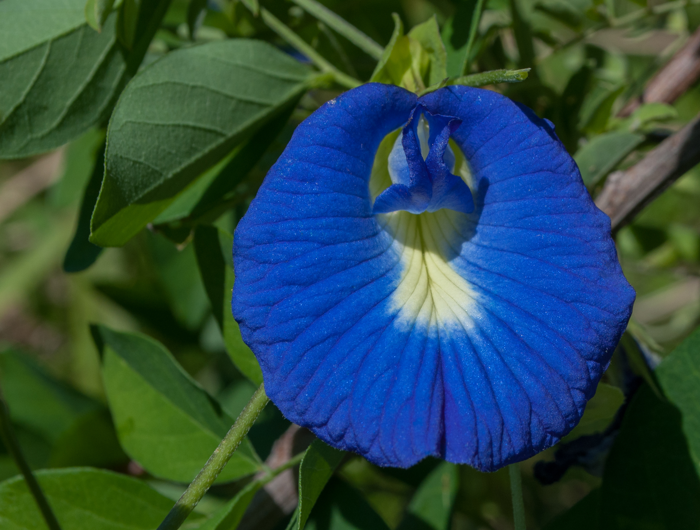

<!-- htf-figure:v1 -->
<figure class="htf-figure">
  
  <figcaption><strong>Fig. 1.</strong> Butterfly pea and pandan trade on color and aroma — hospitality tricks in the glass, not cleanse branding. <em>Rights:</em> CC0; see <a href="https://commons.wikimedia.org/wiki/File:Clitoria_ternatea.jpg">Commons</a> and RIGHTS.md.</figcaption>
</figure>
Blue that turns purple when you squeeze a lime is a hospitality trick before it is a botanist's anecdote.

Thai *nam anchan* — butterfly pea, *Clitoria ternatea* — has lived in Southeast Asian kitchens as a color as much as a taste. The taste is mild, a little earthy, easy to lose under sugar and lime. The color is not mild. It photographs. That is why the last fifteen years of English-language food media cannot leave it alone. A claims-guarded foodways series has to separate the household dye-drink from the cocktail-menu celebrity without sneering at either. People are allowed to like a trick. The trick is not a nutrient panel.

Pandan (*Pandanus amaryllifolius*) is the other half of this draft because it is the opposite trick: you smell it before you see it. A knot of leaves in rice, in a jelly, in a drink, in a pot of something sweet. The aroma is vanilla-adjacent only if you have already been trained by extract. In the kitchen it is its own leaf. It is cheap where it grows. It is a freezer bag of folded leaves in a Midwestern Asian grocery. It is not a mountain pilgrimage.

I will not invent a royal Siamese origin story for the blue glass. Colorants in festive drinks and desserts are an ordinary Southeast Asian fact; specific palace recipes want specific sources. The tourist version — a Bangkok bar, a color-change, a straw — is a 2010s object I have actually seen described a hundred times. That object is real. It is not "ancient Thai herbal tea." The English phrase is doing the Camellia-default and the wellness-default at once. Refuse both.

What is the older foodway, as far as a cautious writer can say? Flowers used to tint rice cakes and drinks; leaves used to perfume. That is cookery. It belongs next to turmeric rice and next to rosewater, not next to a clinic. When a grandmother puts a leaf in a pot, she is closer to a baker than to a monograph. I am guessing at no particular grandmother. I am insisting on the genre.

Export changes the object. Dried butterfly-pea flowers in a glass jar with a kraft label, sold beside "wellness" tins, are a different commodity from a night-market glass. The jar wants you to steep a mood. The night-market glass wants you to be hot and then less hot, and to watch the lime work. Pandan extract in a bottle is a different commodity from a leaf. Foodways uncompresses again: name the form.

I will also keep desserts in the same sentence as drinks. Pandan jelly, blue rice, a sweet glass — the leaf and the flower are kitchen colorists. A series that only files them under "herbal tea" has already lost the plate. The plate is why a child remembers the color. The plate is why a banquet uses the flower. A sachet that wants to be a mood has deleted the plate on purpose.

There is a colonial and scientific-name joke I will not belabor. *Clitoria* is a European botanist's idea of a joke. The Thai name is a flower name. Use the local name in the kitchen; use the Latin when you need to order a bag and not get the wrong pea. Identity errors travel faster than essays.

This draft does not treat, cure, or prevent. It is not medical advice. I am especially not going to finish the sentence that begins "rich in" and ends in a lab noun. Color is not a virtue. Aroma is not a virtue. They are why people pour the drink for a guest. If a later caption tries to make the lime-shift into a metaphor for transformation-as-healing, fail the caption. The lime is acid. The anthocyanins — if you want the chemistry word as a cooking word — change color when the pH changes. That is a kitchen demonstration. It is not a parable, and it is not a protocol.

Pour the blue. Add the lime if you want the trick. Tie the pandan if you want the smell. Call it a drink. Stop there.

## Claims box

- Educational foodways and cultural history only.
- This draft does not treat, cure, or prevent.
- Color and aroma are hospitality tools, not findings.
- Not medical advice. Not a supplement label. Not a protocol.
