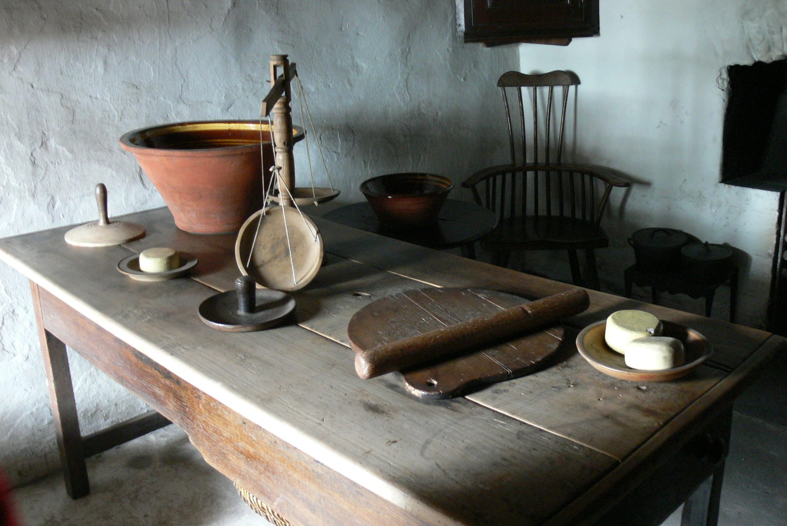

Before anyone called it an island, it was a table you could walk
around.

<figure>
  
  <figcaption>The island’s ancestor: a central table you could walk around while prep stayed in the middle of the room. Photo: Wolfgang Sauber / <a href="https://commons.wikimedia.org/wiki/File:SFHNM_-_Kennixton_Farm_4_K%C3%BCche_Tisch.jpg">CC BY-SA 3.0</a> (Wikimedia Commons).</figcaption>
</figure>

Farm kitchens in the 1800s put a heavy worktable in the middle of
the room because the stove was a beast against the wall and the
water was a pump or a pail. You needed a place to flour, cut, and
set pans down that was not the only other horizontal surface in the
house. The table had legs. It had a thick top. It took abuse. When
the top got bad you planed it or you lived with the scars.

That object never really left. We boxed in the legs, we hid the
mess behind doors, we hung pendants over it, and we started calling
it an island because “table” did not sound like a renovation. The
job is the same. A person should be able to walk around the work
and put both hands on it.

Catharine Beecher spent the mid-19th century trying to get American
kitchens to stop wasting steps. Christine Frederick did the same
with a stopwatch in the 1910s. Neither of them was selling granite.
They were trying to keep a body from walking a mile before supper.
The worktable in the middle was efficient when the room was a
workroom. It became a problem when the room became a showroom and
the table grew a cooktop, a sink, and four stools.

Commercial butcher shops kept the honest version. A maple block,
end grain up, thick enough to last a career, standing where the
work is. You did not sit at it. You did not plug a blender into
the side of it. You cut, you scraped, you oiled, you went home.
Every pretty residential butcher-block island is borrowing that
memory, whether it admits it or not.

When I walk a new kitchen I still look for the farm table. Is there
a rectangle you can stand at on all four sides? Is the top a place
you would actually cut on, or is it a photograph? If the answer is
“we need it for seating,” fine — say that. Seating is a real job.
Just do not tell me it is a worktable and then give me 9 inches of
overhang and a 24-inch aisle.

Bradley islands come out of cabinet shops, not farmhouses. The
lineage is still the table. If the box cannot take a day’s work,
it is a sideboard in the wrong room.
