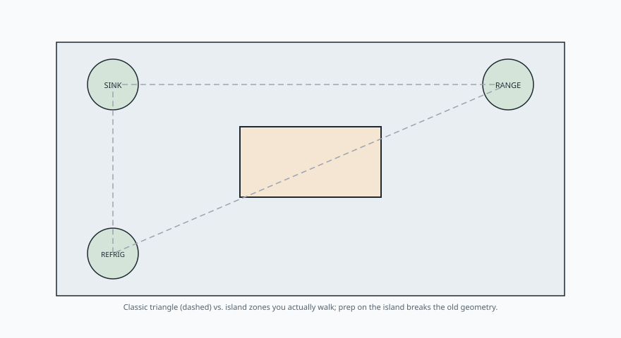

The work triangle is a 1940s idea that still earns its keep, and
it is also the idea that makes people draw stupid islands.

<figure class="bradley-figure bradley-figure--diagram">
  
  <figcaption>
    The work triangle still explains traffic; a real island turns one leg into a prep zone — size the box for how you actually walk, not a textbook triangle.
    Bradley kitchen island guide — editorial schematic.
  </figcaption>
</figure>

Sink, cooktop, refrigerator. Three points. NKBA still says the
three traveled legs should add up to no more than 26 feet, with
no single leg under 4 feet or over 9. No leg should cut through
an island by more than 12 inches. That last sentence is the one
that kills a lot of pretty plans. If your triangle has to climb
over a 4-foot-deep island, you did not design a kitchen. You
designed an obstacle.

The triangle assumed one cook and three appliances. Modern
kitchens have a second sink, a drawer microwave, a coffee
machine that costs more than the first refrigerator I owned, and
two people who cook at the same time on Tuesdays. Zones handle
that better than a triangle: a cleanup zone, a cook zone, a
prep zone, a beverage zone if you must.

An island can be a zone. That is the grown-up use. Prep island
across from the range. Cleanup island with the second sink.
Baking island with the maple top and the marble insert. What an
island should not be is all four zones plus seating plus the
dog bowls. That is how you get a 9-foot monument that nobody
can walk around.

When I place a Bradley island I pick its job first.

- Prep: continuous 36 by 24 of clear top next to a sink, knife
  storage, trash pullout. Triangle can stay on the walls.
- Cook: cooktop with 12 and 15 inches of landing, 9 inches of
  top behind the burners, a hood that actually ducts. Seating
  moves to the far side or goes away.
- Serve: seating, a place for platters, outlets that the 2023
  code will accept. No raw chicken.

You can combine prep and serve. You can combine cook and serve
if the room is large and you are honest about heat and grease
in someone’s lap. You cannot combine all three and then act
surprised when the aisle disappears.

The triangle is not dead. Walk it with a tape after you place
the island. If a leg is 11 feet because you had to walk around
the stools, the stools are in the work. Move them or lose them.
