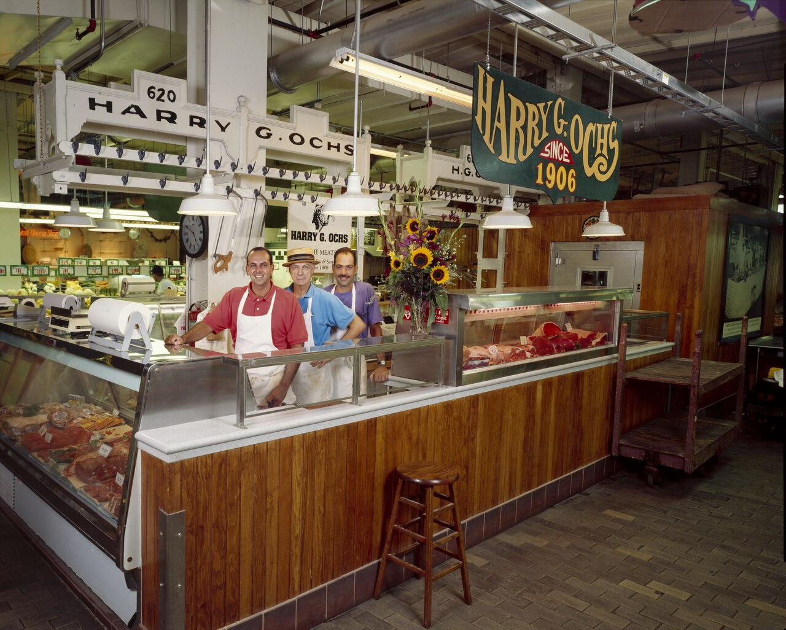

A real butcher block is a tool. The residential island borrowed
the name and sometimes the wood, and then asked the tool to be
a dining table.

<figure class="bradley-figure bradley-figure--photo">
  
  <figcaption>
    Commercial shops kept thick maple where the work happened — residential butcher-block islands borrow that memory whether they admit it or not.
    Library of Congress, Carol M. Highsmith (public domain), LCCN 2011630472.
  </figcaption>
</figure>

End-grain maple in a shop is thick — two, three, four inches —
because knives are going to live there for decades. The fibers
stand up. The edge of the knife slips between them instead of
severing them. You scrape, you salt, you oil. When the surface
goes hollow you send it out to be resurfaced, or you do it
yourself if you still have the back for it.

Three lessons transferred. The rest did not.

Lesson one: a wood top that will be cut on wants oil, not a
film you have to sand off every time you scar it. If you are
not going to cut on it, say so and use a film or use stone.
Pretending is how people get sticky polyurethane and a cutting
board they still pull out of a drawer.

Lesson two: thickness is not decoration. A 1.5-inch edge-grain
top is a good residential top. It is not a shop block. It will
need more help at a seating overhang than a 3-inch slab will.
Do not specify a thin top and a 15-inch stone-style fly and
then act shocked when it bounces.

Lesson three: sanitation is a habit, not a material. Wood used
to be accused of being dirty. Used and oiled wood does fine.
What does not do fine is wood with a puddle of chicken water
left overnight next to a sink that should have been stone.
That is a layout problem dressed up as a species problem.

What did not transfer: sitting at the block. Butchers did not
host. If you want seating at a wood island, you are mixing
jobs. Mix them on purpose. Keep the sink off the wood if you
can. Keep the hottest pans on a pad or on a stone insert.
Tell the client they will re-oil this thing the way they
re-salt a cast-iron pan. If that sentence makes them tired,
they want quartz.

Bradley islands can wear a shop-minded top. We order edge grain
for most kitchens and end grain for the rare client who will
actually use it as a block. We do not call a stained oak plank
top a butcher block. Words still mean things, even in a
showroom.
