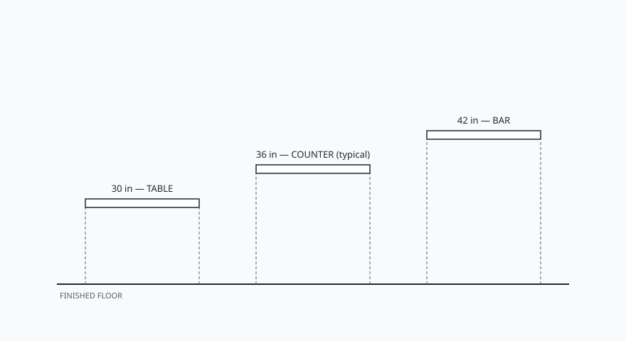

You get three honest heights.

<figure class="bradley-figure bradley-figure--diagram">
  
  <figcaption>
    Table, counter, and bar heights change knee space, stool choice, and sight lines — 36 inches is the default Bradley island top because it matches perimeter counters.
    Bradley kitchen island guide — editorial schematic.
  </figcaption>
</figure>

Thirty inches is a table. Chairs, not stools. Kids can sit
without a climb. The top will not line up with your wall
counters, so the island becomes a piece of furniture that
happens to have cabinets under it. Knee space wants to be
about 18 inches deep and 24 wide per person. It is a good
height if the island is really a table with storage. It is a
bad height if you wanted a place to chop next to a 36-inch
run.

Thirty-six inches is the counter. This is the default for a
reason. Your wall boxes are 36. Your wrists already know it.
Stools are counter stools. Knee space is 15 deep and 24 wide.
Most Bradley islands land here because the job is still
kitchen work. A maple top at 36 is a worktop. A stone top at
36 is a worktop that you will not cut on.

Forty-two inches is a bar. You gain a little visual wall
between the cook and the living room. You lose some dignity
for anyone who does not want to perch. Knee space shrinks to
12 deep because legs hang steeper. You can sometimes recover
island depth in a tight room by going to 42 on the seating
side only — a two-tier — but you are now building two tops
and a crumb trap. See the two-tier draft before you fall in
love with the elevation.

Access-minded kitchens should offer more than one height in
the room: something in the 28-to-36 band and something in the
36-to-45 band. The island can be the second height, or it can
be the first if you drop a section. A 34-inch stretch with
knee space is a gift to a seated cook. It is also a gift you
have to design, not a gift that appears because we picked a
pretty stool.

I almost always argue for 36 on a Bradley island unless the
client has a specific bar ritual or a specific access need.
Matching the surrounding counters keeps the work continuous.
The photograph likes 42. The cook likes 36. I work for the
cook.
